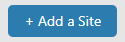
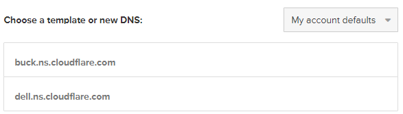
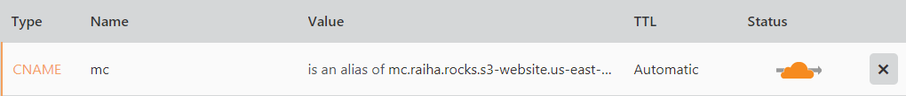

Title: Domain-nimi, CDN ja CloudFlare
Tags: 
  - domain
  - cdn
  - cloudflare
---
## Yleistä löpinää
[Edellisessä blogi-kirjoituksessa](/posts/Staattiset_sivut_pilveen.html) kävin lyhyesti läpi suunnitelmaa, jossa nykyinen domain+webhosting -paketti korvataan erinäisillä pilviratkaisuilla. Tässä kirjoituksessa keskitytään domain-nimeen ja [CloudFlaren](https://www.cloudflare.com/) hyödyntämiseen.

Koska domain-nimen NS-palvelimet on helppo muuttaa toiseksi, kannattaa haluttu domain-nimi ostaa käytännössä halvimmalta toimijalta. Itse päädyin tämän raiha.rocks-domainin osalta [Uniregistryn](https://uniregistry.com/) asiakkaaksi, koska domainin sai ensimmäiseksi vuodeksi huokealla 2 dollarin vuosimaksulla.

CloudFlare tukee nykyään olemassa olevien domain-nimien siirtoa yrityksen omaan [Registrar](https://www.cloudflare.com/products/registrar/)-palveluun, mutta toistaiseksi uusien domain-nimien ostaminen ei vielä onnistu palvelun kautta. CloudFlare ei veloita domain-nimistä ylimääräisiä kuluja, vaan ne myydään asiakkaalle aina listahintaan, joten tämäkin domain siirtynee aikanaan CloudFlaren alle.

CloudFlareen päädyin CDN-toimintojen osalta edullisuuden ja hyvien ominaisuuksien johdosta. Vaikka yritys ei ole suurin toimija [sisällönjakeluverkkopalveluissa](https://fi.wikipedia.org/wiki/Sis%C3%A4ll%C3%B6njakeluverkko) (CDN), on sen ilmainen [free-paketti](https://www.cloudflare.com/plans/) tarpeeksi kattava staattista sivustoa ajatellen. Suurimmat porkkanat ovat rajoittamaton tiedonsiirto, maailmanlaajuinen CDN-verkosto ja yhteinen [SSL-sertifikaatti](https://fi.wikipedia.org/wiki/TLS), joka tuo mukanaan HTTPS-yhteydet.

Käytännössä suomenkielisen blogin liikennöintimäärät ovat hyvin vähäiset, joten Amazonin S3-kulut jäisivät pieniksi myös ilman CDN-toimintoja, mutta koska tarkoitus on säästää jokainen mahdollinen rahayksikkö, saadaan CDN:ää käyttämällä säästöjä, kun sisältöä ei ladata jokainen kerta S3:n kautta.

## Asetukset

Pähkinänkuoressa homma menee seuraavasti: 

- Luodaan tili Uniregistryyn (tai mihin tahansa domain-nimiä kauppaavaan palveluun) ja ostetaan sitä kautta haluttu domain-nimi. Maksu tapahtuu luottokortilla. 

- Luodaan CloudFlareen tili, ja lisätään juuri ostettu domain-palveluun syöttämällä sen nimi **Add a site** -apuriin (domainia ei siis tarvitse siirtää CloudFlareen). Tämän jälkeen palvelu tekee taikojaan, käskee valita tilauksen (*Free*-vaihtoehto käy hyvin) ja kertoo NS-osoitteet, jotka täytyy vaihtaa domainille

- Uniregistryn (tai vastaavan toimijan) asetuksiin laitetaan NS-palvelimiksi CloudFlaren kertomat osoitteet

- CloudFlarea ei tarvitse staattisten web-sivujen osalta juuri säätää, vaan ainoa tarvittava asetus tehdään DNS-osiosta, johon lisätään uusi CNAME-tietua, jonka arvoksi laitetaan osoite, jossa staattiset sivut sijaitsevat (tässä tapauksessa S3 bucketin osoite)

👍

