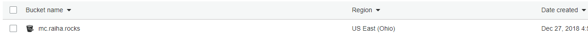
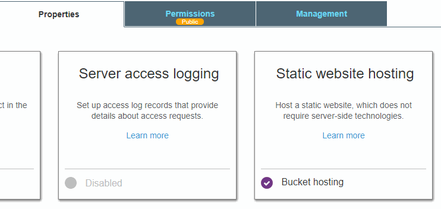
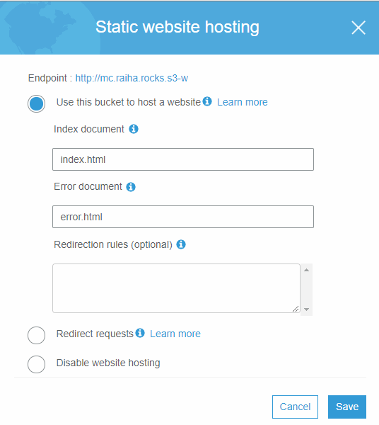
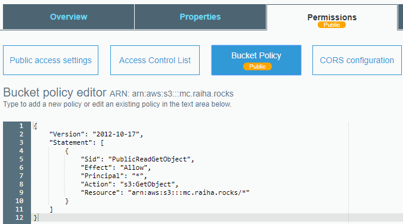
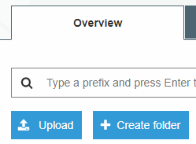

Title: S3 ja staattisten sivujen jakelu eteenpäin
Tags: 
  - AWS
  - S3
  - staattiset sivut
---
## Yleistä löpinää
[Edellisessä blogi-kirjoituksessa](/posts/Osa_yksi_cloudflare.html) kävin läpi lyhyesti CloudFlaren käyttöönottoa CDN:n osalta, ja tällä kertaa vuorossa on [Amazonin S3](https://aws.amazon.com/s3/).

S3 on lyhenne sanoista **Simple Storage Service**, ja se on Amazonin pilvipalvelu tiedostojen säilömiseen. S3 on hyvä alusta esim. varmuuskopioiden tallentamiseen ja kuvatiedostojen jakeluun, mutta tässä tapauksessa käytän S3:sta vain yksinkertaisena HTTP-palvelimena.

S3:ssa tiedostoja tallennetaan bucketeihin (huono suomennos olisi saavi tai ämpäri), ja jokaiselle bucketille voidaan määrittää omat asetukset esim. käyttöoikeuksien ja käytössä olevien ominaisuuksien osalta.

Tiedostojen siirtäminen buckettiin onnistuu vaikkapa selaimella suoraan AWS Consolen kautta. Suurten tiedostomäärien kanssa kannattaa käyttää kuitenkin parempia työkaluja, ja itselläni käytössä on graafinen [Cyberduck](https://cyberduck.io/)-ohjelma.

## Asetukset

Pähkinänkuoressa homma menee seuraavasti: 

- Luodaan [ilmainen AWS-tili](https://aws.amazon.com/free/), jos sellaista ei vielä ole. Ilmaisessa tilissä S3-tallennustilaa saa 5 gigatavua, joka riittää erinomaisesti blogisisällölle. Tilin luominen vaatii luottokortin.

- [Luodaan uusi S3 bucket](https://docs.aws.amazon.com/AmazonS3/latest/user-guide/create-bucket.html), joka nimetään samalla nimellä kuin halutun blogin osoite, tässä tapauksessa siis *mc.raiha.rocks*. Regionilla ei CDN-palvelujen kanssa käytettynä ole niin paljon väliä, mutta ilman niitä bucket kannattaa sijoittaa sille regionille, joka on lähinnä sitä paikkaa, josta kohdistuu eniten liikennettä buckettiin.



- Kun bucket on luotu, tehdään siitä HTTP-yhteydellä saavutettava menemällä kyseisen bucketin **Properties** -osioon, josta valitaan **Static website hosting** -kohta. Aukeavasta ikkunasta valitaan *Use this bucket to host a website* -valinta ja annetaan nimet sekä *Index*- että *Error*-dokumenteille. **Save**-nappia painamalla asetukset astuvat voimaan. Kyseisestä ikkunasta kannattaa kopioida talteen **Endpoint**-osoite, joka kopioidaan myöhemmin CloudFlaren DNS-asetuksiin.





- Viimeiseksi [annetaan kaikille oikeus](https://docs.aws.amazon.com/AmazonS3/latest/dev/HostingWebsiteOnS3Setup.html) poimia bucketista yksittäisiä tiedostoja (jotta selain saa tiedostoja ladattua bucketista). Tämä tapahtuu **Permissions** -kohdan alla olevasta **Bucket Policy** -osiosta, jonne laitetaan seuraavanlainen teksti

```
{
    "Version": "2012-10-17",
    "Statement": [
        {
            "Sid": "PublicReadGetObject",
            "Effect": "Allow",
            "Principal": "*",
            "Action": "s3:GetObject",
            "Resource": "arn:aws:s3:::BUCKETIN_NIMI_TÄHÄN/*"
        }
    ]
}
```



## Lopputekstit

Tässä vaiheessa kannattaa buckettiin siirtää *index.html*-tiedosto, ja kokeilla että aiemmin kopioitu Endpoint-osoite aukeaa selaimessa. Tiedoston voi siirtää S3:een esim. selaimella **Overview**-osion **Upload**-napin kautta avautuvalla työkalulla



Jos osoite toimii selaimessa, voi kyseisen osoitteen ottaa käyttöön CloudFlaren kanssa.

👍

