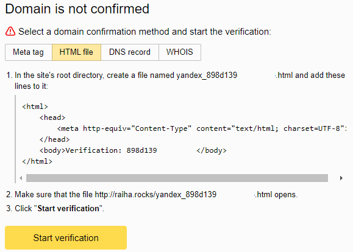
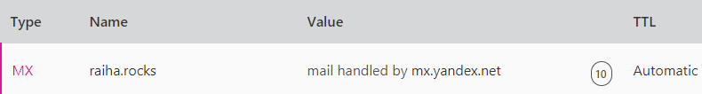
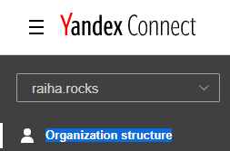
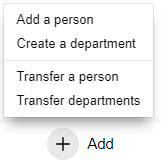
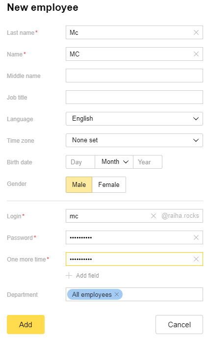
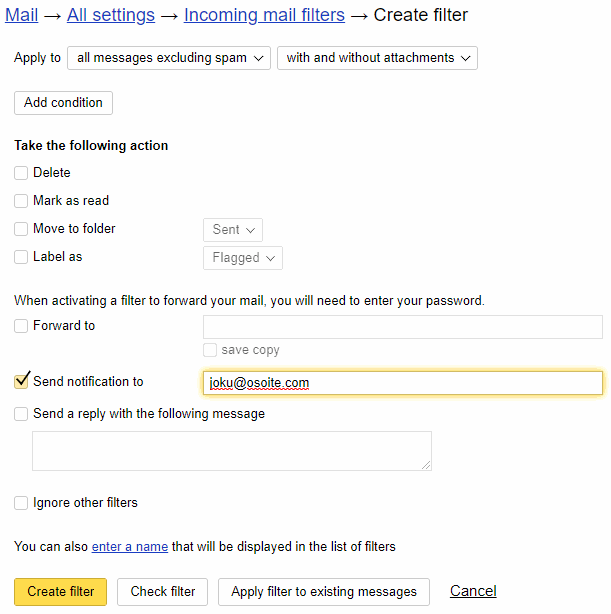

Title: Sähköposti Yandex.Mail for Domainilla
Tags: 
  - Yandex
  - email
---
## Yleistä löpinää
[Edellisessä blogi-kirjoituksessa](/posts/Osa_kaksi_s3.html) kävin läpi lyhyesti staattisten sivujen säilömistä Amazonin S3-palveluun, ja tällä kertaa vuorossa on oman pilvisiirtymäprojektin viimeinen askel, kun sähköpostipuolella otetaan käyttöön [Yandex.Mail for Domain](https://domain.yandex.com/).

Henkilökohtaisesti pidän sähköpostia monelta osin internetin huonoiten toteutettuna yleispalveluna, joten koetan välttää sitä aktiivisesti. Tästä syystä en tarvitse domainille monipuolisia sähköpostipalveluita, vaan käytännössä ainoa tarpeellinen asia on mahdollisuus vastaanottaa sähköposteja muutamaan domainiin liitettyyn osoitteeseen.

Markkinoilla on runsaasti erilaisia sähköpostipalveluita, joissa sähköpostin kylkiäisenä toimitetaan muitakin toimintoja, kuten tiedostojen jakamista, dokumentin yhteiskäyttöä jne., mutta koska näille ei ole mitään tarvetta omalla kohdalla, valitsin käyttöön ensimmäisen ilmaisen sähköpostipalvelun.

## Asetukset

Pähkinänkuoressa homma menee seuraavasti: 

- Luodaan Yandex-tili (jos sellaista ei jo ole). Tili on ilmainen.

- Liitetään haluttu domain Yandex.Mail for Domain -palveluun käyttämällä HTML-varmistusta, jossa HTTP-palvelimelle (tässä tapauksessa S3) siirretään yksi .html-tiedosto, jonka jälkeen painetaan **Start verification** -nappia.

- Kun varmistus on suoritettu, luodaan CloudFlaren DNS-asetuksiin uusi MX-kenttä, joka ohjaa domainiin saapuvat sähköpostit Yandexin palvelimille

- Seuraavaksi luodaan tarvittavat tilit menemällä **Organization structure** -kohtaan ja valitsemalla **Add**-napin alta **Add a person** -valinta. Tärkeää on, että *Login*-kohdan alias menee oikein (tätä samaa aliasta käytetään sähköpostitilin käyttöön).

## Lopputekstit

Lopuksi kannattaa kokeilla sähköpostin lähetystä luotuihin osoitteisiin, jotta voidaan varmistua kaiken toimivan odotusten mukaisesti. 

Sähköpostit voi lukea selaimella menemällä osoitteeseen [mail.yandex.com](https://mail.yandex.com) ja kirjautumalla sisään aiemmin luodulla käyttäjätunnuksella (koko alias, eli tässä tapauksessa mc📧raiha.rocks) ja salasanalla.

Yandexiin tulevat sähköpostit voi halutessaan ohjata toiseen osoitteeseen, tai tilata muistutuksen käyttämällä tilin asetuksista löytyvää **Message filters** -toimintoa. Esimerkiksi muistutus tulisi alla näkyvällä tavalla

👍

