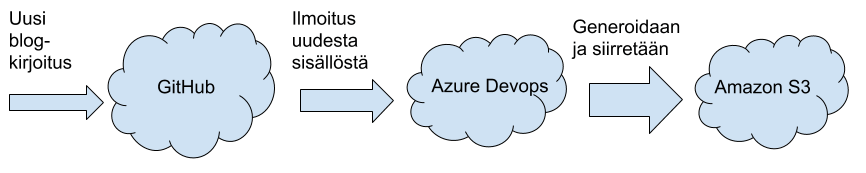

Title: Sisällöt versionhallintaan
Tags: 
  - versionhallinta
  - git
  - automatisointi
---
## Yleistä löpinää

Monille henkilöille versionhallinnasta tulee mieleen lähinnä ohjelmoijien käyttämä salakieli, jonka avulla [asioista tietämättömät](https://xkcd.com/1597/) voidaan pitää poissa projektista.

Versionhallinta kannattaa kuitenkin nykyään sisällyttää mukaan lähes kaikkeen luovaan tekemiseen, koska erilaisten internetistä löytyvien versionhallintapalveluiden (kuten [GitHub](https://github.com/), [BitBucket](https://bitbucket.org/) ja [GitLab](https://about.gitlab.com/)) avulla omaa tekemistään on helppo automatisoida.

Esimerkkeinä vaikkapa HTML-dokumenttien muuntaminen PDF-muotoon, tekstisisällön oikolukeminen, videotiedostojen leikkaaminen tai staattisten sivujen generointi ja siirtäminen HTTP-palvelimelle.

## Mitä kannattaa ottaa huomioon

Jos sisältö on sinällään julkista (vaikkapa blogitekstit), kelpaa palveluksi lähes mikä tahansa vaihtoehto. Jos sisältöä ei kuitenkaan ole tarkoitettu julkiseen jakeluun, kannattaa pitää huolta siitä, että valittu palvelu tukee yksityisiä (private) tallennuspaikkoja.

Toinen huomionarvoinen asia on tallennustilan määrä. Vaikka tekstisisällön kohdalla gigatavun ilmainen tallennustila on aivan riittävä, voi esim. video- ja kuvatiedostojen kanssa kaivata lisää tilaa, josta joutuu yleensä maksamaan.

Kolmas tarkastelua kaipaava seikka on valitun palvelun tarjoamat integrointimahdollisuudet. esim. GitHubin [Marketplace](https://github.com/marketplace)-osio listaa kattavasti erinäisiä palveluita, joissa voi hyödyntää GitHubista löytyvää omaa sisältöä.

## Miten alkuun

Alkuun kannattaa miettiä niitä työvaiheita, joita tulee toistettua paljon, ja joiden automatisointi onnistuu esim. jonkin komentorivityökalun avulla. Kun sopiva työvaihe on löytynyt, pitää seuraavaksi löytää palvelu (tai palveluyhdistelmä), jonka avulla työvaiheen saa suoritettua.

Jos oman tekemisen automatisointi on vieras asia, ja sen tarjoamia mahdollisuuksia on vaikea hahmottaa, voi erilaisiin vaihtoehtoihin tutustua esim. IFTTT-palvelun [esimerkkien](https://ifttt.com/discover) myötä.

Osakokonaisuudet kannattaa yleensä pilkkoa mahdollisimman pieniin osiin, jotta niiden toteutus ja testaus onnistuu mahdollisimman kivuttomasti. Liikkeelle kannattaa yleensä lähteä pienellä aineistolla, jolloin kokonaisuuden hahmottaminen pysyy selkeänä. Apuna voi käyttää vaikkapa kynää ja paperia (tai sopivaa ohjelmistoa).

