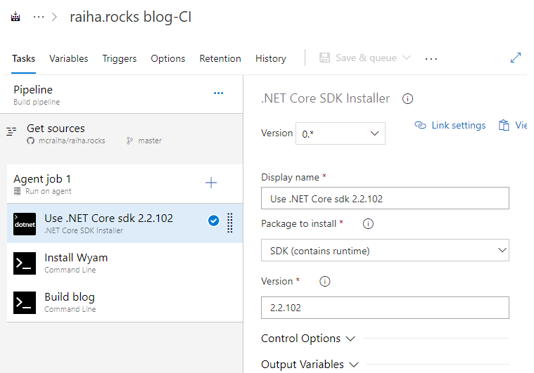

Title: Staattisten sivujen generointi Azure DevOpsin kautta
Tags: 
  - staattiset sivut
  - Azure DevOps
  - automatisointi
---
## Yleistä löpinää
Staattisten websivujen jatkuva manuaalinen päivittäminen jokaisesta pienestä muutoksesta voi tuntua turhauttavalta, jonka takia kyseinen operaatio kannattaa automatisoida.

Tässä tekstissä tehdään [Azure DevOpsin](https://azure.microsoft.com/en-us/services/devops/) avulla automatisointi, joka generoi staattiset sivut automaattisesti uudelleen, kun uutta sisältöä lisätään git-versionhallintaan. Käyttökohteena on tämän blogin sisältö, jota generoidaan [Wyamin](https://wyam.io/) avulla.

Luonnollisesti Azure DevOpsin sijaan voi valita jonkin muun vastaavan palvelun oman automatisoinnin tekemiseen, kuten esim. [Travis CI](https://travis-ci.com/) tai [AppVeyor](https://www.appveyor.com/).

## Azure DevOps

Azure DevOps on **Microsoftin** yhdistelmä projekteista, versionhallinnasta, automatisoinnista ja testauksesta. Palvelu on siis ominaisuuksiensa puolesta tarkoitettu ensisijaisesti erilaisille ohjelmistoprojekteille, mutta sitä voi käyttää myös moniin muihin asioihin. Palvelun [ilmainen versio](https://azure.microsoft.com/en-us/services/devops/compare-features/) riittää hyvin näin pienessä projektissa.

## Käyttöönotto

Ensimmäinen askel Azure DevOpsin kanssa on palvelun käyttöönotto. Jos käytössä ei vielä ole [Microsoft-tiliä](https://login.live.com/login.srf?lw=1), täytyy se luoda aluksi. Tämän jälkeen kirjaudutaan [Azure DevOps](https://dev.azure.com) -sivustolle ja luodaan uusi projekti


Uudesta projektista tehdään tässä tapauksessa yksityinen (Private), koska blogin varsinainen sisältö sijaitsee GitHubissa, ja Azure DevOpsia käytetään vain staattisten sivujen generointiin ja siirtoon paikalleen, jolloin tähän projektiin ei tarvitse kaikkien päästä käsiksi.

Kun projekti on luotu, tehdään jotain täysin odottamatonta, ja otetaan uusia ominaisuuksia pois käytöstä, jotta automatisointiketjun saa tehtyä helpommin valmiiksi. Tämä tapahtuu valitsemalla omasta profiilista **Preview features**


ja ottamalla valinnan pois **New YAML pipeline creation experience** -kohdasta, jonka jälkeen palvelu latautuu uudelleen


Automatisoinnin voi luonnollisesti tehdä myös uuden YAML pipeline -toiminnon kanssa, mutta toistaiseksi se ei tarjoa yhtä hyviä visuaalisia työkaluja toimintojen luontiin.

### Uuden pipelinen eli automaation luonti

Valitaan vasemman reunan **Pipelines** -osion alta **Builds**


ja tehdään uusi Pipeline valitsemalla **New** -nappi.

Ensimmäiseksi valitaan mistä automatisoinnissa käsiteltävä sisältö haetaan. Tässä tapauksessa valitaan **GitHub**, joka autentikoidaan erikseen Azure DevOpsia varten


Templaten osalta valitaan tyhjä eli **Empty job**, koska varsinaiset valmiit pohjat ovat pääsääntöisesti tarkoitettu ohjelmistoprojekteille, jonka takia ne eivät kelpaa tähän yksinkertaiseen tehtävään kovin hyvin


Kun tyhjä pohja on valmis, aletaan sitä täyttämään tehtävillä, eli **task**eilla. Tämä tapahtuu painamalla **+**-nappia **Agent job** -kohdassa


Ensimmäiseksi lisätään uusi **.NET Core SDK Installer** -tehtävä, jolla asennetaan haluttu .NET Core SDK:n versio, tässä tapauksessa siis *2.2.102* versionumeroksi. Oletuksena Build Agentin käyttämä .NET Core on muuten aina uusin vakaa versio. Asentamalla tietyn version voimme pitää huolen siitä, että .NET Coren mahdolliset tulevat päivitykset eivät aiheuta ongelmia automaatiolle.



Toiseksi lisätään uusi **Command Line** -tehtävä Wyamin asentamista varten. Homma hoituu yksinkertaisesti tutulla tavalla eli
```
dotnet tool install -g Wyam.Tool
```
(kuten tästä huomataan, ovat automatisoinnin komennot aivan samoja DevOpsissa, kun omalla koneella)


Ja lopulta tehdään staattisten sivujen generoinnille oma **Command Line** -tehtävä kutsumalla 

```
wyam --recipe Blog --theme CleanBlog
```


Tässä vaihessa kannattaa käyttää **Save & queue** -toimintoa, joka tallentaa automaation ja suorittaa sen. Jos kaikki on mennyt oikein, pitäisi tuloksen näyttää alla löytyvän kuvan mukaiselta


Seuraavassa blogitekstissä otetaan automaatioon mukaan sisällön siirto Amazonin S3:seen.