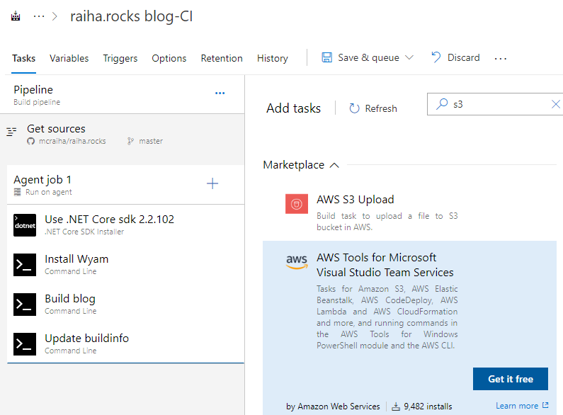
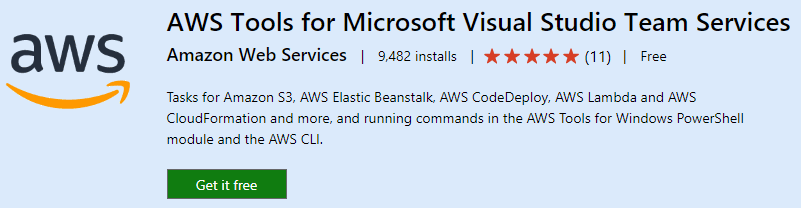
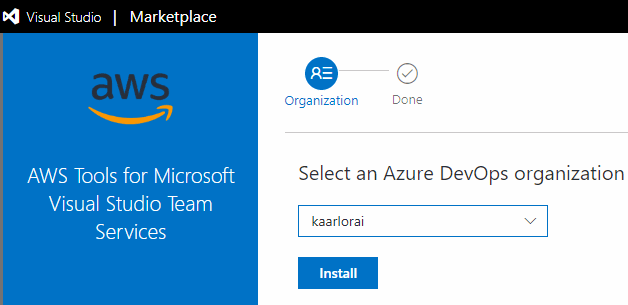
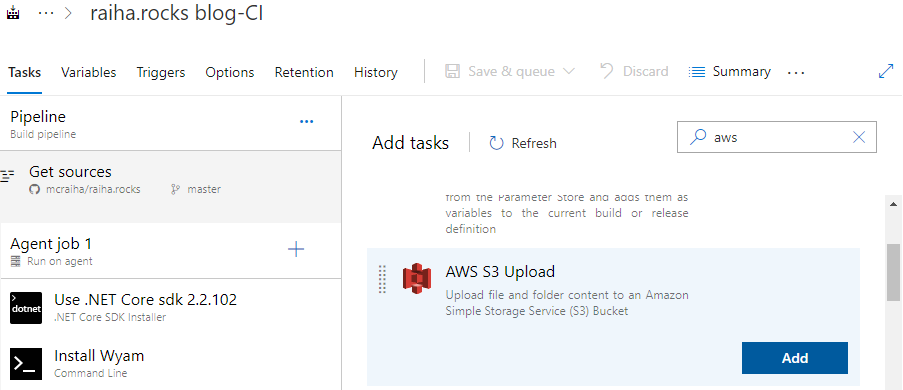
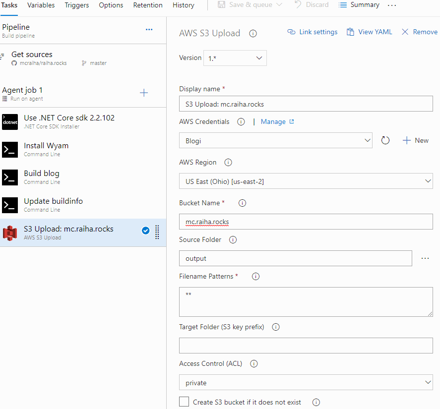

Title: Azure DevOps ja sisällön siirto AWS S3:een
Tags: 
  - staattiset sivut
  - Azure DevOps
  - automatisointi
  - S3
---
## Yleistä löpinää
[Edellisellä kerralla](/posts/Staattisten_sivujen_generointi_Azure_Devops.html) kävin läpi automatisointiputkea, jossa staattiset webbisivut rakennetaan kuntoon Azure DevOpsin avulla. Nyt jatkamme putken virittelyä lisäämällä siihen sisällön automaattisen siirron Amazonin S3:een.

Kuten nokkelimmat osaavat arvata, ei varsinaista tekemistä ole kauheasti, sillä Azure DevOps tarjoaa valmiina erilaisia AWS-integrointeja, joiden avulla monet askareet saa automatisoitua vaivattomasti.

## Asetukset

Pähkinänkuoressa homma menee seuraavasti: 

- Tehdään AWS:n paneelin kautta uusi [IAM](https://aws.amazon.com/iam/)-tunnus, jolle annetaan oikeudet siirtää tiedostoja olemassa olevaan S3 buckettiin
- Aennetaan AWS-lisäosa Azure DevOpsiin ja lisätään siirron tekevä task
- Kokeillaan, että homma toimii

IAM-tunnus saattaa aluksi tuntua vähän erikoiselta, mutta niiden käyttö on suositeltavaa tietoturvan takia. Kun IAM-tilille antaa erittäin rajoittavat oikeudet, eivät potentiaaliset hyökkääjät voi väärinkäyttää sellaisia käyttäjätunnuksia kovinkaan helposti, jos käyttäjätunnukset päätyvät esim. tietomurron takia vääriin käsiin.

Kun IAM-tunnus on tehty, kannattaa varmistaa, että tiedostojen siirto niiden avulla varmasti onnistuu haluttuun S3 buckettiin. Sen voi tarkistaa esim. graafisella [Cyberduck](https://cyberduck.io/)-ohjemalla tai komentoriviltä [AWS CLI](https://docs.aws.amazon.com/AmazonS3/latest/dev/example-walkthroughs-managing-access-example1.html#grant-permissions-to-user-in-your-account-test):llä.

Azure DevOpsin osalta aloitetaan työskentely asentamalla AWS-laajennos omaan organisaatioon (olettaen siis, ettei sitä ole vielä asennettu). Ensimmäinen vaihe on **AWS Tools for Microsoft Visual Studio Team Services** -laajennuksen etsiminen, ja **Get it free** -napin painaminen.

Tämän jälkeen aukeaa varsinainen Marketplace-sivu, josta valitaan jälleen **Get it free** -nappi. 

Ja seuraavaksi valitaan mille organisaatiolle laajennus halutaan asentaa. Tavallisen käyttäjän kohdalla organisaatioita on tavallisesti valittavissa vain yksi.

Asennuksen jälkeen palataan Azure DevOpsin projektiin ja sen Builds-osioon, jonne voidaan nyt lisätä uusi task S3 uploadille. Jos uusia AWS-lisäyksiä ei näy Azure DevOpsin valikoissa, kannattaa selaimessa ajaa **Shift+F5**, jotta Azure DevOpsin näkymä varmasti päivittyy.

Taskiin pitää lisätä seuraavat tiedot:
- AWS Credentials -kohtaan lisätään **New**-napilla käytetyn IAM-tunnuksen tiedot (samaa IAM-asetusta voi jatkossa käyttää muissa vastaavissa tehtävissä)
- AWS Region -kohtaan valitaan se Region, jossa S3 bucket on
- Bucket Name -kohtaan valitaan sen bucketin nimi, jonne tiedostot halutaan lähettää
- Source Folder -kohtaan valitaan tässä tapauksessa *output*, koska WYAM generoi oletuksena staattiset sivut kyseiseen hakemistoon
- Access Control (ACL) -kohtaan otetaan private -valinta, koska bucketin oma asetus pitää huolen siitä, että tiedostoihin päästään käsiksi HTTP/HTTPS:n ylitse

Sitten vain **Save & queue** -valinta ylhäältä, ja toivottavasti blogin sisältö päivittyi onnistuneesti

👍