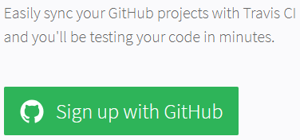
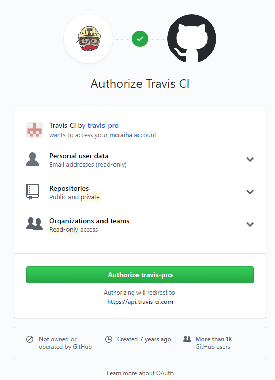
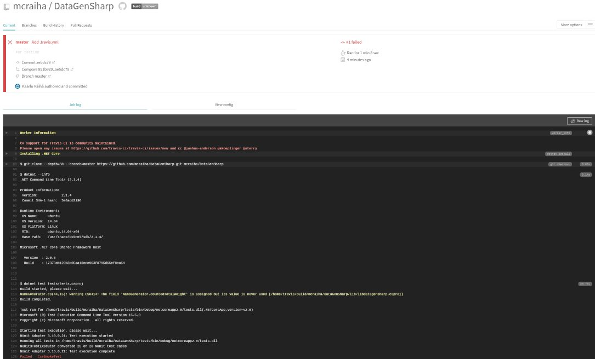
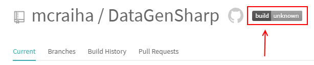
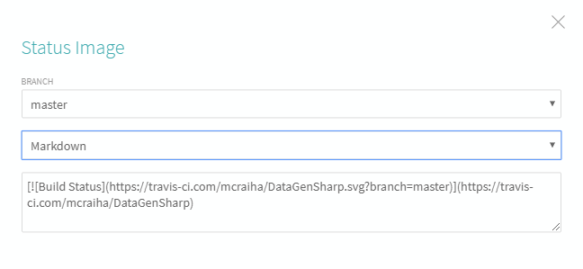
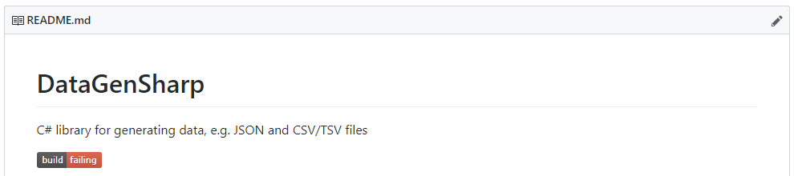

Title: Yksikkötestauksen automatisointi GitHubin ja Travis CI:n avulla
Tags: 
  - yksikkötestaus
  - GitHub
  - Travis CI
---
# Yksikkötestauksen automatisointi .NET Core -projekteissa

Kun yksikkötestit on saatu mukaan ohjelmistoprojektiin, kannattaa seuraavaksi suunnitella yksikkötestauksen automatisointia, jotta testitapausten suorittaminen ei jää pelkästään ihmisten vastuulle.

Yksikkötestien automaattinen suorittaminen kannattaa yleensä sitoa kiinni versionhallintaan, jolloin kehittäjien tekemät muutokset projektiin käynnistävät yksikkötestauksen. Tällöin kehityskäytäntöjä voidaan muuttaa jatkuvan integraation (englanniksi **continuous integration**) suuntaan.

Alla esittelen yhden tavan (muita luvassa seuraavissa blogikirjoituksissa), jolla .NET Core -projekteissa toteutettujen yksikkötestitapausten suoritus voidaan automatisoida. Tässä tapauksessa ei ole väliä, että ovatko yksikkötestitapaukset toteutettu esim. [NUnit](https://nunit.org/)illa, [xUnit](https://xunit.github.io/)illa vai [MSTest](https://docs.microsoft.com/en-us/dotnet/core/testing/unit-testing-with-mstest)illä, koska kaikki testitapaukset suoritetaan oletuksena samalla *dotnet test* -komennolla.

Tässä kirjoituksessa esitetty tapa ei ole ainoa, vaan tarjolla on myös muita ratkaisuja, joihin kannattaa tutusta ennen kuin omassa ohjelmistoprojektissa tekee päätöksiä testausautomaation käyttöönotosta. Erilaisia ratkaisuja voi myös käyttää rinnakkain, ja tarvittaessa testauksen suorituksen voi siirtää toiseen palveluun projektin edistyessä.

## GitHub ja Travis CI

Jos ohjelmistoprojektin lähdekoodit ovat [GitHub](https://github.com/)issa, on testitapausten automaattinen suorittaminen helppo toteuttaa [Travis CI](https://travis-ci.org/)-palvelun avulla. Yksinkertaistettuna Travis CI saa viestin GitHubista, kun projektiin tehdään muutoksia, ja muutosten jälkeen Travis CI lataa GitHubista projektin lähdekoodit virtuaalikoneelle ja suorittaa sitten halutut toiminnot lähdekoodeille, kuten esim. yksikkötestien suorittamisen.

Travis CI on ilmainen avoimen lähdekoodin projekteille, ja muun tyyppisten projektien osalta [hinnoittelu](https://travis-ci.com/plans) alkaa 69 dollarista per kuukausi.

GitHubin ja Travis CI:n yhteistyö toimii myös [pull request](https://help.github.com/articles/about-pull-requests/)ien osalta, jolloin Travis CI:n suorittamien toimintojen lopputulos näkyy osana pull requestia. Tämä helpottaa muutosten katselmointia, koska katselmoijan ei tarvitse suorittaa esim. yksikkötestejä omalla koneellaan, vaan testien etenemisen ja lopputuloksen näkee suoraan selaimella.

### Travis CI:n käyttöönotto

Aluksi Travis CI -palveluun pitää luoda tili. Erillisiä kirjautumistietoja ei kuitenkaan tarvita, vaan palveluun kirjaudutaan suoraan olemassa olevilla GitHub-tunnuksilla.






Rekisteröinnin jälkeen valitaan omien GitHub-projektien tarjonnasta se projekti, jossa halutaan hyödyntää Travis CI:tä. Kyseiseen projektiin pitää lisätä **.travis.yml**-tekstitiedosto, jonka avulla Travis CI osaa sitten suorittaa tarvittavat operaatiot. Alla on yksinkertainen esimerkki .travis.yml-tiedostosta, joka suorittaa **tests**-kansiosta löytyvän **tests.csproj**-projektitiedoston mukaiset yksikkötestit.

```yaml
language: csharp
mono: none
dotnet: 2.1.4
script:
  - dotnet test tests/tests.csproj
``` 

Kun oma .travis.yml-tiedosto on lisätty kyseisen projektin GitHub-versionhallintaan ongelmitta, pitäisi Travis CI:n käynnistää yksikkötestien suorittaminen automaattisesti.
[](../images/travis_04.png)

Jatkossa yksikkötestit suoritetaan automaattisesti, kun projektin GitHubissa olevaan master-haaraan kommitoidaan muutoksia. Myös sellaiset muutokset, jotka eivät sisällä koodimuutoksia (esim. dokumentaation muokkaus) käynnistävät yksikkötestien suorituksen.

### Travis CI:n tulosten näyttäminen muille

Kun Travis CI on otettu käyttoon, voi yksikkötestien suorituksesta tulevan login sisällyttää vaikkapa kyseisen ohjelmistoprojektin **readme.md**-tiedostoon. Tämä tapahtuu valitsemalla haluttu projekti Travis CI:n sivuilta, ja klikkaamalla **build unknown** kuvaa



ja valitsemalla aukeavan valikon toisesta pudotusvalikosta Markdown-valinnan. Tämän jälkeen alla olevasta tekstikentästä voi kopioida kuvan ja linkin sisältävän Markdown-elementin omaan readme.md-tiedostoon



Ja lopputulos on suunnilleen seuraavan näköinen, kun se on lisätty GitHubissa olevaan readme.md-tiedostoon



👍