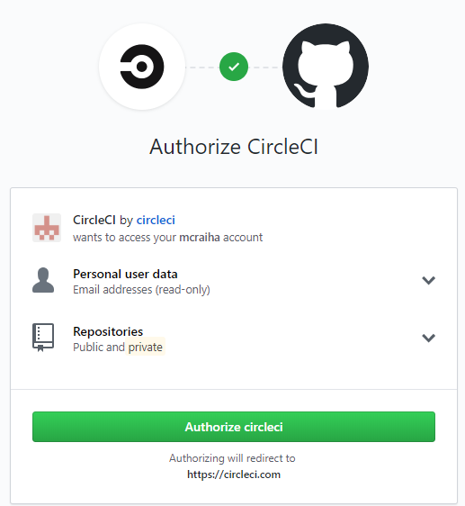
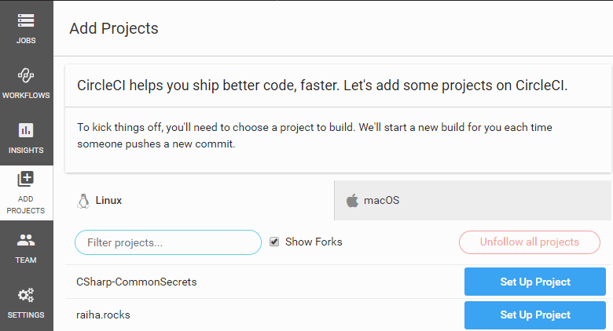
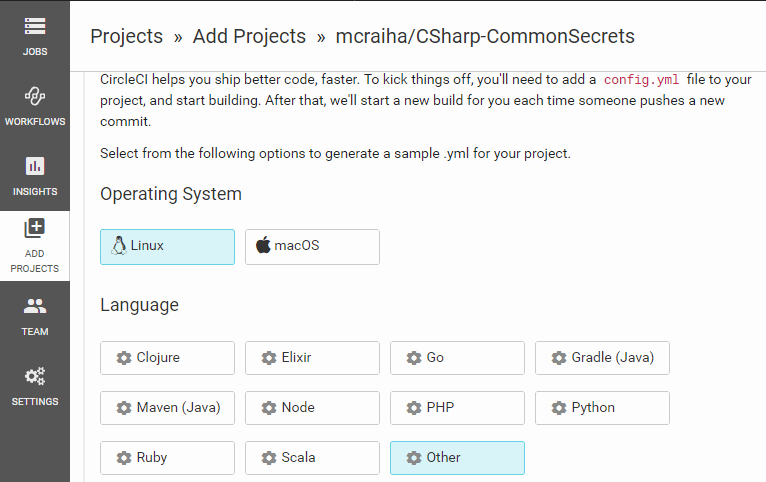
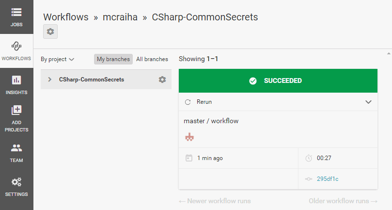
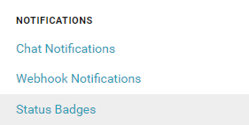
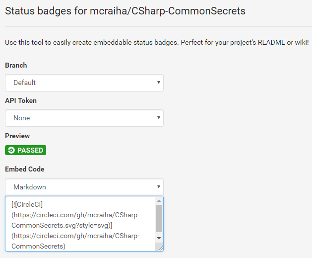
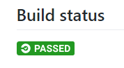

Title: Yksikkötestauksen automatisointi GitHubin ja CircleCI:n avulla
Tags: 
  - yksikkötestaus
  - GitHub
  - CircleCI
---
Kolmisen viikkoa sitten [kirjoitin](/posts/GitHub_ja_Travis_CI.html) miten yksikkötestausta voi automatisoida GitHubin ja Travis CI:n avulla. Tällä kertaa vuorossa on sama käytäntö GitHubin ja [CircleCI](https://circleci.com):n kanssa.

## Travis CI:n ja CircleCI:n erot

Travis on aloittelijoille todennäköisesti helpompi vaihtoehto, koska siinä pohjat ovat valmiiksi määritettyjä, jolloin helpoimmillaan tarvitaan vain muutaman rivin asetustiedosto. Tämän jälkeen testitapaukset suoritetaan automaattisesti, ja projektinhallinassa näkyvät vihreät lätkät pitävät verenpaineen alhaisena.

Joissakin tilanteissa Travisin tarjoamat valmiit pohjat eivät kuitenkaan ole riittäviä, jolloin kannattaa kokeilla CircleCI:tä. Suurin ero näiden kahden palvelun välillä tekniikan osalta on se, että CircleCI:ssä kaikki suorittaminen rakentuu [Docker](https://en.wikipedia.org/wiki/Docker_(software))-konttien päälle.

Dockerin myötä myös monimutkaisempia testaus- ja julkaisujärjestelmiä on mahdollista rakentaa ja ylläpitää järkevästi yhdistelemällä erilaisia kontteja ja asetuksia. Jos omassa ohjelmistoprojektissa on jo Docker käytössä, ei CircleCI:n käyttöönotto ole vaikeaa.

### CircleCI:n hinnoittelu

Avoimen lähdekoodin projekteille CircleCI on monien muiden palveluiden tapaan [täysin ilmainen](https://circleci.com/open-source/). [Kaupallisella puolella](https://circleci.com/pricing/usage/) on myös tarjolla ilmainen Free-taso, jossa käyttöön saa yhden Linux-koneen tietyillä rajoituksilla. Suuremmille yrityksille hinnoittelu lähtee 8 dollarista kuukaudessa kehittäjää kohden.

### CircleCI:n käyttöönotto

Kuten monissa muissakin palveluissa, aloitetaan CircleCI:n käyttöönotto rekisteröitymällä palveluun.

Tälläkin kertaa käytetään rekisteröitymiseen GitHub-tunnuksia.


ja CircleCI:lle annetaan lupa lukea ja muokata halutun käyttäjätunnuksen alta löytyviä GitHub-projekteja



Tämän jälkeen päästään käsiksi CircleCI:n tarjoamiin toimintoihin. Koska kyseessä on täysin uusi projekti (ja täysin uusi käyttäjä CircleCI-palvelussa), käytetään **Set Up New Project** -nappia, jolla päästään eteenpäin.


Aukeavasta **Add project** -osiosta valitaan se GitHub-projekti, johon CircleCI halutaan ottaa käyttöön. Valinta tapahtuu halutun projektin kohdalla olevalla **Set Up Project** -napilla.



Valitettavasti CircleCI ei tarjoa valmista pohjaa C#-projekteille, mutta koska kyseessä on Docker-pohjainen ratkaisu, ei sellaisen luominen vaadi kovin [paljoa työtä](https://maarten.mulders.it/blog/2018/04/building-aspnetcore-with-circleci.html). 



Eli käytännössä valitaan käytettävä Docker-image, ja annetaan ajettavat komennot. Omalla kohdalla lopputuloksena on yksinkertainen kahdeksasta rivistä koostuva *config.yml*-tiedosto

```yaml
version: 2
jobs:
  build:
    docker:
      - image: microsoft/dotnet:2.2-sdk
    steps:
      - checkout
      - run: dotnet test tests/tests.csproj
``` 

* *Image*-kohta kertoo käytettävän imagen, joka on tässä tapauksessa Microsoftin oma virallinen julkaisu Dotnet Coren 2.2-versiolle. SDK-julkaisu mahdollistaa koodin kääntämisen, joka on tämän projektin osalta vaatimus testitapauksien suorittamiselle
* *Steps*-osion **checkout**-kohta suorittaa lähdekooditiedostojen lataamisen GitHubista 
* *Steps*-osion jälkimmäinen kohta suorittaa puolestaa **dotnet test** -komennon testitapausten suorittamista varten

Kyseinen tiedosto laitetaan projektissa **.circleci**-kansioon, jolloin lopullinen polku tiedostolle on **.circleci/config.yml**. Windowsin oman tiedostonhallinnan kanssa kansiota luotaessa on käytettävä nimeä *.circleci.* , jotta [kansion luominen onnistuu](https://superuser.com/questions/64471/create-rename-a-file-folder-that-begins-with-a-dot-in-windows).

Kun tiedosto on paikallaan, kommitoidaan se versionhallintaan ja työnnetään GitHubiin. Sitten painetaan CircleCI:ssä olevaa **Start building** -nappia.


Ja jos operaatio onnistui, on lopputuloksena suunnilleen seuraavalta näyttävä ilmestys



### CircleCI:n tulosten näyttäminen muille

Kun CircleCI on otettu käyttoon, voi testien suorituksesta tulevan login sisällyttää vaikkapa kyseisen ohjelmistoprojektin **readme.md**-tiedostoon. Tämä tapahtuu valitsemalla haluttu projekti CircleCI:n sivuilta, ja klikkaamalla **Settings**-osion alta löytyvää **Notifications**-kohdan **Status Badges** -valintaa.



Ja **Embed Code** -kohdasta voi kopioida suoraan Markdown-yhteensopivan lätkän haluttuun .md-tiedostoon



Lopputulos näyttää GitHubissa seuraavanlaiselta



👍