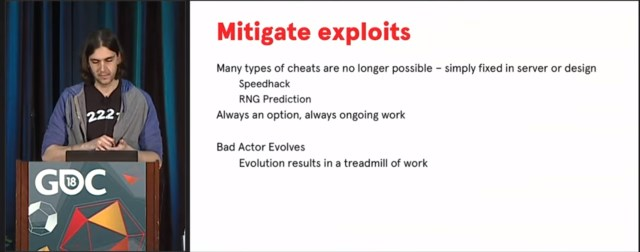

Title: Satunnaisluvut peleissä osa 2.
Tags: 
  - Satunnaisluvut
  - Pelit
  - RNG
---
# Milloin ja missä satunnaisluvut kannattaa generoida

Kun peleissä tarvitaan [satunnaislukuja](https://fi.wikipedia.org/wiki/Satunnaisluku), tulee yleensä ajankohtaiseksi miettiä milloin satunnaisluvut generoidaan, ja missä ne generoidaan. Vaihtoehtoina ovat mm. satunnaislukujen generointi palvelimella ennakkoon vs. asiakkaan päässä tarpeen mukaan.

[Näennäissatunnaislukugeneraattorit](https://fi.wikipedia.org/wiki/N%C3%A4enn%C3%A4issatunnaislukugeneraattori) ovat nykyisillä suorittimilla [niin nopeita](http://www.pcg-random.org/figures/Microbench-Annotated.png), ettei satunnaislukuja kannata laskennallisen suorituskyvyn takia generoida ennakkoon. Suorituskyvyn ohella mietinnässä voi olla kuitenkin muitakin tekijöitä, joten käyn alla läpi yleisimmät vaihtoehdot.

## Peli generoi satunnaisluvut itse

Yleensä helpointa on alustaa satunnaislukugeneraattori jollain alkutilalla ja pyytää siltä satunnaislukuja tarpeen mukaan. Peleissä ongelmaksi tulee kuitenkin tällaisessa tilanteessa huijaamisen mahdollisuus, sillä täysin ennalta arvattavien lukujen jatkuva tuottaminen voi johtaa tilanteeseen, jossa pelaaja tietää tarkalleen mitä tulee tapahtumaan, ja pystyy näin hallitsemaan pelin tapahtumia tai ainakin kääntämään tilanteen hänen edukseen.

Huijaamisen kannalta pahimmassa tapauksessa pelaaja voi myös kontrolloida satunnaislukugeneraattoria erinäisin tavoin (esimerkiksi [laitteen kelloa](https://www.reddit.com/r/Minesweeper/comments/46o7jd/minesweeper_rng_manipulation/) säätämällä), jolloin se tuottaa pelaajalle esim. enemmän hyviä numeroita tai halutun alkutilanteen.

Paras esimerkki hallittavien satunnaislukujen ongelmasta on nähtävissä vuoden 2018 **Awesome Games Done Quick** -tapahtumassa, jossa NES-konsolin **Dragon Warrior** -peli läpäistiin alle 30 minuutissa hyödyntämällä pelin ennakoitavaa satunnaislukugeneraattoria

  
(YouTube aukeaa klikkaamalla yllä olevaa kuvaa)

## Palvelin antaa satunnaislukugeneraattorin alkutilan pelille

Tämä taktiikka on käytössä monessa asynkronisessa mobiilipelissä, jossa esim. taistelun alussa palvelin kertoo millä satunnaislukugeneraattorin ja pelin alkutilalla lähdetään liikkeelle. Taistelun jälkeen peli lähettää palvelimelle takaisin tehdyt siirrot, jolloin palvelin voi nopeasti tarkistaa, että pelaaja pelasi sääntöjen mukaisesti. Kun palvelin lähettää asiakkaalle vain vähän dataa, voi yksi palvelin palvella useampaa pelaajaa, kun internet-yhteyden nopeus ei muodostu pullonkaulaksi.

Valitettavasti myös tässä tapauksessa pelaaja voi ennakoida pelin tapahtumia, koska pelin ja satunnaislukugeneraattorin alkutilat ovat pelaajan tiedossa. Asynkronisissa peleissä on yleensä käytössä aikaraja, jonka puitteissa pelaajan pitää lähettää esim. hyökkäyksen lopputulos takaisin palvelimelle. Tämän aikarajan puitteissa pelaaja voisi ajaa esim. taistelusimulaattoria, joka kävisi läpi taistelun kannalta erilaisia taktiikoita, ja poimisi niiden joukosta pelaajan kannalta (nopein voitto, vähiten käytettyjä resursseja tai muu vastaava) parhaan lopputuloksen.

Vastaavasti esim. reaaliaikaisessa pelissä pelaaja voisi ennakoida seuraavan ammuksen lentoradan paremmin, jos hän tietää millaisen satunnaisluvun peli hänelle antaa seuraavaksi.

  
(YouTube aukeaa klikkaamalla yllä olevaa kuvaa)

## Palvelin generoi pelille kaikki tarvittavat luvut

Kun satunnaislukujen generointi tapahtuu palvelimella, on pelaajien hankalampi huijata peleissä. Esimerkiksi useamman pelaajan pokeripelissä on tärkeää, että pelaajat eivät voi tietää pelin alkutilanteesta [millaiset kortit](http://investigations.nbcnews.com/_news/2012/01/20/10194014-poker-players-sue-to-get-to-the-bottom-of-online-cheating-scheme) muut pelaajat ovat saaneet, ja millaisia kortteja pakasta on vielä tulossa. 

Mutta tietyissä tilanteissa on myös tärkeää ettei peli arvo tulevia satunnaislukuja liian aikaisin, koska tällaisessa tilanteessa vaikkapa palvelimen ylläpitäjä voisi väärinkäyttää tietojaan pelitilanteesta saadakseen itselleen etua pelissä.

Huijaamisen hankaloittamiseksi samaa satunnaislukugeneraattorin instanssia voi hyödyntää vaikkapa useammassa eri pelihuoneessa, jolloin pelaajan on hankalampi yrittää hallita tulevia satunnaislukuja (tai saada selville satunnaislukugeneraattorin alkutilaa), koska satunnaislukujen pyytäjiä on useampia.

Satunnaislukujen jatkuva siirtäminen palvelimelta pelaajalle asettaa kuitenkin tiettyjä vaatimuksia internet-yhteydelle (koska pelin pitää pyytää uusia lukuja ja palvelimen pitää antaa niitä), joten tämä toteutustapa ei välttämättä sovi kaikkiin tilanteisiin.

🎲