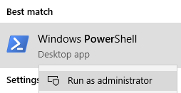
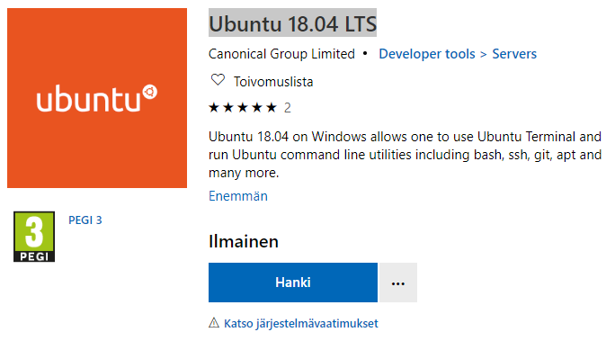
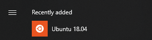
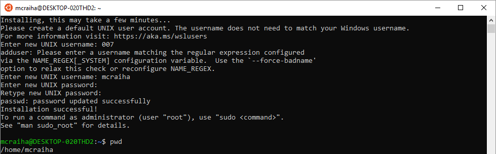
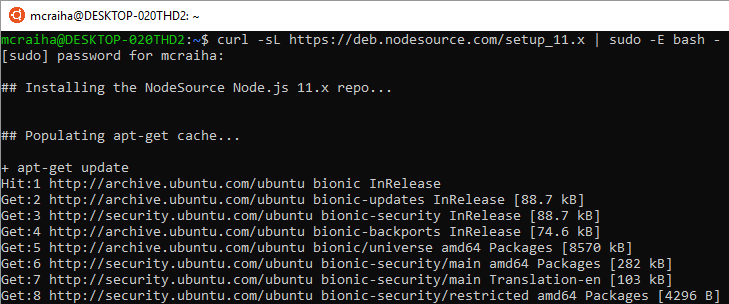
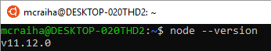
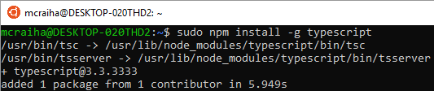
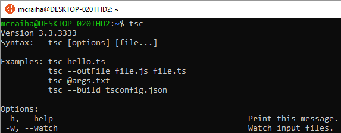

Title: Node.js asennus Windows 10:n Ubuntulle
Tags: 
  - Node.js
  - Windows 10
  - WSL
  - Ubuntu
---
Tässä kirjoituksessa käyn lyhyesti läpi kuinka [Node.js](https://nodejs.org/en/) asennetaan, kun käytössä on Windows 10:n tarjoama [Windows Subsystem for Linux](https://docs.microsoft.com/en-us/windows/wsl/about) -ominaisuus (kavereiden kesken vain WSL), joka mahdollista Linux-käyttöjärjestelmille suunnattujen ohjelmien suorituksen Windowsissa.

Tässä kohtaa joku saattaa miettiä, että miksi Node.js pitäisi asentaa WSL:n kautta, kun saatavilla on myös Windows 10 -versio. Perusteluna voisi olla esim. monissa Linuxeissa hyvin tuettu [Bash](https://fi.wikipedia.org/wiki/Bash)-komentotulkki, jonka päälle rakennetut skriptit toimivat yleensä paremmin Linux-ympäristöissä.

## Windows Subsystem for Linuxin eli WSL:n käyttöönotto

Windows 10:n kanssa WSL pitää ottaa erikseen käyttöön. [Tämä tapahtuu](https://docs.microsoft.com/en-us/windows/wsl/install-win10) käynnistämällä **PowerShell** -komentokehoitteen *Admin*-oikeuksilla,  
  
ja antamalla siihen seuraavan komennon

```powershell
Enable-WindowsOptionalFeature -Online -FeatureName Microsoft-Windows-Subsystem-Linux
```

Kun komento on suoritettu onnistuneesti, pitää Windows 10 käynnistää kerran uudestaan, jotta WSL aktivoituu.

## Halutun Linuxin asennus Microsoft Storesta

Kun WSL on otettu käyttöön, voidaan haluttu Linux-jakelu asentaa suoraan [Microsoft Store](https://www.microsoft.com/fi-fi/store/b/home)sta. Oma valintani oli [Ubuntu 18.04 LTS](https://www.microsoft.com/fi-fi/p/ubuntu-1804-lts/9n9tngvndl3q?activetab=pivot:overviewtab), jonka saa luonnollisesti ilmaiseksi painamalla aluksi **Hanki**-nappia ja sen jälkeen **Asenna**-nappia



Asennuksen jälkeen Ubuntu löytyy Windows 10:n käynnistysvalikosta, josta sen voi käynnistää  



Ensimmäisellä käynnistyskerralla kannattaa varautua muutamien minuuttien odotukseen, kun järjestelmä viimeistelee asennuksensa. Tämän jälkeen luodaan uusi käyttäjätili Linuxiin, ja luonnollisesti oman käyttäjätunnuksen ja salasanan saa valita itse (mutta käyttäjätunnukseksi eivät kelpaa pelkät numerot).



## Node.js asennus

Ubuntun kohdalla Node.js:lle on tarjolla valmiit asennusskriptit, joiden viimeisimmät versiot löytyvät [Nodesource](https://github.com/nodesource/distributions/blob/master/README.md#debinstall)-listauksesta. Itsellä oli tarvetta Node.js:n 11-versiolle, joten asennus onnistui seuraavilla komennoilla

```bash
curl -sL https://deb.nodesource.com/setup_11.x | sudo -E bash -
sudo apt-get install -y nodejs
```



Ensimmäisen komennon kohdalla kysytään käyttäjän salasanaa, koska skiptin suorittaminen, ja Node.js:n asennus vaativat pääkäyttäjän oikeudet. Muutaman minuutin odottelun jälkeen Node.js:n pitäisi olla asennettuna, ja asennuksen onnistumisen voi testata vaivattomasti seuraavalla komennolla

```bash
node --version
```



## Typescriptin asennus npm:n avulla

Kun Node.js on saatu asennettua, tulee usein tarpeelliseksi asentaa muita [npm](https://en.wikipedia.org/wiki/Npm_(software))-pakettienhallinnan tarjoamia paketteja. WSL + Ubuntu -yhdistelmän kanssa globaalit pakettienasennukset vaativat pääkäyttäjän oikeudet. Muussa tapauksessa tarjolla on yleensä *"npm WARN checkPermissions Missing write access to /usr/lib/node_modules"* -tyyppinen virheilmoitus

Täten esim. Typescriptin asennus onnistuu seuraavalla komennolla
```bash
sudo npm install -g typescript
```



ja asennuksen onnistumisen voi testata komennolla
```bash
tsc
```



👍