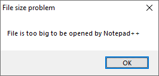
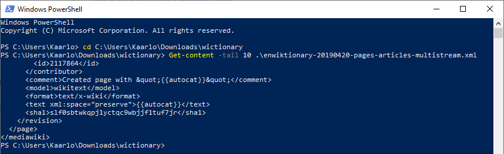
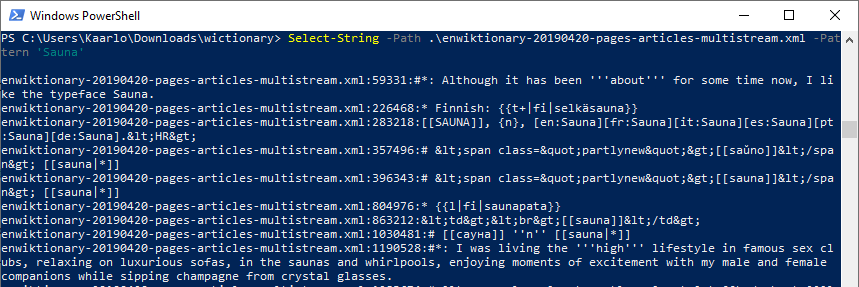
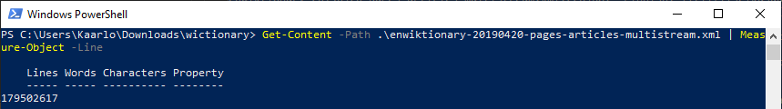

Title: Suuret XML-tiedostot (ja kuinka päätät ystävyyden)
Tags: 
  - XML
  - Tekstieditori
---
Jossain vaiheessa elämää koettaa yleensä hetki, jolloin miettii itsekseen, että ovatko kaikki ystävät vaivansa arvoisia. Varsinkin, jos ystävältä vastaanottaa seuraavanlaisen sähköpostin:

> Hei, mulla olisi tässä kolmen gigatavun kokoinen XML-tiedosto, jota pitäisi hieman muokata, olisiko sulla aikaa auttaa?

## Suuret XML-tiedostot

Jotta en loukkaa ystävääni, en käsittele tässä jutussa hänen XML-tiedostoaan. Valitettavasti ystäväni ei ole ainoa taho tässä maailmassa, joka on joutunut tutustumaan massiivisiin XML-tiedostoihin, joten esimerkkinä tässä tapauksessa on [Wiktionary](https://www.wiktionary.org/)-palvelun [englannikielinen artikkelitiedosto](https://dumps.wikimedia.org/enwiktionary/20190420/), jolla on huhtikuussa (vuonna 2019) kokoa 5 912 141 984 tavua, eli lähemmäs 6 gigatavua.

Ensimmäinen asia, **ÄLKÄÄ KOSKAAN ITSE TUOTTAKO TUOLLAISIA TIEDOSTOJA!** Ja jos joudutte mukaan projektiin, jossa pyöritellään yli 100 megatavun kokoisia XML-tiedostoja niin korjatkaa tilanne heti tai poistukaa paikalta mahdollisimman nopeasti.

Koska XML-data pakkaantuu yleensä hyvin niin monessa tapauksessa hätäratkaisuna on XML-tiedoston pakkaaminen (vaikkapa .zip-formaattiin), jolloin käsiinsä saa pienemmän tiedoston. Pienentynyt tiedostokoko ei tässä tapauksessa ole kuitenkaan tie onneen, vaan tällaisen tiedoston käsittely on aiempaa hankalampaa, koska tiedosto pitää käytännössä purkaa ennen käsittelyä, ja tarvittaessa pakata uudelleen käsittelyn jälkeen.

### Tekstieditorit

Useimmat tekstieditorit eivät pysty käsittelemään suuria tekstitiedostoja, vaan ne joko kaatuvat, jäävät ikuiseen lataussilmukkaan tai antavat suoraan virheen, ja lopettavat tiedoston lataamisen.



Ja vaikka tekstieditori tukisi suuria tekstitiedostoja, voi ongelmia aiheuttaa tekstieditorin sisäänrakennettu XML-jäsennin, joka koettaa itsepäisesti jäsennellä gigatavujen kokoista XML:ää, vaikka mitään takeita tämän kokoluokan XML-tiedostojen jäsentämisestä ei ole.

Ja vaikka tiedoston saisi lopulta auki XML-jäsennettynä, voi yhden merkin muokkaaminen aiheuttaa merkittävän hidastumisen tai ohjelman kaatumisen. Ongelmia saattaa esiintyä lisäksi vaikkapa tekstin vierittämisen tai hakutoimintojen kanssa, jolloin yksinkertainenkin toiminto voi viedä minuutteja aikaa.

**Lp;el** tekstieditorit kannattaa unohtaa suurten XML-tiedostojen kanssa.

### Käsittely komentorivityökaluilla

#### Alku ja loppu
Unix-maailmasta tutut [head](https://linux.fi/wiki/Head)- ja [tail](https://linux.fi/wiki/Tail)-komennot ovat hyvä tapa tarkistaa mitä tiedoston alusta ja lopusta löytyy. Jos käytössä on Windows, voi vastaavan operaation suorittaa **PowerShell**in avulla käyttämällä `Get-content` -käskyä

```powershell
Get-content -tail 10 .\enwiktionary-20190420-pages-articles-multistream.xml
```



#### Tiettyjen sanojen etsiminen
Unix-maailmassa tiedoston sisällöstä sopivien kohtien etsimiseen tarjolla on mm. [grep](https://linux.fi/wiki/Grep), ja Windows-puolella voi vastaavaa tehdä PowerShellin `Select-String` -käskyllä

```powershell
Select-String -Path .\enwiktionary-20190420-pages-articles-multistream.xml -Pattern 'Sauna'
```



#### Rivien laskeminen
Unix-maailmassa tekstitiedoston rivien määrän voi laskea `wc -l` -komennolla, ja synkässä PowerShell-rinnakkaisuniversumissa kuolleet herättävä loitsu on puolestaan. 

```powershell
Get-Content -Path .\enwiktionary-20190420-pages-articles-multistream.xml | Measure-Object -Line
```



Valitettavasti tämä PowerShell-komento tukehtuu massiivisten rivimäärien alla (tässä tapauksesa päälle 179 miljoonaa tekstiriviä), ja yllä olevan esimerkin ajaminen vie minuuttikaupalla aikaa.

### Käsittely koodissa

Ohjelmoinnin osalta ongelmia on myös luvassa, koska suuren XML-rakenteen muuttaminen esim. olioksi sattaa tuottaa tutun *out of memory* -virheilmoituksen. Onneksi monissa ohjelmointikielissä on tarjolla kirjastoja, jotka eivät lataa ja jäsennä koko XML-rakennetta kerralla, vaan koodissa voi itse valita mitkä osat haluaa käsitellä. C#:n osalta kyseinen toteutus on [XmlReader](https://docs.microsoft.com/en-us/dotnet/api/system.xml.xmlreader?view=netframework-4.8)-luokka, joka kuuluu .NET Frameworkin vakiokomponentteihin.

XmlReaderin avulla on helppo poimia XML-tiedostosta vain halutut osat, ja jatkokäsitellä niitä haluamallaan tavalla. Käytännössä tämä tapahtuu lukemalla XML-tiedostosta löytyviä elementtejä niin kauan kunnes haluttu osuma löytyy (tai kun tiedostossa ei ole enää mitään luettavaa).

Vaikkapa siis
```cs
using (XmlReader reader = XmlReader.Create("haluttu_tiedosto.xml"))
{
  while (reader.Read())
  {
    if (reader.NodeType == XmlNodeType.Element && reader.Name == "EtsittyElementti")
    {
      teeJotain();
    }
  }
}
```

XmlReaderin kanssa kannattaa kuitenkin huomata muutama rajoite, kuten se, että XmlReader pystyy lukemaan vain eteenpäin, jolloin esim. löydetyn elementin kohdalla ei voi suoraan palata edelliseen elementtiin.

## Muut vastaavat ongelmat

XML ei luonnollisesti ole ainoa formaatti, jossa suuret tiedostot aiheuttavat ongelmia. Vastaavaa voi käydä vaikkapa .csv- ja .json-tiedostojen kanssa, jos ongelmaa ei tiedosteta tai siihen ei puututa ajoissa. Joten pidetään kaikki yhdessä huolta siitä, että *"Kukaan ei luo massiivisia tekstitiedostoja, ei edes HR-osaston Risto"*

📝