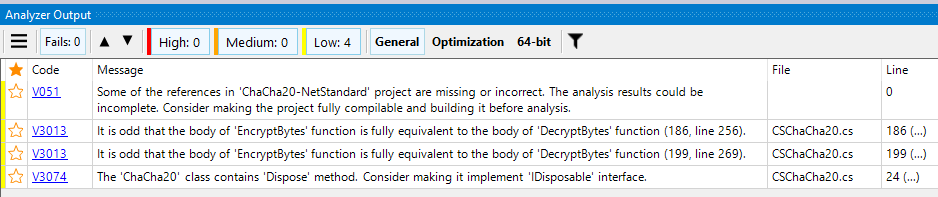

Title: C#-koodin staattinen analysointi
Tags: 
  - C#
  - Staattinen analysointi
  - PVS-Studio
---
## Yleistä höpinää

[Lähdekoodin analysointi](https://fi.wikipedia.org/wiki/L%C3%A4hdekoodin_analysointi) ohjelmallisesti on ollut mukana monessa kehitysympäristössä jo pidemmän aikaa. Kehittäjille kerrotaan yleensä koodia kirjoittaessa, tai käännösaikana runsaasti tietoja siitä, että mitkä ohjelmakoodin kohdat eivät täytä tiettyjä vaatimuksia tai kuinka koodia voisi parantaa.

Kehitysympäristöjen mukana tulevien ratkaisujen lisäksi markkinoilla on toimijoita, jotka tarjoavat hieman monipuolisempia työkaluja lähdekoodien analysointiin. Yksi näistä toimijoista on Venäjältä ponnistava [OOO "Program Verification Systems"](https://www.viva64.com), joka tarjoaa maksullista [PVS-Studio](https://www.viva64.com/en/pvs-studio/)-työkalua lähdekoodin staattiseen analysointiin.

## PVS-Studio

PVS-Studio on tarkoitettu ensisijaisesti Windows-ympäristössä käytettäväksi, ja se osaa analysoida mm. C-, C++ -, Java- ja C#-ohjelmointikielillä toteutettuja projekteja. Windows-puolella tarjolla on mm. **Visual Studio** -integraatio ja erilaisia UI-työkaluja raporttien katseluun. [Viime viikolla](https://www.viva64.com/en/m/0010/) PVS-Studio sai kuitenkin tuen myös .NET Core -projekteille, joten ohjelmaa on nyt mahdollista käyttää aiempaa laajemmin esim. CI-automatisoinnissa.

Windowsin ohella komentorivityökaluja on saatavilla Linux- ja Mac OS -ympäristöihin, joten PVS-Studiota voi käyttää myös näillä alustoilla, vaikkakin kaikki Windows-puolelta löytyvät ominaisuudet eivät ole mukana.

Hinnoitelu on valitettavasti *"ole meihin yhteydessä"* -mallia, ja yksittäisille kehittäjille lisenssejä [ei myydä](https://www.viva64.com/en/single-user/) laisinkaan, koska ohjelma on kehittäjiensä mukaan tarkoitettu suuremmille kehittäjäorganisaatioille. Avoimen lähdekoodin projekteihin on onneksi tarjolla pyytämällä rajoituksia sisältävä [ilmainen lisenssi](https://www.viva64.com/en/b/0614/), jonka puitteissa myös itse olen tutustunut tuotteeseen.

### Käyttöönotto

Koska käytössäni ei ole Visual Studiota, asensin työkalun ilman Visual Studio -laajennuksia. Lisenssin tiedot syötetään ohjelman asennuskansiosta löytyvän **Standalone.exe** -ohjelman avulla (`Tools -> Options -> Registration`), ja komentorivityökalua ei voi käyttää laisinkaan, jos sopivaa **Settings.xml**-tiedostoa ei löydy *C:\Users\profiilin_nimi\AppData\Roaming\PVS-Studio* -kansiosta.

### Käyttö

(Alla oleva esimerkki on tehty [CSharp-ChaCha20-NetStandard](https://github.com/mcraiha/CSharp-ChaCha20-NetStandard) -projektista)

Analysointi käynnistetään **PVS-Studio_Cmd.exe** -työkalulla. Haluttu .csproj-projektitiedosto valitaan *-t* parametrin avulla

```powershell
PVS-Studio_Cmd.exe -t C:\Users\Kaarlo\Documents\GitHub\CSharp-ChaCha20-NetStandard\src\ChaCha20-NetStandard.csproj
```

ja kyseinen komento tuottaa projektin analyysin sisältävän **ChaCha20-NetStandard.plog** -tiedoston samaan kansioon missä projektitiedosto on. Kyseisen tiedoston voi avata suoraan tuplaklikkaamalla .plog-tiedostoa, jolloin näytetään PVS-Studion tekemät löydökset ohjelmakoodista



jos raportin haluaa ulos esimerkiksi tekstimuodossa, on tarjolla **PlogConverter**-työkalu, joka toimii esim. seuraavalla komennolla

```powershell
PlogConverter.exe C:\Users\Kaarlo\Documents\GitHub\CSharp-ChaCha20-NetStandard\src\ChaCha20-NetStandard.plog -t Txt -o C:\Users\Kaarlo\Documents\GitHub\CSharp-ChaCha20-NetStandard\src
```

ja tuottaa lopputuloksena **ChaCha20-NetStandard.plog.txt**-tiedoston, joka näyttää alla olevalta tekstiltä

```txt
 (0): error V051: Some of the references in 'ChaCha20-NetStandard' project are missing or incorrect. The analysis results could be incomplete. Consider making the project fully compilable and building it before analysis.

===============General Analysis (GA)===============
C:\Users\Kaarlo\Documents\GitHub\CSharp-ChaCha20-NetStandard\src\CSChaCha20.cs (186): error V3013: It is odd that the body of 'EncryptBytes' function is fully equivalent to the body of 'DecryptBytes' function (186, line 256).
C:\Users\Kaarlo\Documents\GitHub\CSharp-ChaCha20-NetStandard\src\CSChaCha20.cs (199): error V3013: It is odd that the body of 'EncryptBytes' function is fully equivalent to the body of 'DecryptBytes' function (199, line 269).
C:\Users\Kaarlo\Documents\GitHub\CSharp-ChaCha20-NetStandard\src\CSChaCha20.cs (24): error V3074: The 'ChaCha20' class contains 'Dispose' method. Consider making it implement 'IDisposable' interface.
```

## Loppusanat

PVS-Studio tarjoaa selvästi enemmän tietoja lähdekoodin mahdollisista ongelmista kuin monet muut tuotteet, ja samalla se antaa myös jonkin verran parannusehdotuksia. Tuotteen hankala hankkimiskäytäntö, ja ei avoin hinnoittelumalli tekevät siitä kuitenkin hankalasti lähestyttävän monille organisaatioille, joten ainakin itse on vaikea nähdä, että PVS-Studio yleistyisi vauhdilla ohjelmistoprojekteissa.

🤷