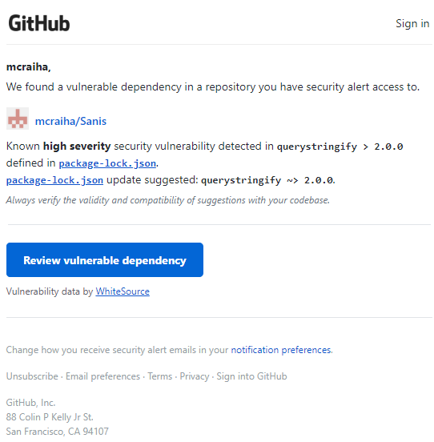
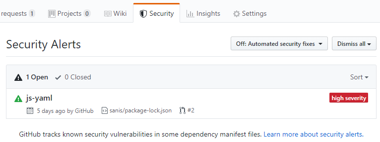
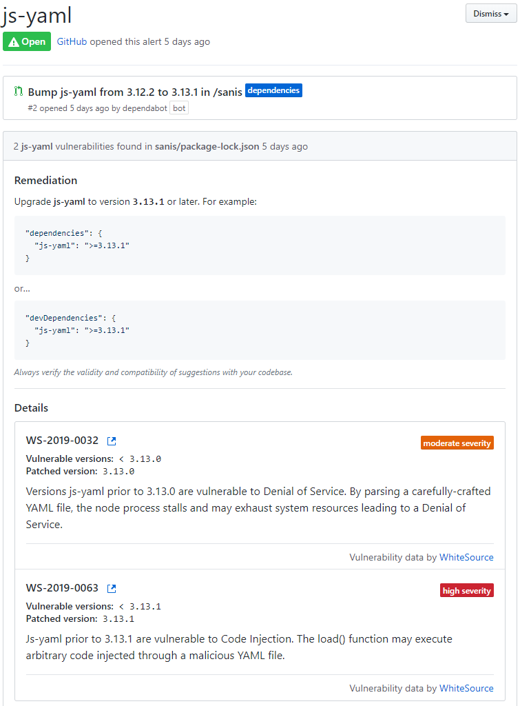
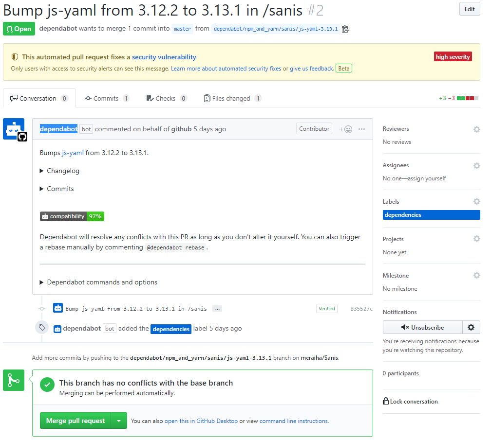

Title: GitHub ja automaattiset tietoturvapaikkaukset
Tags: 
  - GitHub
  - Tietoturva
  - Automatisointi
---
## Yleistä höpinää

Javascript-projektien suurimmaksi ongelmaksi on vuosien saatossa muodustunut [npm-riippuvuushelvetti](https://antongorbikov.wordpress.com/2018/02/07/npm-dependency-hell/), jonka seurauksena yksinkertaisetkin Javascript-projektit sisältävät satoja riippuvuuksia. Useimmissa tapauksissa kehittäjillä ei ole mitään käsitystä miten monimutkainen riippuvuusviidakko heillä on käsissään, ja yleensä ongelma huomataan siinä vaiheessa, kun joku haluaa listan kaikista niistä kolmansien osapuolien kirjastoista, joita projekti hyödyntää.

Riippuvuushelvetin sivutuotteena tuleva tietoturvaongelmat. Koska projektissa mukana olevat paketit saattavat vaatia jonkin toisen paketin tietyn version, on kehittäjien hankala pysyä kärryillä siitä, että kaikki projektissa mukana olevat paketit sisältävät varmasti viimeisimmät tietoturvapäivitykset. Viime vuonna npm sai onneksi uuden [audit-toiminnallisuuden](https://blog.npmjs.org/post/173719309445/npm-audit-identify-and-fix-insecure), jonka avulla omassa projetissa olevia riippuvuuksiin liittyviä tietoturvaongelmia voi etsiä ja korjata. Laiskoille ihmisille on olemassa myös toinen ratkaisu, ja se on [GitHubin](https://github.com/) käyttäminen.

## GitHub ja varoitussähköposti

Kun oma Javascript projekti on siirretty GitHubiin, liittyy se automaattisesti [tietoturvaskannausalgotmin](https://help.github.com/en/articles/about-security-alerts-for-vulnerable-dependencies) tarkistuslistalle ja palvelu huomauttaa kehittäjille sähköpostin muodossa, jos projektissa on haavoittuvuuksia sisältäviä paketteja. Tarkitus tapahtuu tässä tapauksessa versionhallintaan lisätyn `package-lock.json` -tiedoston avulla, joten jos kyseinen tiedosto on jätetty ulos versionhallinnasta, ei varoituksia luonnollisesti tule.

Jos jostain paketista löytyy myöhemmin tietoturva-aukko, lähettää GitHub myös tässä tapauksessa sähköpostin kehittäjille.

## Varoitussähköpostiin reakointi

Kun sähköpostissa olevan linkin avaa, johtaa se kyseisen projektin GitHubissa olevaan **Security**-osioon.

  
Security-osiosta löytyy lista projektin mahdollisista ongelmista. Ongelmiin voi tarvittaessa pureutua syvemmin tutkimalla esim. palvelun ehdottamia korjaustoimenpiteitä ja haavoittuvuuden vakavuutta. Ehdotettu korjaus saattaa paikata samalla kertaa useamman eri tietoturva-aukon, kuten alla olevasta kuvankaappauksesta käy ilmi.

  
Ehdotettuja korjauksia ei myöskään tarvitse tehdä itse omaan lokaaliin versioon, vaan GitHubista löytyvä **Dependabot**-botti osaa luoda sopivan [pull requestin](https://en.wikipedia.org/wiki/Distributed_version_control#Pull_requests) automaattisesti, jolloin sen voi hyväksyä saman tien mukaan selaimesta. Täten korjaukset saa otettua käyttöön projektiin suoraan vaikkapa matkapuhelimen selaimesta ilman komentorivin, tekstieditorin jne. käyttämistä.

Dependabotin tekemät pull requestit eivät näy oletuksena kaikille, vaan ainoastaan niille kehittäjille, joilla on pääsy GitHubissa olevan projektin tietoturvahuomautuksiin. Täten kehittäjät voivat rauhassa reakoida täysin julkisten projektien tietoturvaongelmiin, ja keskustella niistä niin etteivät nämä keskustelut näy muille tahoille. Kun sopiva korjaus on hyväksytty ja otettu käyttöön, voidaan käyty keskustelu tarvittaessa tuoda julki pull requestin hyväksymisen jälkeen.

🐛