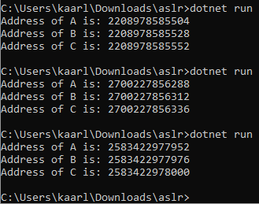

Title: Dotnet ja entropia
Tags: 
  - C#
  - Dotnet
  - Entropia
---
## Yleistä höpinää

Parin viikon sisällä internetissä on ollut jonkin verran keskustelua **Ryzen 2** -suorittimien [rdrand](https://en.wikipedia.org/wiki/RdRand)-käskyn [ongelmista](https://www.extremetech.com/gaming/295020-destiny-2-doesnt-currently-run-on-ryzen-3000-cpus-but-a-fix-is-coming), joiden vuoksi esim. **Destiny 2** -peli ei toistaiseksi toimi kyseisillä suorittimilla. 

Satunnaislukujen generoinnissa tarvittavan [entropian](https://en.wikipedia.org/wiki/Entropy_(computing)) tavalliset ohjelmat voivat ottaa käyttöjärjestelmältä, joten Destiny 2:n kohdalla ongelma olisi helposti kierrettävissä, jos peli hankkisi satunnaisluvut käyttöjärjestelmältä, eikä suoraan suorittimelta.

Tässä kohtaa joku saattaa kuitenkin miettiä, että mistä esim. C#-ohjelmointikielellä toteutettu ohjelma voisi saada entropiansa (eli kasan satunnaisia bittejä), jos sitä ei voisi ottaa käyttöjärjestelmältä tai suoraan suorittimelta.

## Entropian lähteet

Entropiaa voi kerätä järjestelmästä (tässä tapauksessa tietokoneesta) esim. tutkimalla hiiren liikettä, tuulettimen pyörisimisnopeutta, suorittimen lämpötilaa, käytössä olevan vapaan muistin määrää jne., mutta monissa tapauksissa ongelmaksi muodostuu se, että ohjelmointikielen käytössä oleva standardikirjasto ei tarjoa tapaa näiden tietojen keräämiseen. 

Entropian keräämiseen voi tietenkin käyttää erilaisia kirjastoja, mutta näiden kohdalla ongelmia saattaa syntyä vaikkapa käyttöjärjestelmäyhteensopivuuden kanssa.

Puhtaan konsoliohjelman kohdalla saattaa olla myös haastavaa pakottaa käyttäjä esim. liikuttamaan hiirtä, koska kohdejärjestelmässä ei välttämä sisällä mitään osoitinlaitetta.

## Vakaa entropia suorituksen aikana

Entropian alustaminen tehdään yleensä kerran ohjelman käynnistämisen yhteydessä, jonka jälkeen ohjelma voi generoida erilaisilla algoritmeilla itselleen niin paljon satunnaislukuja kuin on tarvis. Erilaisten arvioiden mukaan [128](https://security.stackexchange.com/questions/102157/do-you-need-more-than-128-bit-entropy) tai [256](https://www.2uo.de/myths-about-urandom) bittiä on tarpeeksi entropiaa, jotta järjestelmää vastaan hyökkäävä taho ei pysty suorittamaan ns. brute force -hyökkäyksiä löytäkseen vastaavan alkutilan.

Omalla kohdalla on kuitenkin yksi erikoisvaatimus, koska ohjelmassa käytettävän entropian alkuarvoa tai nykytilaa ei voi suoraan tallentaa ohjelman muistiavaruuteen, vaan tila on pystyttävä generoimaan uudelleen tarvittaessa. Tämän takia esim. hiiren liikkeen seuraaminen ei tässä tapauksessa ole sopiva ratkaisu.

### Prosessin alkuaika

Dotnet-ajoympäristö tarjoaa ajettavalle ohjelmalla runsaasti erilaista tietoa. Yksi vakaaksi entropiaksi välttävästi kelpaava asia on prosessin alkuaika. Sen saa tietoonsa yhden rivin `Process.GetCurrentProcess().StartTime.Ticks` -ihmeellä

```csharp
using System;
using System.Diagnostics;
					
public class Program
{
	public static void Main()
	{
		Console.WriteLine(Process.GetCurrentProcess().StartTime.Ticks);
	}
}
```
ongelmaksi valitettavasti muodustuu se, että ajoympäristö voi halutessaan pyöristää aloitusajan, joten arvot ovat usein muotoa **636991455877000000**, jolloin vuorokauden aikana vain muutamat bitit vaihtavat arvoaan.

### Prosessin oma tunniste

Toinen helppo ja rajatuilla arvoilla varustettu asia on prosessin oma tunnistenumero, jonka saa selville `Process.GetCurrentProcess().Id` -lorulla

```csharp
using System;
using System.Diagnostics;
					
public class Program
{
	public static void Main()
	{
		Console.WriteLine(Process.GetCurrentProcess().Id);
	}
}
```
ongelmia on tässä kohtaa useampi. Jos järjestelmä ei aja kovinkaan montaa prosessia samanaikaisesti, jää tunnisteen numero pieneksi, eikä se välttämättä vaihdu lainkaan eri suorituskertojen välillä.

### ASLR:n hyödyntäminen

[ASLR](https://en.wikipedia.org/wiki/Address_space_layout_randomization) eli (address space layout randomization) on ohjelmakoodin suorittamiseen liittyvä tietoturvaratkaisu, jossa ohjelman käyttämät muistiosoitteet vaihtuvat jokaisella suorituskerralla. Tällöin hyökkääjän on hankalampi hyökätä kohdeohjelmaa vastaan, koska hyökkääjä ei voi olettaa ohjelmakoodin ja muuttujien olevan aina samoissa muistiosoitteissa.

ASLR kelpaa satunnaisuutensa vuoksi myös entropian generointiin, mutta esim. C#:n kanssa tekniikan hyödyntäminen vaatii hieman tekemistä, koska C#:n kanssa muistiosoitteiden kaivaminen ajonaikaisesti vaatii `unsafe`-avainsanan käyttämistä, ja myös roskienkeruu heittää omat kapulansa rattaisiin, koska se voi siirtää ohjelman keskusmuistissa olevia muuttujia toisiin osoitteisiin ohjelman suorituksen aikana.

```csharp
using System;

namespace aslr
{
	class Program
	{
		private static IntPtr GetAddress(object obj)
		{
			unsafe
			{
				TypedReference tr = __makeref(obj);
				IntPtr ptr = **(IntPtr**)(&tr);
				return ptr;
			}
		}
		
		private static object objA = new object();
		private static object objB = new object();
		private static object objC = new object();
		
		static void Main(string[] args)
		{
			Console.WriteLine($"Address of A is: {GetAddress(objA)}");
			Console.WriteLine($"Address of B is: {GetAddress(objB)}");
			Console.WriteLine($"Address of C is: {GetAddress(objC)}");
		}
	}
}
```
tuottaa seuraavia tuloksia eri ajokerroilla  


<span style="font-size:4em;">🎰</span>