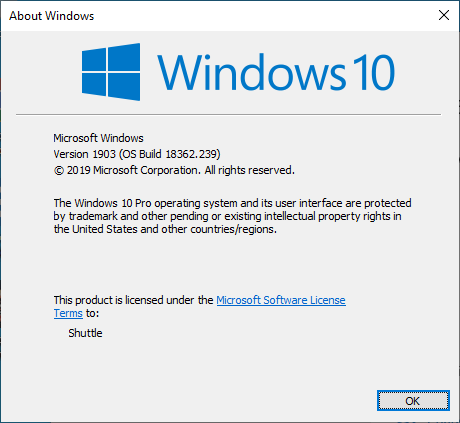
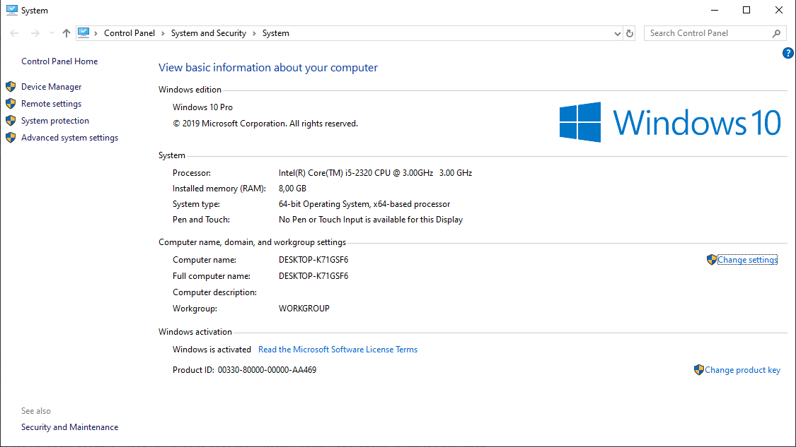
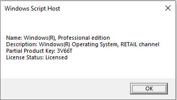

Title: Windowsin version ja lisenssin tarkitus
Tags: 
  - Windows 10
  - Lisenssi
---
## Yleistä höpinää
Joskus käsiin saattaa päätyä **Windows 10** -käyttöjärjestelmällä varustettu tietokone, jonka historiasta ei ole koneen uudella omistajalla kovin tarkkoja tietoja. Onneksi tiettyjen tietojen kaivaminen esiin onnistuu muutamalla komennolla

### Windowsin versio
Helpoin tapa saada tietoa alla olevasta Windowsista on suorittaa `winver` -komento (vaikka **Win + r** -näppäinyhdistelmän kautta). Aukeava graafinen **About Windows** -ikkuna paljastaa mm. käyttöjärjestelmän, sen versio ja kenelle käyttöjärjestelmä on lisensoitu.

Yllä olevasta kuvasta selviää nopeasti, että kyseessä on Windows 10 -käyttöjärjestelmän [Pro-versio](https://www.microsoft.com/fi-fi/windows/compare-windows-10-home-vs-pro), johon on asennettu 1903-numeroa kantava päivitys (tunnetaan myös 19H1-nimellä).

### Lisenssin tilanne
Yleensä lisenssin osalta riittää tieto siitä, että onko Windows 10:n aktivointi suoritettu onnistuneesti. Tämän tarkitus onnistuu helpoiten painamalla **Win + Pause** -näppäinyhdistelmää, jolloin aukeaa **Ohjauspaneeli**n/**Control Panel**in **Järjestelmä**/**System** -osio.

Yllä olevasta kuvasta selviää mm., että Windows 10 on aktivoitu, koneesssa on 8 gigatavua RAM-muistia ja suoritin on Intelin i5-2320.

Tarkemmat tiedot lisenssistä saa esiin `slmgr /dli` -komennolla

Yllä olevasta kuvasta selviää aktivoinnin tilanteen lisäksi se, että kyseessä on Windows 10:n **Retail**-versio (muut vaihtoehdot ovat pakettikoneisiin tarkoitettu **OEM** ja yrityskäyttöön tarkoitettu **Volume**) ja aktivointiin käytetyn tuoteavaimen loppuosa on **3V66T**.

🖥️