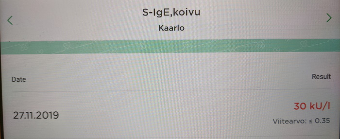

Title: Koivuallergia ja Itulazax *PÄIVITETTY*
Tags: 
  - Koivuallergia
  - Siitepöly
  - Itulazax
---
> En ole lääketieteen ammattilainen, joten kaikki tässä kirjoituksessa oleva teksti on vain henkilökohtaista kokemusta

> Kukaan ei ole maksanut minulle mitään tästä kirjoituksesta, tai kustantanut minulle mitään, joten kyse ei ole millään tavalla sponsoroidusta sisällöstä

## Koivun siitepölyn siedätyshoito

Itse olen kärsinyt koivun siitepölyallergiasta koko elämän, ja kun tänä vuonna Eurooppaan [tuli](https://www.mediuutiset.fi/uutiset/koivuallergian-siedatyshoito-helpottuu-uusi-tablettina-kotona-kaytettava-laake-hyvaksyttiin/a66067fc-3587-44c1-8d6a-a16766968053) vihdoin myyntiin helpohko [siedätyshoito](https://www.kaypahoito.fi/hoi14010) kyseiseen allergiaan **[Itulazax](https://pharmacafennica.fi/spc/51328764)**-tablettien muodossa, päätin tarttua tilanteeseen ja aloittaa siedätyshoidon.

Itulazax on kielen alle kerran päivässä laitettava tabletti, joka liukenee suuhun yleensä alle minuutissa. Tabletteja syödään kolmen vuoden ajan, ja siedätyshoito pitäisi aloittaa 4 kuukautta ennen siitepölykauden odotettua alkua.

Itulazax on reseptilääke, ja reseptin saaminen vaatii käyntiä allergioiden hoitoon perehtyneen erikoislääkärin luona. Omalla kohdalla täytyi lisäksi käydä spirometriassa ja allergiakokeissa, jotta saatiin varmuus sille, että keväällä ilmaantuvat oireet todellakin johtuvat koivun siitepölystä, eivätkä esim. astmasta.

Ensimmäinen Itulazax-tabletti täytyy nauttia terveydenhuoltoalan ammattihenkilön valvonnan alla. Tästä eteenpäin tabletit laitetaan kielen alle omatoimisesti.

Itsellä ei ensimmäisellä kerralla tullut mitään mainittavia sivuoireita, joten tältä osin siedätyshoito on lähtenyt hyvin liikkeelle. Siedätyshoiton todellinen toimivuus näkyy omalla kohdalla, kunhan siitepölykausi käynnistyy keväällä.

### Kustannukset

Siedätyshoidon aloittaminen ei ole ilmaista. <s>Koska Itulazax ei kuulu tällä hetkellä KELA:n lääkekorvauslistalle (tähän on lääkärin mukaan tulossa muutos), pitää lääkkeet maksaa kokonaan itse</s> (KELA-korvattavuus tuli voimaan helmikuussa 2020). Apteekissa 30 tabletin pakkaus (eli 30 päivän annos) maksaa <s>130,54</s> 116,38 euroa, ja erikseen haettavan [KELA-korvauksen](https://asiointi.kela.fi/laakekys_app/LaakekysApplication/Korvattavuus?korvaava=081344) myötä (40 %) maksettavaa jää 69,83 per pakkaus.

Alla listattu kustannuksia (mahdollisten KELA-korvausten jälkeen)

| Kuvaus       | Hinta  |
| ------------- | -----:|
| 15 minuutin käynti erikoislääkärin luona yksityisellä puolella | ~ 110 euroa |
| Spirometria | 136 euroa |
| Allergiatesti verikokeella | 104 euroa |
| Itulazax 30 tablettia | <s>130,54</s> 116,38 euroa |
| Lääkäripalkkio reseptistä| 35 euroa |
| Valvottu lääkkeen otto ja ohjeistus | 66 euroa |

Eli ensimmäisen lääkkeen ottamisen yhteydessä rahaa on kulunut noin 580 euroa.

**PÄIVITYS**

Helmikuussa 2020 Itulazax hinta (30 tablettia) tippui 116,38 euroon. Erikseen haettavan KELA-korvauksen myötä (40 %) maksettavaa jää 69,83 euroa kuukaudessa.