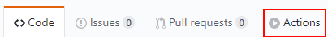
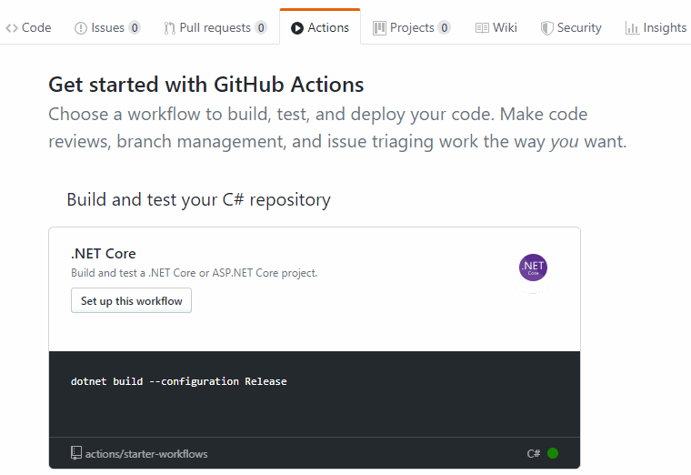
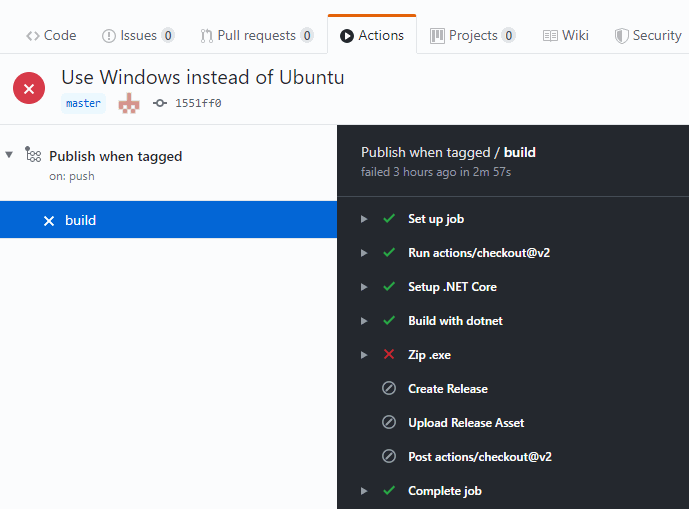
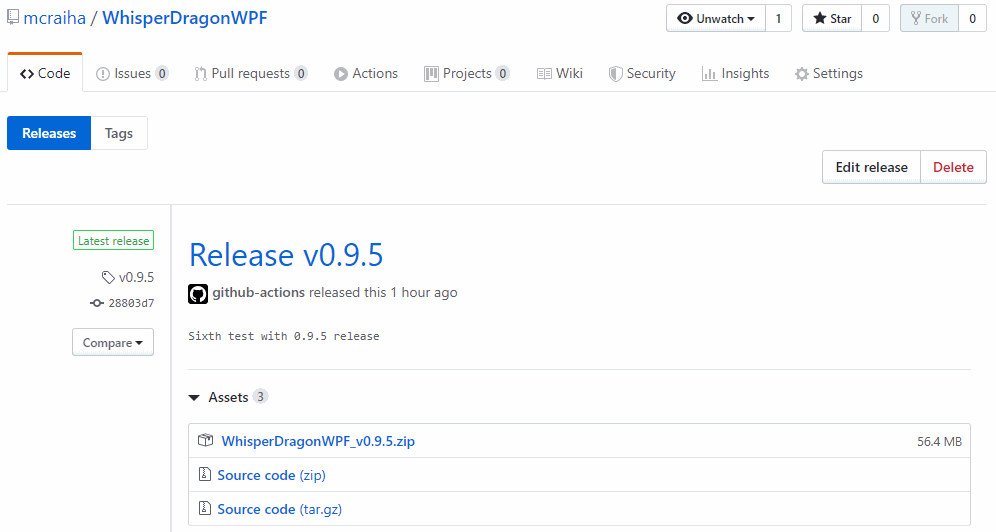

Title: GitHub Actions ja WPF-julkaisu
Tags: 
  - GitHub Actions
  - WPF
  - CI / CD
  - automatisointi
  - dotnet
---
## Yleistä höpinää

Kilpailu CI / CD -markkinoilla on käynyt viime vuosina kuumana, ja viime vuonna markkinoille saatiin jälleen yksi nimekäs/suuri toimija, kun **GitHub** avasi oman [Actions](https://github.blog/2019-08-08-github-actions-now-supports-ci-cd/)-ratkaisunsa kaikille halukkaille elokuussa. Actionsiin tutustuminen on kuulunut omalle TODO-listalleni jo useamman kuukauden verran, ja tänä viikonloppuna sain sen vihdoin ruksittua pois sieltä, kun toteutin sen avulla ensimmäisen julkaisujärjestelmän.


### WPF-ohjelman julkaisun automatisointi

Vaikka **Microsoft**in [WPF](https://fi.wikipedia.org/wiki/Windows_Presentation_Foundation)-käyttöliittymäkirjasto on jo yli 13 vuotta vanha, on sillä edelleen käyttöä, koska sen avulla voi julkaista Windowsille graafisia ohjelmia, jotka toimivat sekä Windows 7:n, 8:n ja 10:n kanssa (ja myös Windowsin Server-versioilla).

Oma WPF-projektini on [WhisperDragonWPF](https://github.com/mcraiha/WhisperDragonWPF)-nimellä kulkeva salasanamanageri, jonka lähestyessä ensimmäistä beta-versiota päätin automatisoida sen julkaisun.

Dotnet Coren 3.0-version myötä WPF-sovelluksia voi julkaista ns. standalone-mallisina, eli käyttäjän tarvitsee ladata vain yksi .exe-tiedosto, jonka voi sitten käynnistää suoraan. Käyttäjän ei siis tarvitse asennella mitään kirjastoja tai ajoympäristöjä, vaan ohjelman käytön voi aloittaa suoraan .exe-tiedoston tuplaklikkauksella.

Ohjelman kääntäminen .exe-tiedostoksi tapahtuu helposti, sillä käännösasetukset ovat määritetty .csproj-tiedostossa, jolloin riittää alla olevan komennon suorittaminen oikeassa hakemistossa.
```bash
dotnet publish src/WhisperDragonWPF.csproj -c Release
```

Kääntämisen seurauksena syntyvä .exe-tiedosto on kuitenkin yli 140 megatavun kokoinen, joten loppukäyttäjän kannalta on helpompi pakata se .zip-tiedostoon, jonka lataamalla ja purkamalla käyttäjä saa työkalun itselleen.

Luodun .zip-tiedoston jakelun hoidan luonnollisesti GitHub:in Release-osion kautta, jolloin minun ei tarvitse itse murehtia tiedoston jakeluun liittyvistä kustannuksista tai CDN-toteutuksista.


### GitHub Actions

GitHub Actions otetaan käyttöön siirtymällä selaimella halutun GitHub-projektin sivustolle, ja valitsemalla yläpalkista **Actions**-linkki



Tämän jälkeen valitaan joko GitHubin ehdottama oletusskripti CI / CD -toiminnoille tai luodaan oma. Tässä tapauksessa päätin luoda oman, koska julkaisuni vaatii useamman eri skriptin yhdistämisen.



Alla esitetty oma [dotnetcore.yml](https://github.com/mcraiha/WhisperDragonWPF/blob/master/.github/workflows/dotnetcore.yml)-tiedosto
```YAML
name: Publish when tagged

on:
  push:
    # Sequence of patterns matched against refs/tags
    tags:
    - 'v*' # Push events to matching v*, i.e. v1.0, v20.15.10

jobs:
  build:

    runs-on: windows-latest

    steps:
    - uses: actions/checkout@v2
    
    - name: Setup .NET Core
      uses: actions/setup-dotnet@v1
      with:
        dotnet-version: 3.1.100
    
    - name: Build with dotnet
      run: dotnet publish src/WhisperDragonWPF.csproj -c Release
      
    - name: Get the version
      id: get_version
      run: echo ::set-output name=VERSION::${GITHUB_REF/refs\/tags\//}
      shell: bash
    
    - name: Zip .exe
      run: Compress-Archive -Path .\src\bin\Release\netcoreapp3.1\win-x64\publish\WhisperDragonWPF.exe -DestinationPath WhisperDragonWPF_${{ steps.get_version.outputs.VERSION }}.zip -CompressionLevel Optimal
    
    - name: Create Release
      id: create_release
      uses: actions/create-release@v1.0.0
      env:
        GITHUB_TOKEN: ${{ secrets.GITHUB_TOKEN }}
      with:
        tag_name: ${{ github.ref }}
        release_name: Release ${{ github.ref }}
        draft: false
        prerelease: false
    
    - name: Upload Release Asset
      id: upload-release-asset 
      uses: actions/upload-release-asset@v1.0.1
      env:
        GITHUB_TOKEN: ${{ secrets.GITHUB_TOKEN }}
      with:
        upload_url: ${{ steps.create_release.outputs.upload_url }} # This pulls from the CREATE RELEASE step above, referencing it's ID to get its outputs object, which include a `upload_url`. See this blog post for more info: https://jasonet.co/posts/new-features-of-github-actions/#passing-data-to-future-steps 
        asset_path: ./WhisperDragonWPF_${{ steps.get_version.outputs.VERSION }}.zip
        asset_name: WhisperDragonWPF_${{ steps.get_version.outputs.VERSION }}.zip
        asset_content_type: application/zip
```

Hieman selitystä skriptistä.

**On, push, tags** -osio pitää huolen siitä, että toiminto käynnistetään, kun gitin avulla tehdään tagi, joka alkaa **v**-kirjaimella, esim. v0.9.4, eli uutta julkaisua ei tehdä automaattisesti jokaisesta commitista.

**runs-on** -kohta pitää huolen siitä, että skripti suoritetaan Windows-käyttöjärjestelmällä varustetulla tietokoneella. Tämä siksi, että Linux- ja Mac OS -käyttöjärjestelmällä ei voi nykyisellään kääntää WPF-ohjelmia, vaikka monet muut cross compile -operaatiot onnistuvatkin. Jos kääntämisen yrittää tehdä vaikkapa Ubuntulla, tulee seuraava virheilmoitus *error NETSDK1100: Windows is required to build Windows desktop applications.*

**uses: actions/setup-dotnet@v1** -osassa puolestaan valitaan se .NET Coren versio, jota halutaan käyttää kääntämiseen. Omalla kohdallani siis uudehko 3.1.100

**get_version** pitää huolen siitä, että github.ref:in sisällään pitämä *refs/tags/v0.9.2* -tyyppisestä tekstistä saadaan poimittua talteen versionumero, eli esim. v0.9.2 myöhempää käyttöä varten. Tämä komento ajetaan poikkeuksellisesti bash-shellin avulla.

**Zip .exe** -kohta suorittaa .exe-tiedoston pakkaamisen .zip-tiedostoksi PowerShellin tarjoaman [Compress-Archive](https://docs.microsoft.com/en-us/powershell/module/microsoft.powershell.archive/compress-archive?view=powershell-7)-komennon avulla. Tässä kohtaa käytetään .zip-tiedoston nimessä aiemmassa kohdassa talteenotettua versionumeroa.

**Create Release** tekee GitHubiin kyseiselle projektille Release-osioon uuden julkaisun. Kyseessä on GitHubin tarjoama [valmis Action](https://github.com/actions/create-release), joita voi luonnollisesti ketjuttaa haluamallaan tavalla. **secrets.GITHUB_TOKEN** -muuttuja tulee GitHub Actionsiin automaattisesti, joten mitään salasanoja tai muita tunnistautumismerkkijonoja ei tarvitse syöttää

**Upload Release Asset** käyttää aiemmassa kohdassa luotua julkaisua, ja liittää aiemmin luodun .zip-tiedoston osaksi tätä julkaisua. Julkaisussa näkyvän tiedostonimen saa valita vielä erikseen tässä vaiheessa.


### Lopputulos

Kun tagi on tehty ja pushattu GitHubiin, käynnistyy kyseinen automaatio, ja sen onnistumisesta/epäonnistumisesta lähetään automaattisesti sähköposti, josta näkee operaation suorituksen tarkemmin.



Monien muiden CI / CD -järjestelmien tavoin skriptin suoritus pysähtyy ensimmäiseen virheeseen.

Kun automaatio on suoritettu onnistuneesti, voi lopputulosta ihailla oman projektin Release-osiosta



<span style="font-size:4em;">🤖 💓 ☁️</span>