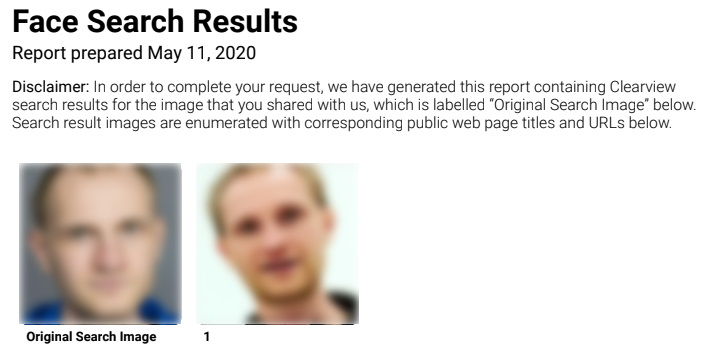

Title: Clearview AI ja yksityisyys internetissä
Tags: 
  - Clearview AI
  - Yksityisyys
---
## Clearview AI ja yksityisyys internetissä
Ihmisten kasvojen tunnistus on parantunut huiman nopeasti viimeisen kymmenen vuoden aikana. Tavallisen kuluttajan arjessa ominaisuus on käytössä lähinnä puhelimen lukituksen avaamisessa, mutta omia kuvia voi nykyään käyttää myös etsimään lisää kuvia itsestään. Nykyisellään useat firmat lataavat internetistä löytyviä kuvia ja rakentavat niistä kasvojentunnistushakupalveluita.

Yksi markkinoilla olevista [toimijoista](https://clearview.ai) on **Clearview AI**, joka tarjoaa viranomaisille keinon löytää kuvia ja niihin liittyviä URL-osoitteita henkilöstä olemassaolevan kuvan perusteella. Vaikka palvelua ei ole tarkoitettu kuluttajakäyttöön, voi EU:ssa voimassa olevan [GDPR](https://fi.wikipedia.org/wiki/Yleinen_tietosuoja-asetus)-tietosuoja-asetuksen avulla kaivaa palvelun kautta löytyvät omat kuvat esiin.

### Omat kuvat esiin
Operaatio tapahtuu siirtymällä Clearview AI:n palvelussa löytyvään [lomakkeeseen](https://clearviewai.typeform.com/to/ePcsEp), jossa yhden oman kuvan ja henkilötodistuksen kopion kera käynnistetään omien tietojen hakuprosessi.

Omalla kohdalla pyynnön käsittely kesti 11 päivää. Kuvaksi valitsin valokuvaajan itsestäni ottaman kuvan, jotta kasvojentunnistuksella olisi parhaat mahdollisuudet tehdä kasvoistani tunnistusta varten tarkka "sormenjälki".

### Lopputulos
Odottelun jälkeen sähköpostiin tuli viesti, jossa liitteenä olevassa PDF-tiedostossa oli listattuna löydetyt tulokset. Koska en ole kovin valokuvauksellinen, eikä minulla ole some-profiileja, oletin tuloksia olevan vähän, ja näin myös oli. Clearview AI löysi omalla kohdalla internetistä vain yhden kuvan, ja kyseisessä kuvassa todellakin olen minä muiden ihmisten joukossa. PDF-tiedosto ei sisällä löydettyjä kuvia kokonaisina, vaan niistä on rajattu ainoastaan oma naama. Kuvien lisäksi mukana tulevat URL:it, joista alkuperäiset kuvat ovat löytyneet.

  
*(kuvat blurrattu tarkoituksella)*

Clearview AI painottaa, että kuvia haetaan vain julkisilta sivuilta, ja myös omalla kohdalla löydetty kuva oli Instagramista löydetty.

Kuten arvata saattaa, ei kasvojentunnistus toimi 100% varmuudella. Aiemmin tänä vuonna [Thomas Smith](https://onezero.medium.com/i-got-my-file-from-clearview-ai-and-it-freaked-me-out-33ca28b5d6d4) teki vastaavan kokeilun, ja hänen kohdallaan mukana oli kuva myös täysin toisesta henkilöstä.

### Kuinka suojaan yksityisyyttäni
Luonnollisesti yksinkertaisin tapa välttyä tällaisten hakupalvelujen indeksoinneilta on välttää kuvien jakamista internetin kautta. Jos kuvia kuitenkin haluaa jakaa (tai on pakko tehdä esim. töiden takia), kannattaa kuvata kymmeniä tai satoja esimerkkikuvia itsestään, ja jaella niitä useiden eri palveluiden kautta. Tällöin henkilön kuvien läpikäynti muuttuu hetkessä yllättävän työlääksi.

Ammattimainen tapa olisi luoda GAN (generative adversarial network) -järjestelmä, joka loisi [This Person Does Not Exist](https://thispersondoesnotexist.com/) -palvelun tapaan jo olemassa olevista omista kuvista satoja tuhansia variaatioita, ja tämän jälkeen näitä kuvia voisi hiljalleen sitten jaella eteenpäin internetin kautta.

📷