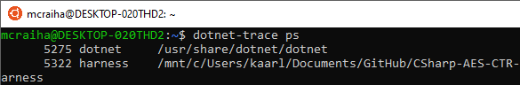
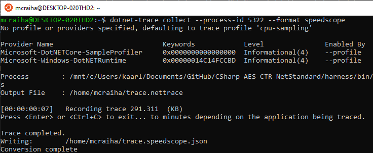
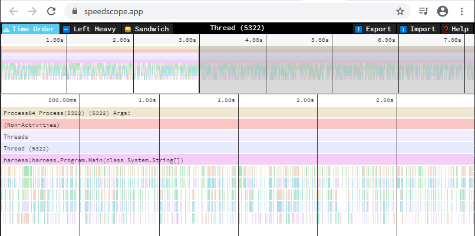

Title: Profilointi dotnet tracen avulla
Tags: 
  - dotnet
  - C#
  - trace
  - profilointi
---

## Profilointi dotnet tracen avulla

Joissain tilanteissa saattaa olla tarve profiloida ohjelmaa, jota ei ajeta paikallisella koneella. Tällöin ongelmaksi saattaa muodustua se, ettei oma rakas profilointiohjelma tue etäyhteyksiä, jolloin profilointidata pitää kerätä etäkoneella. .NET Coren kohdalla profilointidataa voi kerätä suoritettavasta ohjelmasta erillisen [trace](https://docs.microsoft.com/en-us/dotnet/core/diagnostics/dotnet-trace)-työkalun avulla, ja alla neuvon lyhyesti kuinka homma onnistuu.

### Asennus

Dotnet trace asentuu komentoriviltä seuraavalla komennolla
```bash
dotnet tool install --global dotnet-trace
```
tällöin trace asentuu globaaliksi työkaluksi, jolloin sitä voi käyttää mistä tahansa kansiosta. Asennuksen jälkeen terminaali/komentokehoite täytyy käynnistää uudelleen, jotta komento löytyy.

### Suoritettavan prosessin löytäminen

Dotnet trace ei toistaiseksi osaa käynnistää profiloitavaa ohjelmaa, vaan ainoastaan kiinnittyä jo käynnissä olevaan ohjelmaan. Eli kun profiloitava ohjelma on käynnistetty, voi sen [PID](https://www.linux.fi/wiki/PID):in etsiä seuraavalla komennolla
```bash
dotnet-trace ps
```
alla olevassa kuvassa näkyy kaksi prosessia joihin dotnet trace voisi tarttua kiinni. Haluttu on jälkimmäinen, eli sen PID on 5322  



### Profiloinnin aloittaminen

Kun haluttu ohjelma on käynnistetty, käynnistetään profilointi seuraavalla komennolla
```bash
dotnet-trace collect --process-id NUMERO --format speedscope
```
jossa **NUMERO**-kohtaan tulee aiemmassa kohdassa etsitty prosessin PID (eli tässä tapauksessa 5322). `--format speedscope` takaa puolestaan sen, että profilointidata tallennetaan [speedscope](https://github.com/jlfwong/speedscope)-formaatissa, jolloin sitä voi helposti tarkastella selaimessa menemällä [speedscope.app](https://www.speedscope.app/)-osoitteeseen.



Profilointidatan kerääminen täytyy itse pysäyttää haluttujen operaatioiden jälkeen **Ctrl+c** -näppäinyhdistelmällä tai **Enter**:iä painamalla. Esimerkkiohjelman kohdalla seitsemässä sekunnissa saatiin aikaiseksi noin 800 kilotavua profilointidataa, joten kovin pitkiä profilointihetkiä ei kannata tehdä, jos dataa on tarkoitus tarkastella selaimessa.

### Profilointidatan tarkastelu

Kun luodun *trace.speedscope.json*-tiedoston avaa [speedscope.app](https://www.speedscope.app/)-sivustolla, saa ulos graafisen esityksen siitä, mihin laskenta-aika ohjelman profiloinnin aikana on kulunut.



Oletuksena olevan [Time Order](https://github.com/jlfwong/speedscope#time-order) -näkymän ohella kannattaa käyttää [Left Heavy](https://github.com/jlfwong/speedscope#%EF%B8%8Fleft-heavy) -näkymää, jonka avulla on helpompi hahmottaa aikoja.

<span style="font-size:4em;">⏲️</span>