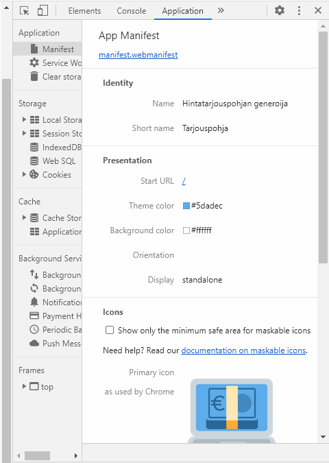

Title: SPA:sta PWA, osa 1. manifesti
Tags: 
  - SPA
  - PWA
  - manifesti
---

## SPA:sta PWA, osa 1. manifesti

Jos olet joskus toteuttanut webbipalvelun [single-page application](https://citydevlabs.fi/single-page-app/) (SPA) -toteutuksena, olet samalla saattanut miettiä, että saisiko tuon vaivalla rakennetun palvelun tuotua helposti tietokoneen ohjelmalistaukseen tai mobiililaitteen työpöydälle, jolloin käyttäjän ei tarvitsisi aina avata selainta palvelun käyttöä varten. [Progressive web application](https://www.itewiki.fi/opas/progressive-web-application-pwa-progressiivinen-verkkosovellus/) (PWA) on ratkaisu tähän pulmaan, ja tässä ja tätä seuraavassa blogikirjoituksessa kerron lyhyesti miten se onnistuu.

### Mikä ihmeen manifesti?

Jotta selain ja käyttöjärjestelmä osaavat tunnistaa PWA-yhteensopivat nettisivustot, pitää sivuston mainostaa selaimille toimintojaan JSON-pohjaisen [manifest](https://developer.mozilla.org/en-US/docs/Web/Manifest)-tiedoston avulla. Käytettävän manifest-tiedoston nimi on kehittäjän valittavissa, ja itse olen käyttänyt Mozillan esimerkin mukaisesti **manifest.webmanifest** -nimeä. Alla listattuna oman [Tarjouspohja](https://tarjous.raiha.rocks/)-palvelun manifest-tiedosto

```json
{
    "name": "Hintatarjouspohjan generoija",
    "short_name": "Tarjouspohja",
    "description": "Tarjouspohja - Ilmainen, avoin, mainosvapaa ja yksityisyyttä kunnioittava hintatarjouspohjan generoija",
    "icons": [
        {
          "src": "icons-192.png",
          "type": "image/png",
          "sizes": "192x192"
        },
        {
          "src": "icons-512.png",
          "type": "image/png",
          "sizes": "512x512"
        }
      ],
    "theme_color": "#5dadec",
    "background_color": "#ffffff",
    "display": "standalone",
    "scope": "/",
    "start_url": "/"
}
```

`name` -, `short_name` - ja `description` -kentät ovat selkeitä, ja tiedot voi yleensä kopioida suoraan olemassa olevasta SPA:sta.  
`icons`-kenttään laitetaan listana kuvatiedostoja, joita voidaan käyttää sovelluksen ikoneina. Chromen kanssa [suositus](https://web.dev/add-manifest/) on tarjota 192 x 192 - ja 512 x 512 -resoluution ikonit.  
`theme_color` ja `background_color` kertovat värit, joilla sovelluksen näyttävä selain personoidaan. Nämäkin arvot on helppo kopioida SPA:n väreistä.  
`display` mahdollistaa SPA:n näyttämisen esim. tiettyjen selaimen vakioelementtien kanssa tai mahdollisesti kokoruudun tilassa (joka sopii hyvin esim. peleille)  
`scope` tarjoaa keinon [rajoittaa](https://developer.mozilla.org/en-US/docs/Web/Manifest/scope) SPA:n PWA-toiminnallisuuden vain tiettyihin sivuston polkuihin. Jos käyttäjä poikkeaa näiden asetettujen rajojen ulkopuolelle, näytetään ne hänelle tavallisessa selaimessa.  
`start_url` arvoa ei yleensä tarvitse laittaa, mutta sen kanssa on mahdollista asettaa PWA-tilassa toinen aloitussivu, jolloin käyttäjän käyttökokemusta voi muokata erilaiseksi sen perusteella, että tapahtuuko käyttö suoraan nettisivun kautta vai laitteen PWA-näyttöohjelman avulla.

Kun oma manifesti on askarreltu kokoon, lisätään HTML-koodin **head** -osioon seuraava rimpsu
```html
<link rel="manifest" href="manifest.webmanifest">
```

Tämän jälkeen operaation onnistumisen voi tarkastaa vaikka Chrome-selaimen kehittäjätyökalujen **Application**-osiosta



Seuraavassa osassa luvassa lyhyt tutustuminen Service Workereihin