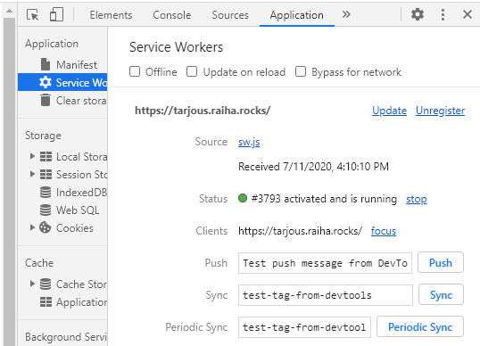

Title: SPA:sta PWA, osa 2. Service worker
Tags: 
  - SPA
  - PWA
  - Service worker
---

## SPA:sta PWA, osa 2. Service worker

[Edellisessä blogi-kirjoituksessa](/posts/SPA-PWA_osa_1.html) kerroin lyhyesti ensimmäisestä työvaihteesta, jonka avulla SPA:sta saadaan tehtyä PWA-yhteensopiva. Tässä tekstissä tutustutaan toiseen vaiheeseen, eli Service workereihin.

### Mikä ihmeen Service worker?

Service worker on internet-sivuston yhteydessä esiteltävä Javascript-komponentti, joka ensisijaisesti mahdollistaa sivustolle paremman välimuistin hallinnan. Loppukäyttäjälle Service workereiden suurin etu on se, että sivustoa voi teoriassa käyttää myös ilman internet-yhteyttä, koska aiemmin haettua sisältöä voidaan näyttää käyttäjälle suoraan välimuistista.

Koska Service worker toteutetaan Javascriptillä, voidaan sen toiminnallisuutta muokata sivustokohtaisesti. [Oma projektini](https://tarjous.raiha.rocks/) tarjoilee käyttäjille ainostaan staattista sisältöä, joten sen kanssa "täydellinen" välimuistitus on helppo toteuttaa. Service workerin [yhteensopivuus](https://caniuse.com/#feat=serviceworkers) selainten kesken on erinomainen, ja valtavirtaselaimista ainoastaan jo kuopattu IE ei sitä tue.

### Esimerkkitoteutus

Alla oman projektini Service Worker -toteutus
```javascript
// Service worker

// Välimuistin nimi, versionumeroa kasvatetaan päivityksien yhteydessä
const PRECACHE = 'v3';

// Lista URL:eista, jotka otetaan aina alussa välimuistiin
const PRECACHE_URLS = [
  'index.html',
  './', // Alias index.html
  'tietoja.html',
  'mvp.css',
  'index.js',
  'favicon.ico'
];

// Lataa kaikki tarvittavat osat muistiin, kun asennus tapahtuu
self.addEventListener('install', event => {
  event.waitUntil(
    caches.open(PRECACHE)
      .then(cache => cache.addAll(PRECACHE_URLS))
      .then(self.skipWaiting())
  );
});

// Poistaa vanhat välimuistit tarvittaessa
self.addEventListener('activate', event => {
  const currentCaches = [PRECACHE];
  event.waitUntil(
    caches.keys().then(cacheNames => {
      return cacheNames.filter(cacheName => !currentCaches.includes(cacheName));
    }).then(cachesToDelete => {
      return Promise.all(cachesToDelete.map(cacheToDelete => {
        return caches.delete(cacheToDelete);
      }));
    }).then(() => self.clients.claim())
  );
});

// Palauttaa välimuistista löytyvät, jos niitä on
self.addEventListener('fetch', function(event) {
  event.respondWith(
    caches.match(event.request)
      .then(function(response) {
        // Löytyy välimuistista
        if (response) {
          return response;
        }

        // Haetaan internetistä
        return fetch(event.request);
      }
    )
  );
});
```

Tärkeimmät osat ovat `PRECACHE`, joka kertoo tämänhetkisen sivustoversion käyttämän välimuistin nimen ja `PRECACHE_URLS`, joka pitää sisällään ne tiedostot, jotka ladataan ensimmäisellä käynnistyksellä välimuistiin. PRECACHE-arvoa pitää muokata jokaisen muutoksen yhteydessä, jossa sivuston sisältöä muokataan jollain tavalla. PRECACHE_URLS kaipaa lisäyksiä ja/tai poistoja vain silloin, kun projektiin lisätään uusia staattisia tiedostoja tai olemassaolevia poistetaan.

`install`-kutsu tapahtuu sivuston ensimmäisellä käynnistyskerralla, kun selain lataa sivuston Service Worker -komponentin muistiin.  
`activate`-kutsu tapahtuu jokaisella kerralla, kun sivusto otetaan käyttöön, ja sen yhteydessä on hyvä poistaa vanhat tiedostot välimuistista käyttäen apuna PRECACHE-muuttujan arvoa.  
`fetch`-kutsu tapahuu puolestaan joka kerta, kun sivusto lataa jotain sisältöä internetistä (myös siis muutenkin kuin fetch-metodilla). Jos käyttäjän tekemiä dynaamisia latauksia [haluaa välimuistittaa](https://developers.google.com/web/fundamentals/primers/service-workers#cache_and_return_requests), tapahtuu se tämän fetch-kutsun yhteydessä.

Service Worker otetaan käyttöön varsinaisella sivustolla lisäämällä seuraavanlainen Javascript-koodi sinne
```javascript
if ('serviceWorker' in navigator) {
    navigator.serviceWorker.register('sw.js');
}
```
(olettaen siis, että ylläoleva Service Worker -koodi, oli tallennettu **sw.js**-nimiseen tiedostoon)

### Tarkistaminen

Jos kaikki meni kerralla oikein niin Service Workerin asennuksen onnistuminen sivuston avaamisen yhteydessä pitäisi näkyä selaimen kehitystyökalujen kautta



Ja ensimmäinen latauksen jälkeen laitteen voi laittaa lentokonetilaan, ja selaimesta tehtävän sivuston uudelleenlatauksen jälkeen sivuston pitäisi edelleen latautua oikein (ainakin välimuistissa olevan sisällön osalta).

### Oman PWA-suorituksen auditointi

Kun sekä manifesti että Service Worker ovat paikoillaan, voi toteutuksen onnistumisen tarkistaa esim. Chromen sisäisellä [Lighthouse](https://developers.google.com/web/tools/lighthouse)-työkalulla tai [PWA Builder](https://www.pwabuilder.com/)-sivustolla. Molemmat tarjoavat sekä numeerisia arvosanoja että parannusehdotuksia, joiden avulla käyttäjien/asiakkaiden elämää voi parantaa sivuston toiminnan osalta.

### Mitä muuta Service Worker tarjoaa?

Service Workerin avulla on mahdollista toteuttaa myös sivuston [Push Notification](https://developer.mozilla.org/en-US/docs/Web/API/Push_API) -tuki ja taustalla tapahtuvat [Sync](https://web.dev/periodic-background-sync/)-päivitykset. Tulevaisuudessa Service Workerin saataneen myös muista uusia ominaisuuksia, jolloin PWA-toteutusten on helpompi taistella itsenäisesti natiivisovelluksia vastaan.