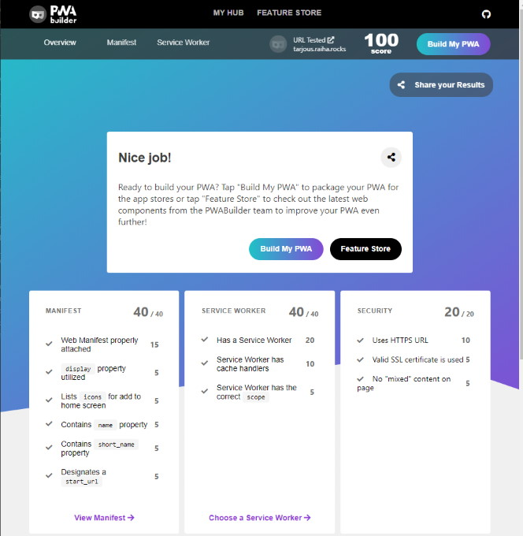
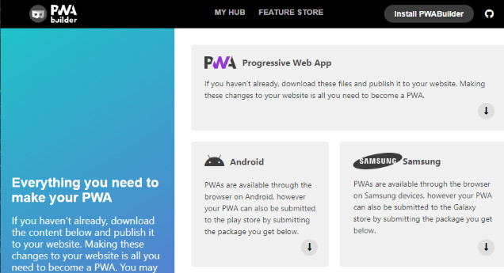
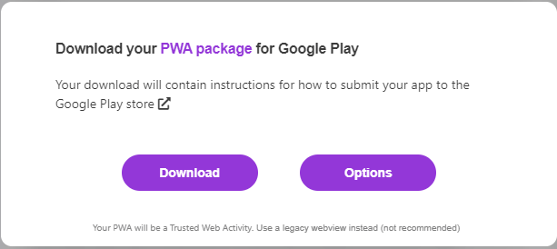
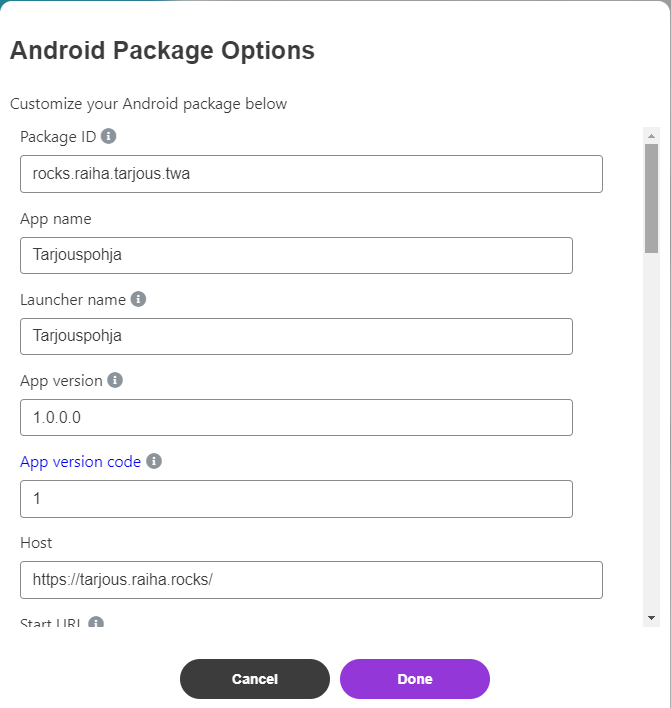
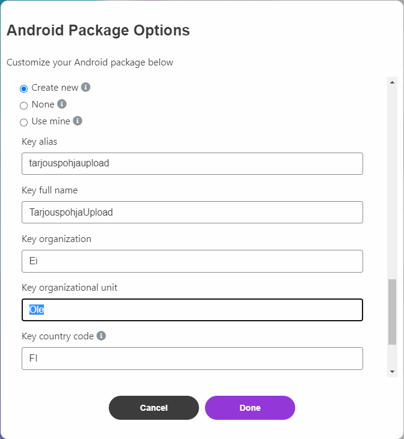

Title: PWA Google Play -kauppaan osa 1.
Tags: 
  - SPA
  - PWA
  - Google Play
---

## PWA Google Play -kauppaan, osa 1.

*Tässä kirjoituksessa keskitytään PWA -> APK -työstöön. Seuraavassa osassa sitten Google Play -puoleen.*

Kun olet vihdoin ja viimein saanut ensimmäisen [Progressive web application](https://www.itewiki.fi/opas/progressive-web-application-pwa-progressiivinen-verkkosovellus/) -sovelluksen (PWA) valmiiksi, mietiskelet ehkä seuraavaksi että minne kaikkialle sen voisi lisätä. Internet-selaimen ohella PWA:n saa tungettua esim. [App Storeen](https://apps.apple.com/fi/app/apple-store/id375380948), [Microsoft Storeen](https://www.microsoft.com/fi-fi/store/apps/windows) ja [Google Playihin](https://play.google.com/).

Teknologisesti kyvykkäät käyttäjät osaavat itsekin lisätä tekemäsi PWA:n laitteensa kotiruudulle, mutta valitettavasti kaikki käyttäjät eivät ymmärrä PWA:n hienouksia, jolloin on helpompaa tarjota samaa sisältöä myös laitteen oman sovelluskaupan kautta. Samalla tämä parantaa hieman oman PWA:n hakukonenäkyvyyttä, koska hakukoneet ovat erittäin hyviä sovelluskauppojen indeksoinneissa.

### Miksi Google Play?

Tässä esimerkissä päädyin Google Playihin sen takia, että olen itse pääsääntöisesti mobiilipuolella Androidin käyttäjä. Lisäksi Google Play on kehittäjän kannalta huomattavasti edullisempi julkaisualusta kuin App Store, koska Google Playssä on vain yksi 25 dollarin hintainen liittymismaksu (App Store pyytää 99 dollaria per vuosi) ja kehitystyön voi suorittaa Windows-, Linux- tai Mac OS -alustoilla (App Storeen sovelluskehitys vaatii käytännössä XCoden ja Mac-tietokoneen).

En tässä julkaisussa kerro tarkemmin Google Playhin rekisteröitymisestä, mutta se onnistuu helposti muutamassa minuutissa, kunhan käytössä on Google-tili ja luottokortti.

### PWA:sta APK

[Android application package](https://fi.wikipedia.org/wiki/APK) (APK) on Android-laitteissa (ja nykyään monissa muissa laitteissa) toimiva asennuspaketti, joka mahdollistaa sovelluksen asentamisen laitteeseen. Normaalisti Android-sovelluksia kehitetään esim. [Android Studion](https://developer.android.com/studio) avulla, mutta PWA:n kohdalla näin ei tarvitse tehdä, koska muut ovat jo tehneet kaiken raskaan työn. Omalla koneelle ei siis tarvitse asentaa mitään työkaluja, vaan kaikki hoituu maagisen internetin tarjoamien palveluiden avulla.

PWA muuttuu helposti APK:ksi [PWA Builder](https://www.pwabuilder.com/) -palvelun avulla. PWA Builder:ille kerrotaan vain PWA:n internet-osoite, ja se antaa sitten kehittäjälle mahdollisuuden ladata alustasta riippuen joko suoran asennuspaketin tai kehitysympäristön vaatimat tiedostot. Androidin kohdalla kehittäjä saa suoraan .apk-tiedoston, jonka voi sitten laittaa Google Playihin. 

PWA Builder rakentaa toimivan APK-asennuspaketin oman olemassa olevan PWA-sovelluksen [manifest](https://developer.mozilla.org/en-US/docs/Web/Manifest)-tiedoston avulla. Aluksi PWA Builder kuitenkin tarkistaa, että oma PWA täyttää kaikki tarvittavat vaatimukset sovelluksen tekemistä varten. 

Kun tarkistus on mennyt läpi, jatketaan operaatiota **Build My PWA** -nappia painamalla. Seuraavaksi valitaan alustalistalta **Android**.

Jonka jälkeen aukeavasta dialogista valitaan **Options**, koska haluamme hieman muokata oletusasetuksia.

Suurin osa oletusasetuksista toimii tässä tapauksessa suoraan oikein, koska teemme ensimmäistä versiota sovelluksesta (versionumeroihin ei siis tarvitse koskea). Ikoneille en tee mitään ylimääräistä, koska yhden ikonin strategia toimii esimerkkinä olevan [Tarjouspohjan](https://tarjous.raiha.rocks/) kanssa. 

Ainoa suuri muutos on digitaalisten allekirjoitusasetusten muokkaaminen, ja koska tarkoituksena on antaa Google Playn huolehtia sovelluksen digitaalisesta allekirjoituksesta ei näillä arvoilla ole niin väliä (loppukäyttäjä siis näkee vain Googlen luomat asetukset). PWA Builderin kautta saatava avainnippu (ja sen käytön mahdollistavat salasanat) täytyy kuitenkin tallettaa erittäin hyvään talteen (katso seuraava kohta), koska sovelluksen päivittäminen Google Playihin vaatii sen, että sovelluksen uusi versio on digitaalisesti allekirjoitettu samalla avaimella kuin ensimmäinen Google Playihin lähetetty versio.

Jos tarkoituksena on käyttää jo olemassa olevaa allekirjoitusavainta (**Use mine**) niin valitse se, ja täydennä avainnipun tiedot. Luonnollisesti .apk-tiedoston voi myöhemmin [allekirjoittaa](https://stackoverflow.com/questions/10930331/how-to-sign-an-already-compiled-apk) myös tietokoneella, jolloin voi käyttää myös **None**-valintaa tässä osiossa. Kun asetukset ovat kunnossa, päästään **Done**-napilla takaisin latausikkunaan, josta voidaan nyt valita **Download**-valinta.

Noin 20 sekunnin kuluttua pitäisi selaimen ladata .zip-tiedoston, jonka sisältä löytyvät *assetlinks.json*-, *signing.keystore*-, *signing-key-info.txt*- *Readme.html*- ja *SinunSovellus.apk*-tiedostot. Tässä vaiheessa suosittelen **VAHVASTI** varmuuskopioiden ottamista *signing.keystore*- ja *signing-key-info.txt*-tiedostoista.

Jos saman PWA -> APK -operaation haluaa suorittaa omalla tietokoneella, on tarjolla [bubblewrap](https://github.com/GoogleChromeLabs/bubblewrap)-niminen työkalu, joka tekee saman komentoriviltä.
