Title: PWA Google Play -kauppaan osa 2.
Tags: 
  - SPA
  - PWA
  - Google Play
---

## PWA Google Play -kauppaan, osa 2.

[Edellisessä kirjoituksessa](/posts/PWA_Google_Play_osa_1.html) kerroin, kuinka [Progressive web application](https://www.itewiki.fi/opas/progressive-web-application-pwa-progressiivinen-verkkosovellus/) -sovelluksesta (PWA) saa tehtyä [Android application package](https://fi.wikipedia.org/wiki/APK) (APK) -tiedoston Android-laitteita varten. Tässä osassa tarkistellaan APK:n lähettämistä [Google Playihin](https://play.google.com/) ja [assetlinks.json](https://developer.android.com/training/app-links/verify-site-associations)-tiedoston luontia.

### APK lähettäminen Google Playihin

Kun .apk-tiedosto on ladattu/luotu, on aika laittaa se Google Playihin. Siirrytään siis selaimella Google Playn [julkaisupuolelle](https://play.google.com/apps/publish) ja valitaan **Publish an Android App On Google Play** -valinta.

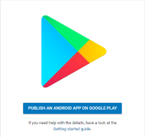

#### Perustiedot kuntoon

Ennen kuin varsinainen .apk-tiedosto siirretään eteenpäin, täytyy Google Playlle kertoa tietoja sovelluksesta. Ensimmäiseksi valitaan sovelluksen oletuskieli ja annetaan sovellukselle nimi. Tässä tapauksessa koska esimerkkinä toimiva [Tarjouspohja](https://tarjous.raiha.rocks/)-sovellus on tarkoitettu vain suomenkielisille käyttäjille, on luonnollista valita oletuskieleksi suomi.

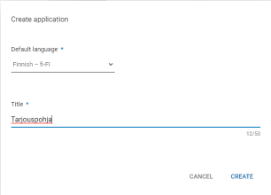

Sitten täytetään mm. sovelluksen kuvaus, valitaan haluttu ikoni, valitaan sovelluksen kategoria jne. Tähän kohtaan kannattaa valita runsaasti aikaa, jos kyseessä on ensimmäinen kerta, kun sovellusta laittaa Google Playhin, koska täytettävää on paljon. Kaikkea tietoa ei tarvitse syöttää kerralla, vaan **Save Draft** -napilla senhetkisen tilanteen voi tallentaa, ja jatkaa tietojen syöttämistä myöhemmin. Kannattaa huomata, että pakollisia kohtia löytyy useammasta osiosta, kuten **App Content** ja **Pricing & distribution**.

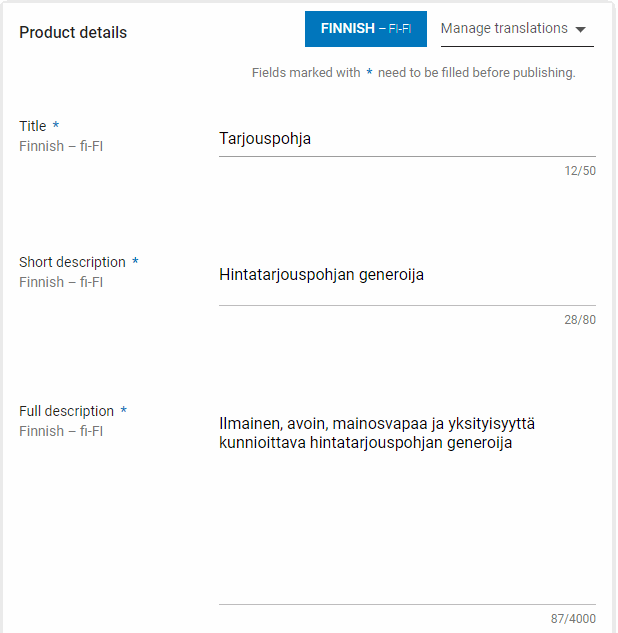

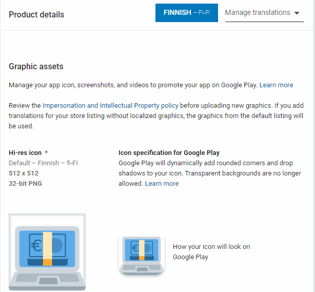

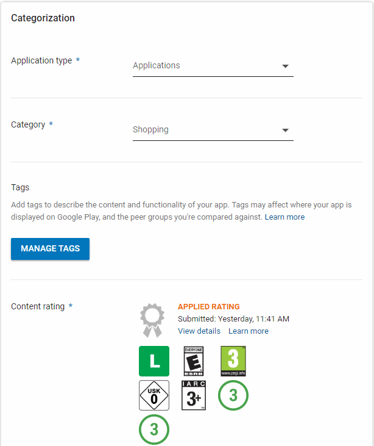

#### Internal test julkaisu

Kun Google Playn kaipaamia tietoja sovelluksesta on syötetty tarpeeksi (kaikki kohdat pitää täyttää vasta ennen virallisen version julkaisua), lähetetään varsinainen .apk-tiedosto Google Playn tarkistukseen **App Releases** -osion kautta. Aluksi kannattaa valita **Internal test**, koska sen avulla sovellus tulee ladattavaksi vain omiin laitteisiin, jolloin on mahdollista tarkistaa, että kaikki toimii oikein.

Internal test ei siis vaadi kaikkien sovellustietojen täyttämistä, eikä pidempää Googlen tarkistusprosessia .apk-tiedostolle

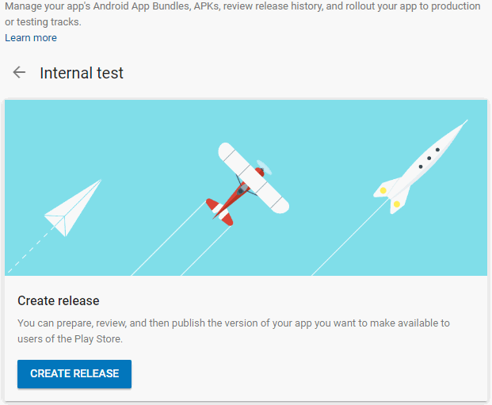

Tärkein asia on .apk-tiedoston valinta. Koska PWA Builderin tekemä .apk-tiedosto on noin megatavun kokoinen, siirtyy se nopeasti Google Playn palvelimille **Browse Files** -valinnan kautta, ja jos .apk-tiedostossa ei ole suoranaista ongelmaa, voi sen laittaa sisäisen testausporukan ladattavaksi alhaalta löytyvän **Review**-napin kautta.

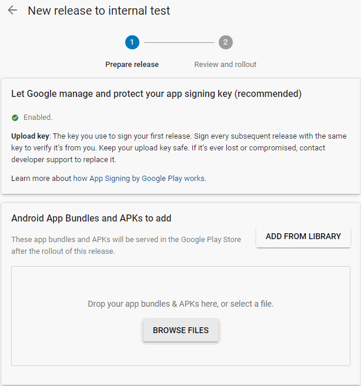

#### Varsinainen julkaisu

Varsinainen julkaisu (jossa kuka tahansa voi ladata sovelluksen Google Playstä) tapahtuu **Release**-osion kautta. Seuraavaksi valitaan miten allekirjoitusavainten kanssa toimitaan, ja tässä kohtaa annan Googlen hallita allekirjoitusavaimia, jolloin minun ei tarvitse itse murehtia niistä jatkossa, kunhan vain allekirjoitan lähetettävät .apk-tiedostot samalla avaimella kuin tein ensimmäisen julkaisun yhteydess. Tarvittaessa voin myös resetoida tämän oman avaimeni olemalla yhteydessä Google Playn tukeen.

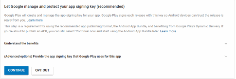

Haluttu .apk-tiedosto valitaan **Browse Filesin** kautta, jonka jälkeen julkaisulle voi antaa oman sisäisen nimen (joka ei siis näy loppukäyttäjille) **Release name** -kentän avulla.

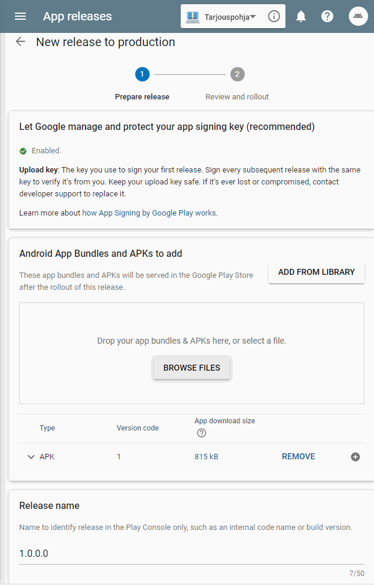

Jokaisen julkaisun yhteyteen voi lisätä tietoja kyseisestä julkaisusta, jotka kertovat käyttäjille mitä tässä versiossa on muutettu. Ensimmäisen version kanssa muutoshistorialle ei yleensä ole siis tarvetta.

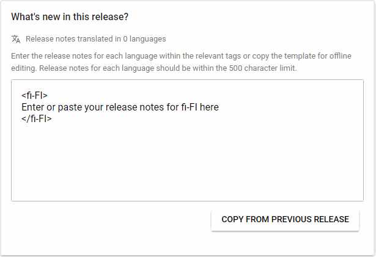

Kun kaikki on valmiina, voidaan kokonaisuus laittaa tarkistettavaksi **Review**-napilla. Uuden sovelluksen ensimmäinen tarkistus saattaa viedä useamman päivän aikaa, joten kannattaa vain odotella rauhallisesti.

#### Julkaisun tarkistaminen

Kun oma sovellus on mennyt tarkistusputkesta läpi, löytyy sen listaus **Dashboard**-osiosta, josta löytyy lisäksi esim. tilastoja sovelluksen asennusmääristä ja sovelluksen kauppasivulle johtava **View On Google Play** -nappi.

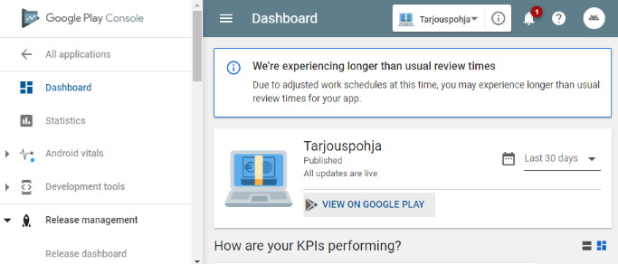

Kyseisestä linkkiä voi luonnollisesti jakaa heti eteenpäin esim. PWA:n kotisivujen ja sosiaalisen median kautta. Google Playn omaan hakulistaukseen sovellus ei kuitenkaan välttämättä päädy heti, vaan pahimmassa tapauksessa on päivien odotus ennen kuin sovellus löytyy edes sen suoralla nimellä hakiessa.

#### Laitetaan assetlinks.json kuntoon

Jotta Androidilla saadaan kaikki hyöty irti APK-muotoisesta PWA:sta, täytyy PWA:n sivuille lisätä assetlinks.json-tiedosto, jonka avulla Android voi varmistua että sovellus todella on tarkoitettu tietyn sivuston kanssa käytettäväksi.

Alla esimerkki omasta assetlinks.json-tiedostostani, joka siis sijaitsee *https://tarjous.raiha.rocks/.well-known/assetlinks.json* -osoitteessa, huomaa siis `/.well-known/assetlinks.json`

```json
[{
      "relation": ["delegate_permission/common.handle_all_urls"],
      "target" : { "namespace": "android_app", "package_name": "rocks.raiha.tarjous",
                   "sha256_cert_fingerprints": ["D4:F6:4A:DC:C4:7E:69:1B:C1:4C:E2:9C:8B:6D:15:A4:C0:D1:09:D7:F4:97:A8:FC:06:3D:B2:39:1A:D7:9E:1C"] }
}]
```
**package_name** -kohtaan laitetaan oman .apk-tiedoston ID, joka siis tässä tapauksessa valittiin PWA Builderin Options-osiossa  

**sha256_cert_fingerprints** -kohtaan laitetaan .apk-tiedoston allekirjoitusavaimen sha256-tarkistussumma. Jos Google Playn jakelemaksi tarkoitetun .apk-tiedoston jättää Googlen allekirjoitettavaksi (kuten tässä tapauksessa), löytyy tämä tarkistussumma Google Play Publish -julkaisupuolen **App signing** -osion alta **App signing certificate** -kohdasta. Jos .apk-tiedoston allekirjoittaa kokonaan itse, voi sha256-tarkistussumman etsiä vaikkapa [keytool-työkalun](https://docs.getsocial.im/knowledge-base/android-signing-key-sha256/) avulla.

### Entä päivitykset?

Koska PWA päivittyy suoraan internet-sivujensa kautta, ei varsinaista .apk-tiedostoa tarvitse välttämättä päivittää koskaan. Päivitys saattaa kuitenkin olla tarpeellinen esim. jos sovelluksen ikoni tai nimi muuttuu, jotta käyttäjät ja hakukoneet osaavat paremmin yhdistää uudistuneen sovelluksen ja PWA-sivuston. 

Jos päivitys tulee eteen, kannattaa silloin PWA Builderilla tehdä uusi .apk-tiedosto, ja kasvattaa samalla versionumeroa yhden pykälän suuremmaksi.

<span style="font-size:4em;">📱</span>
