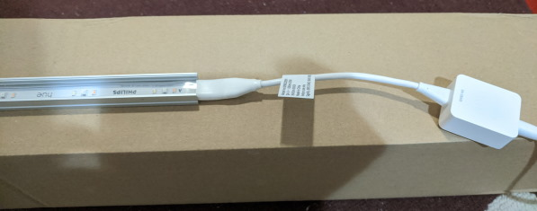
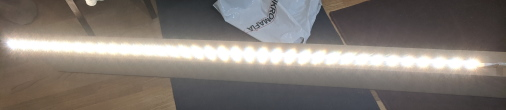
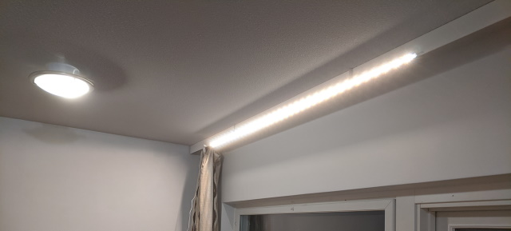

Title: Philips Hue LightStrip ja alumiiniprofiili
Tags: 
  - Philips
  - Hue
  - LightStrip
  - Alumiiniprofiili
---
> Kukaan ei ole maksanut minulle mitään tästä kirjoituksesta tai antanut tuotteita ilmaiseksi

## Philips Hue LightStrip ja alumiiniprofiili

Syksyn pimeyden jälleen hiipiessä lähemmäksi päätin parantaa olohuoneeni valaistusta. Koska asun vuokralla, en viitsi tehdä valoille mitään pysyviä asennuksia, joten päädyin hankkimaan parimetrisen himmennettävän LED-nauhan, jonka laittaisin alumiiniprofiilin avulla kiinni seinälle.

### Philips Hue LightStrip

Philipsin Hue LightStrip päätyi ostoskoriini kolmesta syystä:
1. Ostoshetkellä hyvä 20% alennus
2. Himmennystä varten hankittavissa erillinen kaukosäädin (kännykkää/tabletia ja sen sovellusta ei siis tarvitse käyttää)
3. Tarvittaessa LED-nauhaa saa pidennettyä laajennuspalojen avulla

Hinnaltaan Philips Hue LightStrip ei alennuksista huolimatta ole markkinoiden edullisin ratkaisu, joten euroja säästävän kuluttajan kannattaa valita esim. Xiaomi Yeelight Lightstrip Plus -valonauha.

Philips Hue LightStripin poikkeaa kuitenkin yhdellä merkittävällä tavalla monista muista LED-valonauhoista, ja se on leveys, sillä valonauha on 1,5 cm leveä, kun monet muut nauhat ovat noin 1 cm leveitä. Tästä syystä monista verkkokaupoista löytyvät alumiiniprofiilit eivät ole yhteensopivia sen kanssa.

### Alumiiniprofiili

Pienen hakukonehetken jälkeen ostin itselleni 2 metrin mittaisen **Hide-a-lite Art Low** -alumiiniprofiilin (EAN-koodi **7392971132662**), johon Philips Hue LightStrip siis mahtuu. Koska ulkonäöllä ei tässä kohdin ole väliä, en ottanut profiiliin sopivaa erillistä kupua ja väriksi otin alumiinin. Kiinnikkeet ostin samalla kertaa, ja itse alumiiniprofiili maksoi kahden metrin palalta 15,50 euroa ja kiinnikkeet 3,40 euroa.

### Asennus profiiliin

LED-nauhan työntäminen profiilin sisään sujui ilman ongelmia, eikä tähän operaatioon tarvita työkaluja. Tähän meni aikaa pari minuuttia, ja nauha tuntui olevan asennuksen myötä tukevasti kiinni profiilin sisällä

Valonauhan toimivuus kannattaa testata ennen profiiliin asennusta ja myös asennuksen jälkeen. Kiinnikkeet työnnetään profiiliin kiinni takapuolelta, joten kiinnikkeet voi myös laittaa aluksi paikalleen kohteeseen ja työntää profiilin sitten paikalleen.

Asennuspaikkaa valittaessa kannattaa huomata käytössä olevan virtalähteen johdon riittävyys. 

💡