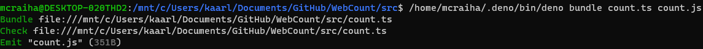
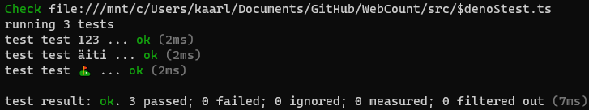

Title: Deno, haastaja Nodelle
Tags: 
  - Deno
  - Javascript
  - Typescript
  - Node.js
---

## Deno, haastaja Nodelle
Tänä vuonna Javascript/Typescript-rintamalla on tapahtunut merkittävää kehitystä yhdellä osa-alueella, ja se on [Deno](https://deno.land/)-projektin kehittyminen haastajaksi Node.js:lle.

Denossa on pyritty korjaamaan Node.js:n pahimpia ongelmia, joiden takia ainakin allekirjoittanut on aiemmin vältellyt Nodella tapahtuvaa ohjelmistokehitystä. Alla olen listannut omalta osaltani merkittävimmät muutokset

### Typescript-tuki

Denossa [Typescript](https://www.typescriptlang.org/)-tuki on sisäänrakennettuna, joten **npm**-helvettiin ei tarvitse tutustua, jos tarkoitus on kirjoittaa Typescript-koodia. Typescript-koodia voi suoraan suorittaa Denossa, ja tarvittaessa kääntää sen Javascriptiksi ilman mitään ulkopuolisia työkaluja.

esim. alla olevan Typescript-koodin
```typescript
export class CharacterCounter {
    static CountVisibleCharacters(input: string) : number {
        return [...input].length;
    }

    static CountUTF_16Characters(input: string) : number {
        return input.length;
    }

    static CountUTF_8Characters(input: string) : number {
        const encoder = new TextEncoder();
        return encoder.encode(input).length;
    }
}
```
saa muutettua Javascriptiksi seuraavalla komennolla
```
deno bundle count.ts count.js
```


### Testausympäristö

Monien muiden kunnollisten ajoympäristöjen tapaan testitapausten luonti ja suorittaminen on sisäänrakennettu Denoon. Täten mitään ylimääräistä ei tarvitse asentaa, jos omaan projektiin haluaa lisätä testitapauksia.

esim. alla olevan Typescript-koodin
```typescript
import { assertEquals } from "https://deno.land/std/testing/asserts.ts";
import { CharacterCounter } from "./count.ts";

Deno.test("test 123", () => {
    const testCase: string = "123";
    assertEquals(3, CharacterCounter.CountVisibleCharacters(testCase), "Count visible characters");
    assertEquals(3, CharacterCounter.CountUTF_16Characters(testCase), "Count UTF-16 characters");
    assertEquals(3, CharacterCounter.CountUTF_8Characters(testCase), "Count UTF-8 characters");
});

Deno.test("test äiti", () => {
    const testCase: string = "äiti";
    assertEquals(4, CharacterCounter.CountVisibleCharacters(testCase), "Count visible characters");
    assertEquals(4, CharacterCounter.CountUTF_16Characters(testCase), "Count UTF-16 characters");
    assertEquals(5, CharacterCounter.CountUTF_8Characters(testCase), "Count UTF-8 characters");
});

Deno.test("test ⛳", () => {
    const testCase: string = "⛳";
    assertEquals(1, CharacterCounter.CountVisibleCharacters(testCase), "Count visible characters");
    assertEquals(1, CharacterCounter.CountUTF_16Characters(testCase), "Count UTF-16 characters");
    assertEquals(3, CharacterCounter.CountUTF_8Characters(testCase), "Count UTF-8 characters");
});
```
saa testattua seuraavalla komennolla
```
deno test tests.ts
```


### Suorituskyky

Pahimmillaan Node.js-projekteissa testitapausten suorittaminen vie kymmeniä sekunteja, joten Denon vauhdikas [suorituskyky](https://deno.land/benchmarks), jossa testitapauksia suoritetaan muutamissa millisekunneissa tuntuu mullistavalta.

### Ei NPM-helvettiä

Denossa NPM-tukea ei ole lainkaan, jonka takia NPM-helvettiä ei pääse syntymään. Ulkopuolisiin moduuleihin voi viitata suoraan https-osoitteilla, ja Deno ylläpitää kohtuullisen kattava [standardi](https://deno.land/std)-kirjastoa, josta löytyy mm. kryptografiaan ja HTTP-yhteyksiin tarvittavat moduulit.

### Tietoturva

Denossa ajettava ohjelma ei [oletuksena](https://deno.land/manual/getting_started/permissions) pääse käsiksi levyllä oleviin tiedostoihin, tai internet-yhteyteen, jolloin esim. pieniä apuohjelmia voi ajaa turvallisemmin mielin. Verkkoyhteyksien osalta yhteyksiä voi myös rajoittaa domain-kohtaisesti, jotta ohjelmat eivät voi liikennöidä aivan minne sattuu.

### Formatointi vakiona

Denossa on vakiona myös koodin [formatointi/kaunistaminen](https://deno.land/manual/tools/formatter). Toiminnon voi suorittaa kaikille projektissa oleville tiedostoille yksinkertaisesti seuravalla komennolla 
```
deno fmt
```
tai jos haluaa esimerkiksi kaunistaa vain yhden koodi-tiedoston, voi sen puolestaan tehdä seuraavalla komennolla
```
deno fmt ugly.ts
```

### Tulevaisuus

Denon edistymistä voi seurata projektin virallisen [blogin](https://deno.land/posts/) kautta. Allekirjoittaneelle denon nykyinen 1.6-versio on toiminut niin hyvin, etten aio enää koskaan aloittaa omasta toimesta Node-projektia, vaan valinta on jatkossa aina deno.

<span style="font-size:4em;">🔥</span>