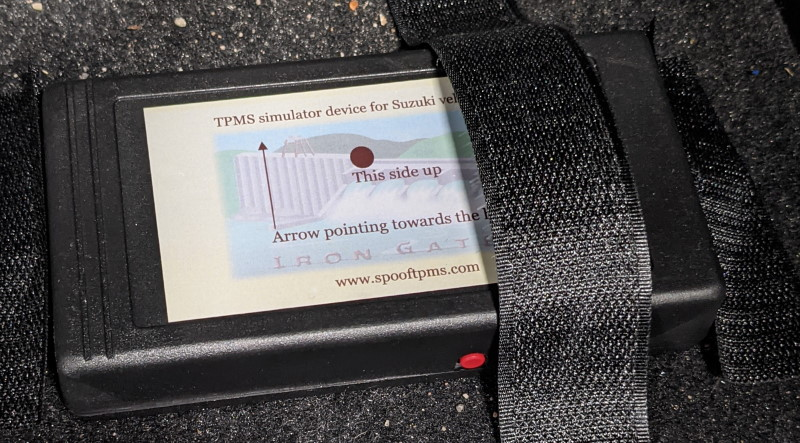

Title: TPMS-huijauslaite
Tags: 
  - TPMS
  - Rengaspaineet
  - Huijauslaite
---

> Kukaan ei ole maksanut minulle mitään tästä kirjoituksesta, tai kustantanut minulle mitään, joten kyse ei ole millään tavalla sponsoroidusta sisällöstä

## TPMS-huijauslaite

[TPMS](https://en.wikipedia.org/wiki/Tire-pressure_monitoring_system) eli renkaiden paineenvalvontajärjestelmä (Tire Pressure Monitoring System) on vuoden 2014 marraskuun jälkeen ollut pakollinen uusissa henkilöautoissa EU-alueella. TPMS on perusidealtaan ihan hyvä, mutta valitettavasti monet autonvalmistajat ovat pahasti epäonnistuneet järjestelmän visualisoinnissa autojen kojelaudoissa, jonka takia TPMS voi aiheuttaa vaaratilanteita ja harmaita hiuksia autoilijoille.

Uutta autoa Suomessa ostaessa kannattaa uhrata muutama euro, että saa autoonsa molemmat rengassarjat TPMS-antureilla, jos kyseinen automalli käyttää [direct TPMS](https://en.wikipedia.org/wiki/Direct_TPMS) -tyyppistä ratkaisua. Tämä siksi, että erikseen ostettuna neljä kappaletta auton oman järjestelmän kanssa yhteensopivia antureita maksaa reilusti yli 200 euroa, ja myös asennuksesta joutuu luonnollisesti maksamaan lisää.

Jos haluaa kuitenkin elää nuukasti, ja unohtaa TPMS-anturit kokonaan, on tarjolla kuitenkin vaihtoehtoja. Vaikka autovalmistajat eivät yleensä salli TPMS:n ottamista pois käytöstä, on markkinoilla onneksi kolmansien osapuolien tuotteita, joilla voi huijata auton omaa järjestelmää uskomaan, että rengaspaineet ovat kohdillaan.

## Valmistajakohtaista huijausta

Koska jokaisella automerkillä on oma tapansa hoitaa TPMS-kommunikointinsa, täytyy myös huijauslaite hankkia valmistajan mukaan. Yleensä saman valmistajan eri automallit käyttävät samankaltaisia toteutuksia, joten monissa tapauksissa yksi laite toimii niiden kaikkien kanssa. Koska säädöissä on kuitenkin eroja (esim. renkaspaineiden osalta), täytyy huijauslaite yleensä opettaa mukautumaan kyseiseen autoon erillisen oppimistilan kautta. Joidenkin laitteiden kanssa oppiminen pitää tehdä erikseen kun renkaat vaihdetaan toisiin, mutta yleensä ihmisillä on vain yksi rengassarja ilman TPMS-antureita, joten tämä tulee harvemmin ongelmaksi.

## SpoofTPMS-laite

SpoofTPMS asennetaan auton takakonttiin tarranauhalla. Virtaa se saa mallista riippuen joko AA-pattereista tai 12V-linjasta (kaikissa autoissa ei tätä ole takakontissa). Uudemmissa malleissa on erillinen On/Off-kytkin, josta laite laitetaan päälle. Tämän jälkeen laitetaan asetusnappia pari kertaa painamalla oppimistila päälle, ja ajellaan ympäriinsä kunnes laite oppii asetukset, jonka huomaa siitä, että kojelaudan TPMS-varoitusvalo sammuu. Tämän jälkeen painetaan asetusnappia vielä kerran, jonka jälkeen laite muistaa opitut asetukset jatkossa.

🚗🔌