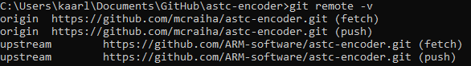
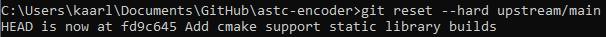

Title: GitHub-forkin resetointi
Tags: 
  - GitHub
  - git
---

## GitHub-forkin resetointi

Eli olet forkannut jonkun projektin GitHubin kautta, ja muutaman hetken (tai jopa vuoden jälkeen) haluat resetoida oman forkkisi samaan tilanteeseen kuin missä alkuperäinen projekti on nyt. GitHub Desktopin tai GitHubin verkkosivun kautta tämä ei toistaiseksi onnistu, mutta onneksi vanha kunnon git-komento pelastaa tälläkin kertaa

### Remoten tarkistus
GitHubin yksi _"salaisuus"_ on se, että forkin tehdessä alkuperäinen projekti jää **upsteam** -nimisenä remotena mukaan. Tämän voi tarkistaa omassa projektissa seuraavalla komennolla
```
git remote -v
```
ja tuloste pitäisi olla esimerkiksi alla olevan näköinen  


### Upstreamin päivitys
Upstreamin voi päivittää ajantasalle seuraavalla komennolla
```
git fetch upstream
```
Kyseinen operaatio voi viedä useita minuutteja, jos forkkaamisesta on aikaa ja alkuperäinen projekti on saanut runsaasti committeja (tai suuria tiedostoja).

### Oman masterin tai mainin yliajaminen
Kun olet varma ettei omassa master- ja/tai main-haarassa ole mitään säilyttämisen arvoista (koska komento kirjaimellisesti poistaa kaikki omat muokkaukset), voit korvata sen upstreamin vastaavalla käyttämällä seuraavaa komentoa
```
git reset --hard upstream/main
```
**main**-kohtaan voi luonnollisesti vaihtaa sen haaran, johon tilanteen haluaa resetoida  


### Muutosten pushaaminen GitHubiin
Lopulta voi tarvittaessa päivittää resetoinnin myös omaan GitHubin originiin (eli tämä poistaa valitusta remoten haarasta kaikki muutokset) seuraavalla komennolla
```
git push --force
```


<span style="font-size:4em;">🔧</span>