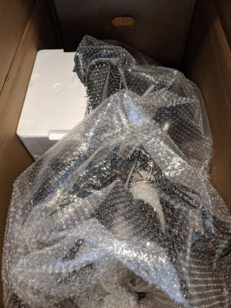
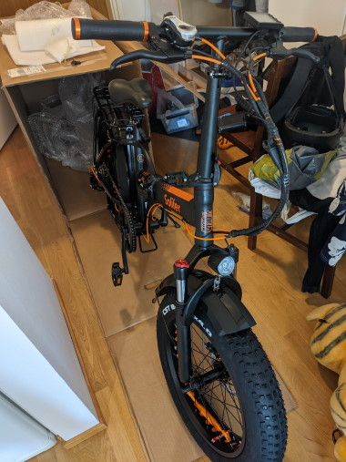
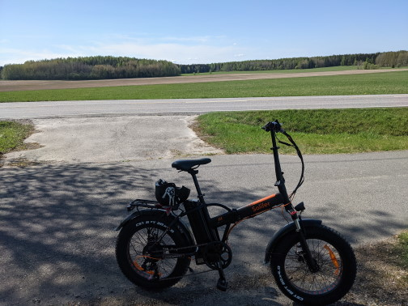
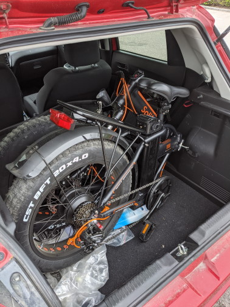

Title: Kokeilussa Solifer 20 FAT -sähköpyörä
Tags: 
  - Sähköpyörä
  - Solifer 20 FAT
---

> Kukaan ei ole maksanut minulle mitään tästä kirjoituksesta, tai kustantanut minulle mitään, joten kyse ei ole millään tavalla sponsoroidusta sisällöstä

## Kokeilussa Solifer 20 FAT -sähköpyörä

Vuoden alussa voimaan tulleen [polkupyöräedun](https://www.veronmaksajat.fi/Palkka-ja-elake/Luontoisedut/polkupyoraetu-2021/#beee3bb5) myötä päätin hankkia itselleni elämäni ensimmäisen sähköpyörän. Koska pyörää tarvitsen vain lyhyillä matkoilla, halusin itselleni taitettavan sähköpyörän, jossa olisi paksut renkaat.

Taittopyörän etu omalla kohdalla on se, että pyörän saa kotimaanmatkojen yhteydessä laitettua auton takakonttiin, jolloin varsinaisessa matkakohteessa voi pyöräillä ympäriinsä. Paksut renkaat olivat ehtona puolestaan sen takia, että pyörää voi tarvittaessa käyttää talvella esim. kauppareissuilla.

Kyseisen pyöräkategorian tarjonta on Suomessa hyvin rajoittunut, ja Verkkokauppa.comin kauppaamaan [Solifer 20 FAT](https://www.verkkokauppa.com/fi/product/48124/qjhsc/Solifer-20-FAT-sahkopyora-taittuvalla-rungolla-20) -sähköpyörään päädyin pitkälti sen edullisen hinnan puolesta.

Kyseessä on siis 20 tuumaisilla renkailla varustettu malli.

### Toimitus ja kokoaminen

Pyörä toimitettiin yhdessä suuressa pahvilaatikossa valmiiksi koottuna (taitettuna, jotta pakkaustilaa menisi mahdollisimman vähän). Pyörän lisäksi paketista löytyivät ohjekirjat, akku ja laturi. 

  

Kokoaminen onnistuu helposti. Suurimmat taittokohdat ovat ohjaustanko ja runko. Lisäksi pedaalit taittuvat, ja satulan saa tarvittaessa irrotettua.

  

### Ohjekirjat ja akku

Mukana tulevat ohjekirjat ovat kevyesti ilmaistuna huonot. Niissä on kirjoitusvirheitä, kuvat eivät vastaa kyseistä pyörää ja kaikkia tarpeellisia tietoja ei ole kerrottu, vaan niitä saa kaivaa esim. Verkkokauppa.comin [Kysymykset ja vastaukset](https://www.verkkokauppa.com/fi/product/48124/qjhsc/Solifer-20-FAT-sahkopyora-taittuvalla-rungolla-20/questions) -osiosta. Sinällään ohjekirjoja ei tarvitse pyörän käyttöön, mutta kehnot ohjekirjat eivät anna Soliferin toiminnasta kovinkaan hyvää vaikutelmaa.

Mukana tuleva akku lukittuu runkoon avaimen avulla, ja akun irrottaminen pyörästä vaatii käytännössä satulan irrottamisen, koska akkua täytyy nostaa rungosta ylöspäin. Akun lataus tyhjästä täyteen kestää useamman tunnin ja mukana tuleva laturi kuumenee tällöin jopa 65 asteiseksi, joten sitä ei uskalla jättää lataamaan ilman valvontaa. Toistaiseksi tarjolla ei ole vara-akkuja, mutta Verkkokauppa.comin mukaan niitä on tulossa jossain vaiheessa myyntiin.

Akussa on yksi latausportti, ja siinä ei ole muita toimintoja (kuten USB-lataus ja varaustason tarkitustoiminto merkkivalojen avulla), joten se ei tältä osin pärjää hintavampien sähköpyörien akuille. 

### Avustus

Pyörässä sähkömoottorilla on viisi eritehoista avustustasoa, jotka ovat käytännössä ne nopeudet, joihin saakka sähkömoottori avustaa. Korkeimmalla avustustasolla (taso 5) pyörä avustaa 25 km/h -nopeuteen asti, ja erityisesti matka-ajossa kyseinen taso on itselläni käytännössä aina käytössä, koska paksujen renkaiden vierintävastus tekee tavallisesta polkemisesta erittäin työlästä.

Kaupungissa (erityisesti risteysalueilla) käytän kuitenkin pienempiä avustustasoja, koska nopeat kiihdytykset voivat osoittautua hankalaksi muun liikenteen seassa.

Avustus kytkeytyy päälle polkiessa pienellä viiveellä, joten pyörän kanssa ei ole pelkoa siitä, että polkimen pieni liikuttaminen aiheuttaisi vaaratilanteita. Avustus kytkeytyy myös automaattisesti pois päältä kun polkemisen lopettaa tai käyttää takajarrua.

Toimintamatkaksi tuotekuvaus lupaa yhdellä latauksella noin 15-35 km, mutta itse olen ajanut yhdellä latauksella selvästi yli 35 km. Toimintamatkaan vaikuttaa luonnollisesti oma polkeminen, ja ajettava reitti.

### Jarrut ja vaihteet

Sekä edessä ja takana tarjolla olevat levyjarrut ovat riittäneet omaan käyttööni mainiosti. Myöskään **Shimano**n vaihteiden kanssa ei ole ollut ongelmia, mutta vaihteille ei avustuksen kanssa ole niin paljoa käyttöä, koska pyörä menee helposti eteenpäin suuremmallakin vaihteella. 

### Etuvalo ja merkkiääni

Pyörän akkua voi halutessaan kuluttaa myös etuvalolla ja sähköisellä merkkiäänellä. Kummankaan voimakkuutta ei voi säätää.

### Pyöräily

Itse olen tehnyt pyörällä pari pidempää lenkkiä (mm. ajo Tuusulanjärven ympäri) ja pyörällä on yllättävän mukava ajaa. Ajoasento on kohtuullisen korkea ja polkimien päällä seisoskellessa esim. alamäessä näkee hyvin pidemmänkin matkan päähän. 

Paksut renkaat pitävät erittäin kuultavaa rullausääntä sekä asfaltilla että soralla, joten ninjapyöräilyyn tämä pyörä ei kelpaa.

Paksujen renkaiden myötä pyörä on myös yllättävän vakaa ja esim. ostoskassin kuljettaminen ohjaustangon toisella sivulla roikkuen ei tuota ongelmia ajamisen osalta.

Ainoa varsinainen miinus matka-ajon osalta on mukana tulevan satulan kovuus. Koko päivää sen kanssa ei jaksaisi ajaa missään tapauksessa, ja pidemmillä ajoreissuilla kannattaa pysähtyä välillä jaloittelemaan.

  

### Taittaminen

Taittaminen käy todella nopeasti rungon ja ohjaustangon osalta. Myös polkimet kääntyvät helposti, ja tästä on etua ahtaissa pyörävarastoissa.

Taitettuna pyörä sopii myös pienien autojen takakonttiin ilman ongelmia. Kannattaa kuitenkin huomioita, että pyörä painaa yli 25 kiloa, joten nostaminen ei ole aivan niin helppoa kuin esim. allaoleva kuva antaa ymmärtää

  

### Lisävarusteet

Paksujen renkaiden osalta kannattaa huomioida, että esim. kaikki U-lukot eivät sovi pujotettaviksi renkaiden läpi (pinnojen läpi lukitus onnistunee kaikilla U-lukoilla). Itsellä käytössä oleva [Yale High Security Bike Lock](https://www.yale.fi/fi/yale/etusivu/tuotteet/polkupyoran-lukot/yale-high-security-pyoran-u-lukko/) menee juuri ja juuri renkaan läpi, mutta huomattavasti helpompaa on lukita pyörä rungosta, olettaen että sopiva lukituspaikka on lähellä.

Myöskään monet lukkojen kuljetuskiinnikkeet eivät sovi pyörään, koska pyöreällä putkella olevia kiinnityskohtia ei pyörässä ole, ellei satulan putkea sellaiseksi laske.

Pyörässä vakiona oleva seisontatuki on todella vakaa, ja pyörään voi sen kanssa jättää vaikkapa ostoskassin roikkumaan ilman pelkoa pyörän kaatumisesta.

Mukana olevaan tarakkaan saanee asennettua halutessaan korin, joka helpottaa esim. ostosten kuljetusta. 

### Loppusanat

Itselleni kyseinen pyörä on ainakin toistaiseksi ollut hyvä hankinta. Kesäpäivien ulkoiluun se tuo mukavaa vaihtelua, koska tuttujen paikalliskävelyreittien ohella pyörällä pääsee helposti tutustumaan kauempina oleviin kohteisiin. Myös henkilöauton käyttö on sähköpyörän myötä vähentynyt selvästi, koska esim. kauppa- ja asiointireissuja voi helposti hoitaa sähköpyörän avulla.

🚴⚡