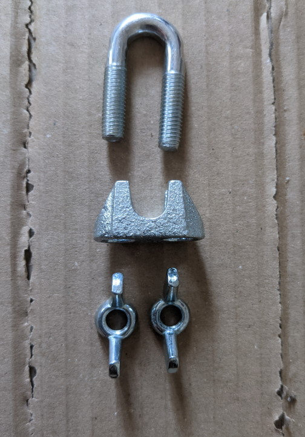
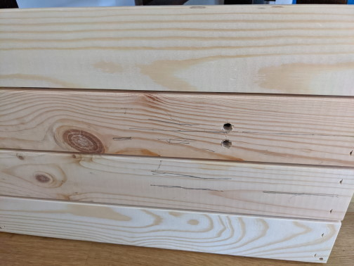
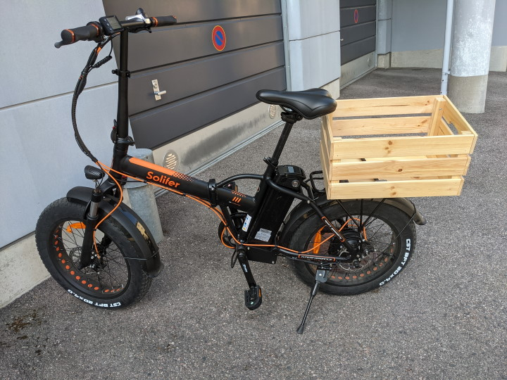
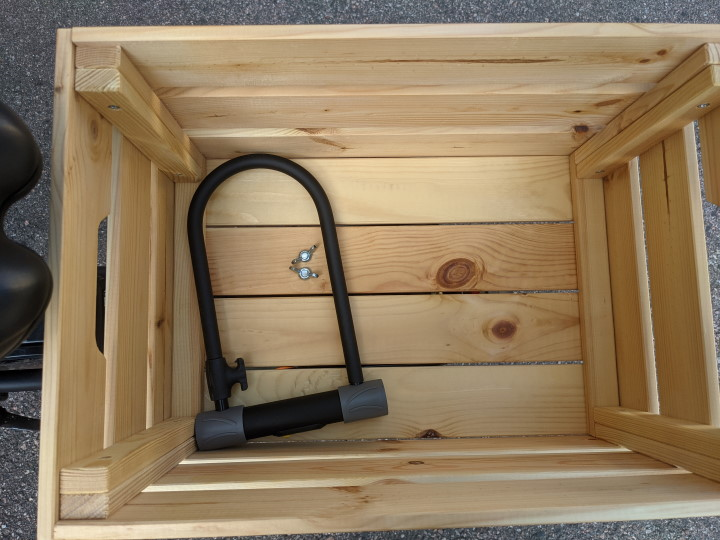

Title: Edullinen tarakkakori polkupyörään
Tags: 
  - Tarakkakori
  - Polkupyörä
---

## Edullinen tarakkakori polkupyörään

Polkupyörään hankittavissa olevien lisävarusteiden kirjo on valtaisa, mutta välillä toivottua tuotetta ei ole saatavilla, joten vaihtoehdoksi jää tallöin oma rakentelu/askartelu. Tällä kertaa tarve oli kestävälle puiselle takakorille, jonka saa kiinni pyörän tarakkaan, joten keskusteluista kuullun vihjeen perusteella päätin laittaa pyörään kiinni **IKEA**:n puisen 46x31x25 cm -kokoisen [KNAGGLIG](https://www.ikea.com/fi/fi/p/knagglig-laatikko-maenty-70292359)-korin. 9,99 euron hintaisena kori on todella edullinen vaikka sitä ei saa suoraan kiinni pyörän tarakkaan.

### Kiinnitys

KNAGGLIG:issa ei ole valmiiksi paikkoja kiinnikkeille, mutta korin saisi helpoiten kiinni pyörään [mustekaloilla](https://m.motonet.fi/fi/kategoria/2058/223906/Mustekalat-ja-kumikoydet). Itse päätin kuitenkin kiinnittää korin tarakkaan [vaijerilukon](https://m.motonet.fi/fi/tuote/387646/Vaijerilukko-6-mm-AISI-316) ja [siipimuttereiden](https://www.puuilo.fi/wurth-wip-siipimutteri-m8-10kpl) avulla, koska korin saisi tällöin tukevasti kiinni ja se olisi tarvittaessa nopea irrottaa tarakasta. 

  

Käytännössä tämä kiinnitystapa vaatii kahden reiän poraamista puulaatikon pohjaan, joten työkalupakista on löydyttävä pora ja mieluusti myös mittanauha, jonka avulla porauspaikat voi mitata.

  

Kun reiät on porattu laatikkoon, laitetaan vaijerilukko tarakkaan kiinni niin että avonaiset päät osoittavat ylöspäin. Sitten laatikko pujotetaan päälle ja kiristetään kunnolla kiinni siipimuttereilla. Väliin kannattaa laittaa aluslaattoja/aluslevyjä/prikkoja, jolloin kiinnityksestä saa tukevamman.

Sähköpyörän kanssa kannattaa tarkistaa ennen lopullista asennusta, että pyörän akun saa tarvittaessa irroitettua ilman korin irrottamista, jos on tarkoitus ladata akkua niin ettei se ole kiinni pyörässä. 

### Puun käsittely

Koska kyseisen puulaatikon pinta on käsittelemätön, kannattaa se aluksi hioa kevyesti hiomapaperilla ja sen jälkeen esim. lakata tai petsata ennen kokoamista ja kiinnittämistä. Itse laitoin hionnan jälkeen pintaan parin kerroksen verran kevyesti puuöljyä, joka toivottavasti suojelee puuta tarpeeksi. Tarkoitus on käyttää koria ympärivuotisesti, joten sen on kestettävä pieni lumi/vesi/räntäsade.

### Lopputulos

Korin kiinnittäminen tarakkaan sujui yllättävän helposti. Kori on omaan käyttöön ehkä hieman liian suuri, mutta IKEA:n valikoimissa on vain kahta kokoa koreja, ja pienempi kori on taas omaa käyttöäni ajatellen liian pieni. Kori ei haittaa varsinaista pyöräilyä millään tavalla ja se helpottaa huomattavasti esim. ostosten kuljettamista.

  

  

🚴📦