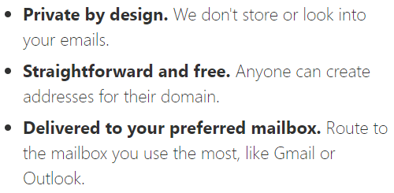
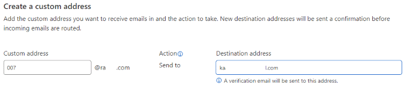
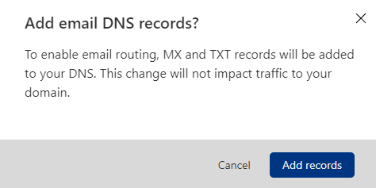
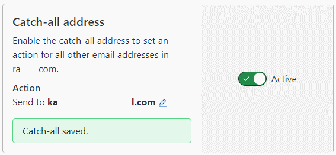

Title: Kokeilussa Cloudflare Email Routing
Tags: 
  - Email
  - Cloudflare
---

## Cloudflare Email Routing

[Cloudflare](https://www.cloudflare.com/) on laajentanut viimeisen vuoden aikana tarjontaansa valtaisasti. Yrityspuolelle suunnattujen ratkaisujen lisäksi tarjolle on tullut myös tavallisia kuluttajia kiinnostavia ratkaisuja, joista yksi on uudehko [Email Routing](https://blog.cloudflare.com/introducing-email-routing/).

## Email Routing pähkinänkuoressa

Email Routing tarjoaa nimensä mukaisesti omaan domainiin saapuvien sähköpostien uudelleenohjauksen haluttuihin osoitteisiin. esim. palaute@munhienoosoite.com:iin tulevat sähköpostit voi ohjata poraaja86@kaupuningkovinduunari.com:iin. Yksittäisten osoitteiden lisäksi tuettuna on ns. catch-all-toiminto, jolla kaikki domainille saapuvan sähköpostin voi ohjata haluttuun osoitteeseen.

## Kustannukset

Tarkan kulukuurin ihmisille Email Routing on erinomainen tuote, koska se on täysin ilmainen. 

## Asetukset

Kun Cloudflare on antanut palveluun kutsun, käy DNS-asetusten vaihto (tai laittaminen, jos domainilla ei ole aiemmin ollut sähköpostipalveluita) ja palvelun käyttöönotto parilla hiirenklikkauksella. Cloudflare lähettää vastaanottavalle sähköpostiosoitteelle automaattisesti vahvistusviestin, jonka hyväksynnän jälkeen voi DNS-asetukset (MX- ja TXT-tietueet) asettaa oikeiksi nappia painamalla

  

DNS-asetusten jälkeen sähköposti uudelleenohjautuu välittömästi ja myös tarpeellinen catch-all -toiminto tulee käyttöön nappia painamalla

## Plussat

Ilmainen, helppo ottaa käyttöön ja ainakin toistaiseksi erinomainen toimintavarmuus tekevät tästä parhaan Email Routing -palvelun, jota olen käyttänyt.

Email Routingin myötä Cloudflare on ylivoimaisesti edullisin hosting-ratkaisu tavalliselle kuolevaiselle, koska sen ainoa maksullinen osa on domain-nimi, josta joutuu maksamaan joka tapauksessa jotakin. 

## Miinukset

Email Routing ei tarjoa sähköpostilaatikoita tai sähköpostin lähetysmahdollisuutta, joten se ei korvaa esim. Yandex.Mail-palvelua, joka tarjoaa molemmat näistä toiminnoista.

📧