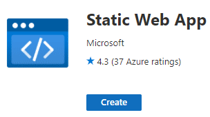
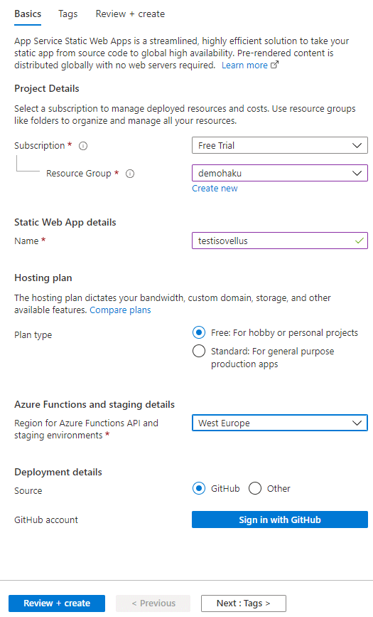
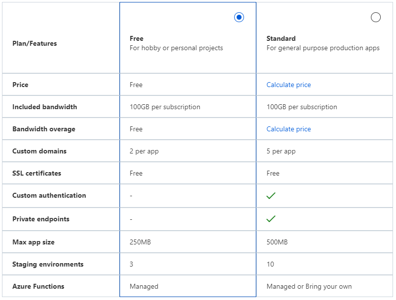

Title: Kokeilussa Azure Static Web Apps
Tags: 
  - Azure
  - Azure Static Web Apps
  - Azure Functions
  - GitHub
  - staattiset sivut
---

## Azure Static Web Apps

Tämän vuoden viimeisessä kokeilussa on vuorossa [Azure Static Web Apps](https://docs.microsoft.com/en-us/azure/static-web-apps/overview), joka yhdistää staattiset web-sivut (front end) ja Azure Functionsit (back end) samaan pakettiin.

Aiemmin Azure Static Web Appsia vastaavat toiminnot on saanut käyttöönsä oman CI/CD-putken, Azure Storagen ja Azure Functionsin avulla. Nyt **Microsoft** on niputtanut nämä yhteen pakettiin, joka helpottaa huomattavasti kokonaisuuden hallintaa, koska kaiken saa nyt automatisoitua kerralla kuntoon.

### Aluksi GitHub tai Azure DevOps projekti

Aluksi tarvitaan joko **GitHub**ista tai **Azure DevOps**ista löytyvä sopiva projekti, joska kokonaisuus rakennetaan. Microsoft tukee automatisoinnin osalta front end -puolella mm. [Angular](https://angular.io/)ia, [React](https://reactjs.org/)ia, [Svelte](https://svelte.dev/)ä, [Vue](https://vuejs.org/)ta ja [Blazor](https://dotnet.microsoft.com/en-us/apps/aspnet/web-apps/blazor)ia, joten palveluun on helppo siirtää sekä olemassa olevia projekteja että käyttää sitä uusien projektien alustana. Käytännössä front end -kehitystä voi tehdä millä tahansa tekniikalla, sillä [ajettavat komennot](https://docs.microsoft.com/en-us/azure/static-web-apps/build-configuration?tabs=github-actions#build-and-deploy) voi määrittää itse luotavaan .yaml-tiedostoon.

Microsoft tarjoaa kehittäjille alkuun valmiita [pohjia](https://github.com/staticwebdev/) GitHubin kautta, joilla pääsee eteenpäin. Azure Functionsia ei ole pakko käyttää, joten palvelu kelpaa myös omien staattisten sivujen pyörittämiseen.

Omaa [esimerkkiä](https://github.com/mcraiha/azurestaticwebappblazordemo) varten valitsin C#:lla toteutetun Blazorin ja Functionsin yhdistelmän, joka osaa hakea tarvittaessa tietoa **CosmosDB**:stä.

### Azuren puoli

Azuresta homma menee eteenpäin luomalla uusi resurssi (**Create a Resource**) ja valitsemalla **Static Web Apps**.

  

Tämän jälkeen valitaan resurssiryhmä, annetaan uutukaiselle nimi, valitaan hosting plan, valitaan region ja linkataan luotava Azure Static Web Apps olemassa olevaan projektiin (tässä tapauksessa GitHubista löytyvä projekti).

  

Tämän jälkeen Azure luo automatiikalla kääntämiseen tarkoitetun .yaml-tiedoston projektiin (tämän takia Azure tarvitsee käyttöoikeuden kyseisen projektin versionhallintaan) ja tekee ensimmäisen version. Omalla kohdalla ensimmäisen version kääntäminen ja päivittäminen Azuren palveluihin vei hieman päälle neljä minuuttia.

Kun homma on valmis, löytyy palvelun URL-osoite Azuresta juuri luodun Static Web Appin alta ja osoitteella voi sitten testata palvelun toimivuutta.

### Hinnoittelu

Omia harrasteprojekteja varten Azure Static Web Apps tarjoaa onneksi ilmaisen Free-mallin, joka sisältää 100 gigatavun edestä liikennöintiä ja 250 megatavua tallennustilaa front end -sovellukselle.

Maksullinen Standard-tason hinnat alkavat hieman päälle 8 eurosta per kuukausi. Standardin suurin etu yrityskäyttöä ajatellen on [OpenID Connect](https://en.wikipedia.org/wiki/OpenID) -yhteensopiva [autentikointi](https://docs.microsoft.com/en-us/azure/static-web-apps/authentication-custom?tabs=aad).

  

### Plussat

Palvelu on helppo ottaa käyttöön, front end -kehityksen tekniikat voi päättää itse ja ilmainen free -taso tarjoaa harrasteprojekteille tarpeeksi ominaisuuksia.

### Miinukset

Toistaiseksi tuettuna ovat vain GitHub- ja Azure DevOps -projektit. Pieni tallennustila estää käytännössä mm. valokuva- ja videogallerioiden luomisen. 

☁️