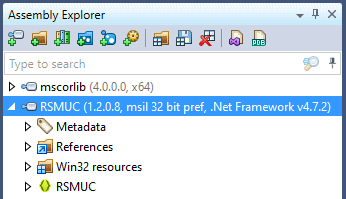
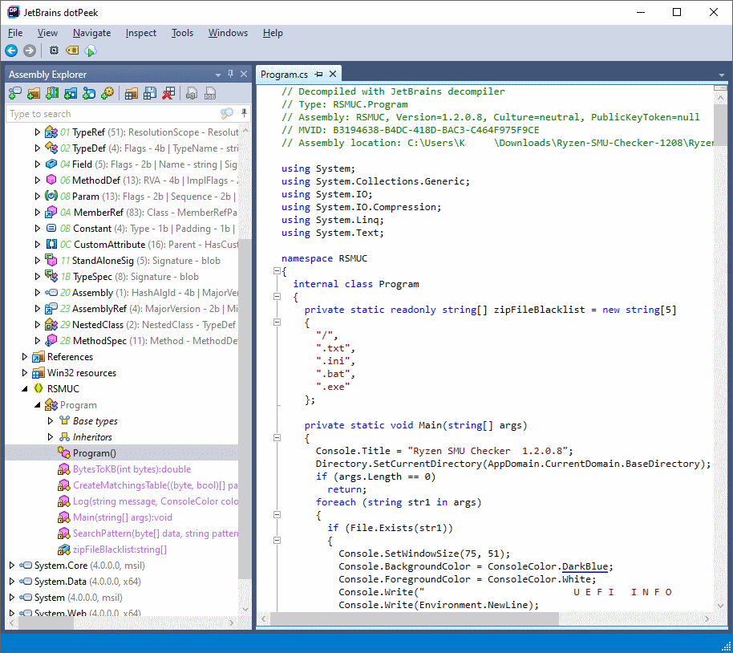

Title: Binääristä takaisin lähdekoodiksi
Tags: 
  - dotPeek
  - .NET
  - C#
---

## Binääristä takaisin lähdekoodiksi

Joskus elämässä päätyy tilanteeseen, jossa pitäisi selvittää miten joku ohjelma on toteutettu vaikka ohjelman lähdekoodeja ei ole saatavilla (köh, köh, muistakaa varmuuskopiot). Tämän lisäksi saattaa olla tarve toteuttaa itse tutkittavan ohjelman tarjoamat ominaisuudet, jolloin kannattaa etsiä omalle alustalle sopiva [decompiler](https://en.wikipedia.org/wiki/Decompiler), jolla binäärikoodin saa muunnettua takaisin ymmärrettävämpään muotoon.

### C#, .NET ja IL-koodi

.NET-maailmassa ohjelmat rakentuvat pitkälti [IL](https://en.wikipedia.org/wiki/Common_Intermediate_Language)-koodiksi käännetyistä komponenteista, jotka ajoympäristö muuttaa ajonaikaisesti ajettavaksi laitteiston ymmärtämäksi koodiksi. Tällaisissa tapauksissa IL-koodin muuntaminen takaisin lähdekoodiksi on huomattavasti helpompaa kuin esim. C/C++ -ohjelmointikielillä toteutetuissa ohjelmissa, sillä .NET:in IL-koodi sisältää runsaasti ylimääräistä tietoa alkuperäisestä lähdekoodista. C/C++ -puolella kääntäjillä on enemmän mahdollisuuksia ohjelman optimoimiseksi (tällöin alkuperäiset asiat katoavat helpommin).

.NET-puolella on tästä syystä tarjolla [useita](https://blog.ndepend.com/in-the-jungle-of-net-decompilers/) takaisinmallinnustyökaluja, ja itse päätin ottaa kokeiluun **JetBrains**in [dotPeek](https://www.jetbrains.com/decompiler/)in, koska se on ilmainen ja se asentuu helposti Windows-koneille. 

### dotPeekin käyttäminen

Asennuksen jälkeen dotPeek käynnistyy ja kysyy lisenssiehtojen hyväksymisen. Tämän jälkeen ohjelma jää ns. tyhjään tilaan, eli valitaan tutkittava .NET-ohjelma **File -> Open...** -valinnalla. Kun haluttu tiedosto on valittu (tässä tapauksessa .exe-tiedosto), lukee dotPeek sen sisällön ja jäsentää tarvittavat tiedot **Assembly Explorer** -ikkunaan.

  

Yllä olevasta kuvasta selviää, että kyseessä on .NET Frameworkin 4.7.2-versiolle tehty sovellus, jonka versionumero on 1.2.0.8

Kun halutaan saada lähdekooditulkinta esiin, suunnataan haluttuun osaan ohjelmassa (tässä tapauksessa **Program()**) ja tuplaklikataan sitä. Tämä käynnistää dotPeekin prosessoinnin, jonka jälkeen lähdekoodi-ikkunan (tässä tapauksessa **Program.cs**) pitäisi aueta.

  

Kyseisen kuvan lähdekoodia voi verrata GitHubista löytyvään aiemmin julkaistun version [lähdekoodiin](https://github.com/LeagueRaINi/Zen2-SMU-Checker/blob/master/SMUC/SMUC/Program.cs), ja nopeasti selviää niiden olevan hyvin lähelle samat. Aivat täydellisestä lopputulosta dotPeek ei luonnollisesti saa aikaiseksi, koska tietyt muuttujien nimet ovat muuttuneet geneerisiksi (`str1`, `str2` jne.), tietyt rakenteet ovat saaneet kokorajoituksia (`new string[]` -> `new string[5]`) ja koodin muotoilu on toisenlainen, mutta lopputulos on jopa aloittelijan tarpeita ajatellen todella hyvä.

### Yhteenveto

Allekirjoittaneelle dotPeek tarjosi toivotun lopputuloksen, ja vastaavat työkalut todellakin helpottavat huomattavasti tietyistä ongelmatilanteista selviämistä.

📇