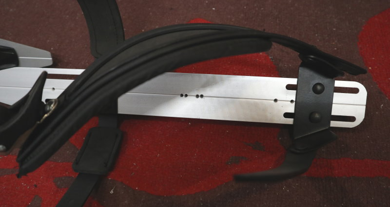
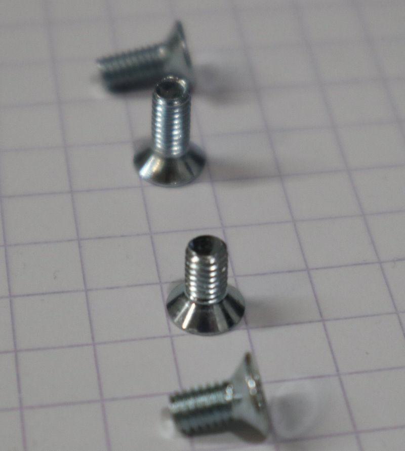
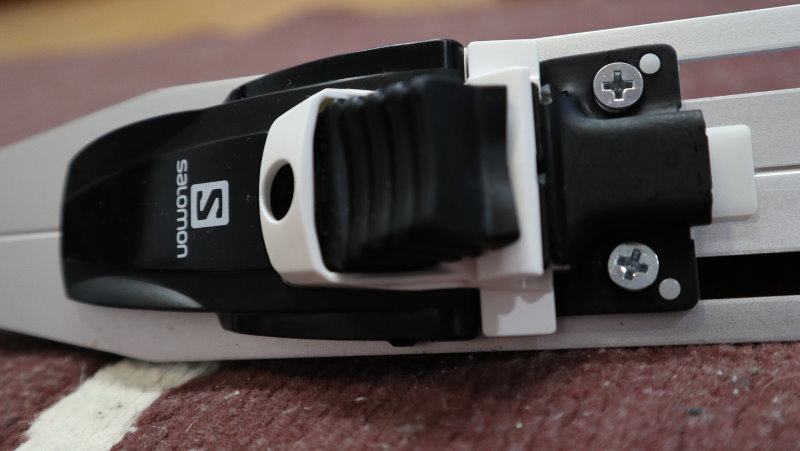
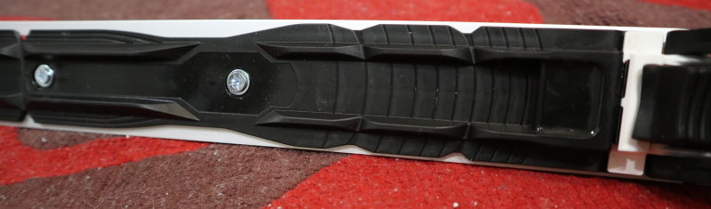
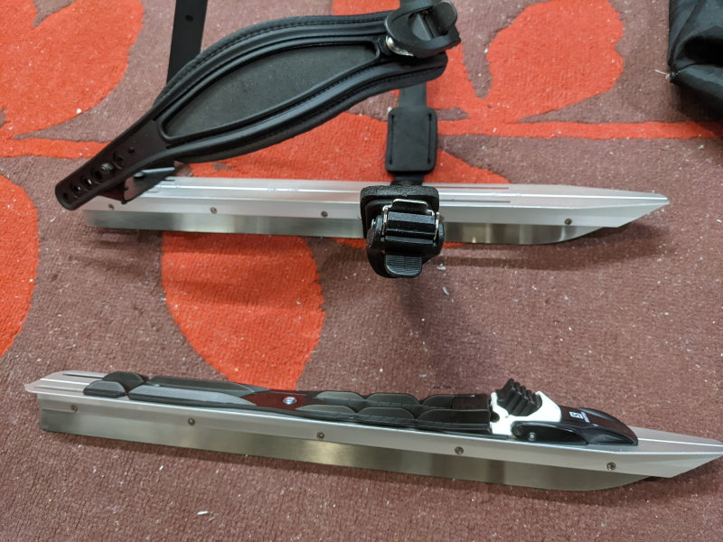

Title: Pumppusiteiden vaihto luistelusiteiksi retkiluistimissa
Tags: 
  - Retkiluistimet
  - Pumppuside
  - SNS
  - NNN
  - Prolink
---

> Kukaan ei ole maksanut minulle mitään tästä kirjoituksesta, tai kustantanut minulle mitään, joten kyse ei ole millään tavalla sponsoroidusta sisällöstä

## Pumppusiteiden vaihto luistelusiteiksi retkiluistimissa

Talven myötä rullaluistelu ulkotiloissa muuttuu mahdottomaksi, ja talvikaudeksi olen koettanut ottaa liikuntavaihtoehdoksi retkiluistelun. Alkuun hankin itselleni edulliset **Toronto**-retkiluistimet, joissa on talvikenkiin kiinnitettävä ns. pumppuside. Omalla kohdalla kenkä ei kuitenkaan kiinnity kyseiseen pumppusiteeseen kovinkaan tukevasti, joten päätin vaihtaa pumppusiteet suksista tuttuihin luistelusiteisiin, jolloin voin käyttää luistinten kanssa monoja.

Toronto-retkiluistimissa on valmiiksi kiinnityspisteet sekä **SNS**- että **NNN**-siteille. Oma valinta oli kuitenkin **Prolink**-siteet, koska löysin edullisesti **Salomon Prolink Pro Skate** -siteet läheisestä urheilukaupasta. Prolink-side asentuu samoihin SNS-kohtiin luistimissa, ja Prolink-side kelpuuttaa minulta jo löytyvät NNN-monot.

### Pumppusiteiden irrotus

Pumppusiteet irtoavat Toronto-retkiluistimista muutamassa minuutissa, jos käytössä on jakoavain tai sopivat hylsysarja. Käytännössä mutterit vain ruuvataan irti ja pumppusiteiden osat voi irroittaa sitten helposti ja laittaa talteen.  

  
(kuvassa näkyvät luistimen keskellä myös ruuvien kiinnityspaikat yleisimpiä hiihtositeitä varten)

### Prolink-siteen asennus

Asennuksen kannalta hankalin vaihe on sopivien ruuvien löytäminen. Koska siteet ovat melko matalat, ei luistimen yläpuolelle jää paljon ruuvia. Siteissä valmiiksi mukana olevat ruuvit eivät kelpaa asennukseen, koska nuo ruuvit ovat tarkoitettu siteiden asennukseen suksiin.

**M4**-kierteeseen menevät ruuvit hain lopulta [Uudenmaan Pultti](https://www.uudenmaanpultti.fi/)-nimisestä firmasta, koska sekatavarakauppojen ruuvihyllyistä ei sopivia löytynyt. Keskiosiin laitettavien ruuvien pituus oli 8 mm ja reunoille otin 10 mm pituudella varustetut. Lisäksi reunoille kannattaa laittaa aluslevyt ja mutterit kiristystä varten. Ja myös takaosan kiinnitys kannattaa suorittaa aluslevyjen avulla. Yhteensä siis tarvitsin kuusi kappaletta 8 mm ruuveja, neljä kappaletta 10 mm ruuveja, kahdeksan aluslevyä ja neljä mutteria.  

  

Prolinkin tapauksessa siteen etuosa kiinnitetään ensin luistimeen. Varsinaista säätöä ei voi siteen paikalle kauheasti tehdä, koska sopivia kiinnityskohtia on käytännössä kaksi, ja niiden välinen ero noin senttimetrin luokkaa. Reunoille tulevat aluslevyt ja mutteiden kiristys täytyy myös tehdä tässä kohtaa, koska Prolink-siteen takaosa peittää kyseiset ruuvit alleen, jolloin niitä ei voi enää kiristää.  

  

Tämän jälkeen siteen takaosan liukuu kohtuu helposti etuosan päälle, ja takaosa kiinnitetään paikalle ruuveilla ja aluslevyillä.  

### Lopputulos

Alla olevassa kuvassa näkyy selvästi alkuperäisen pumppusiteen ja Prolink-siteen ero luistimen kohdalla. Ainakin omalla kohdalla Prolink + NNN-mono -yhdistelmä on selvästi tukevampi luistelun kannalta, mutta siltikään sen kanssa ei pääse rullaluistimesta tuttuun tuentaan, joten luistelu on edelleen omalla kohdalla hieman haparoivaa.  
  

⛸️