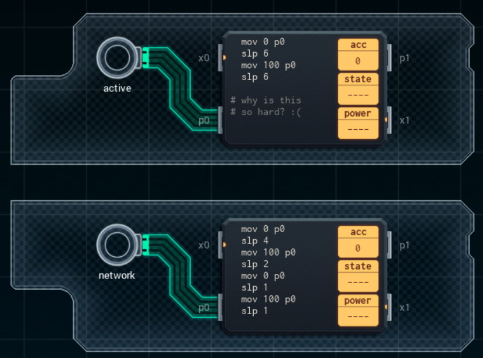

Title: SHENZHEN I/O Fake Surveillance Camera
Tags: 
  - SHENZHEN I/O
  - Vinkit
---
`❗ TÄMÄ TEKSTI SISÄLTÄÄ SPOILEREITA ❗`

## SHENZHEN I/O -pelin Fake Surveillance Camera -tehtävä
SHENZHEN I/O:n tehtävä numero yksi on Fake Surveillance Camera. Alla kuva ensimmäisestä toteutuksesta, jolla sain tehtävän suoritettua.

  

### Missä menin vikaan

En missään, tehtävä on helppo ja tehtävänanto hyvin ymmärrettävissä.

### Mitä olisi voinut tehdä paremmin

Myöhemmin pelissä paljastuvalla [GEN](https://shenzhen-io.fandom.com/wiki/Gen_(instruction))-komennolla koodirivien määrää voi vähentää. Alussa GEN:istä ei kuitenkaan ollut tietoa.

🖥️