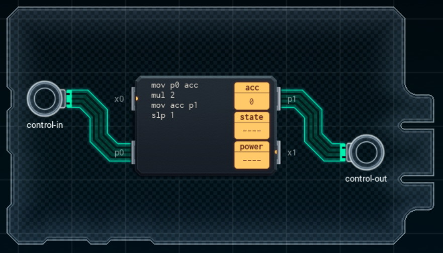

Title: SHENZHEN I/O Control Signal Amplifier
Tags: 
  - SHENZHEN I/O
  - Vinkit
---
`❗ TÄMÄ TEKSTI SISÄLTÄÄ SPOILEREITA ❗`

## SHENZHEN I/O -pelin Control Signal Amplifier -tehtävä
SHENZHEN I/O:n tehtävä numero kaksi on Control Signal Amplifier. Alla kuva ensimmäisestä toteutuksesta, jolla sain tehtävän suoritettua.

  

### Missä menin vikaan

En missään, tehtävä on helppo ja tehtävänanto on jälleen hyvin ymmärrettävissä. Eli sisääntulevan signaalin arvo pitää tuplata.

### Mitä olisi voinut tehdä paremmin

Ei mitään. (Tähän on olemassa koodimäärältä pienempi ratkaisu, mutta jos se kiinnostaa, kannattaa se etsiä hakukoneella)

🖥️