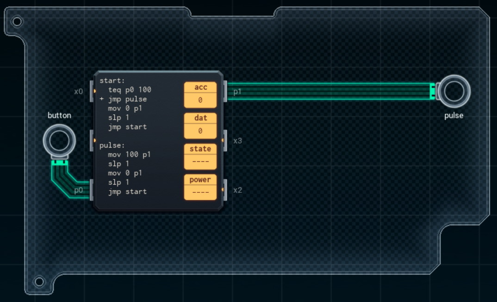

Title: SHENZHEN I/O Diagnostic Pulse Generator
Tags: 
  - SHENZHEN I/O
  - Vinkit
---
`❗ TÄMÄ TEKSTI SISÄLTÄÄ SPOILEREITA ❗`

## SHENZHEN I/O -pelin Diagnostic Pulse Generator -tehtävä
SHENZHEN I/O:n tehtävä numero kolme on Diagnostic Pulse Generator. Alla kuva ensimmäisestä toteutuksesta, jolla sain tehtävän suoritettua.

  

### Missä menin vikaan

En missään, tehtävä on helppo ja tehtävänanto on jälleen hyvin ymmärrettävissä. Eli napin ollessa painettuna pitäisi generoida pulssisignaalia.

### Mitä olisi voinut tehdä paremmin

Koko pulse-osion voisi korvata myöhemmin pelissä paljastuvalla [GEN](https://shenzhen-io.fandom.com/wiki/Gen_(instruction))-komennolla. Tällöin koodi mahtuisi myös pienempään piiriin, jolloin kustannuksissa voisi myös säästää.

🖥️