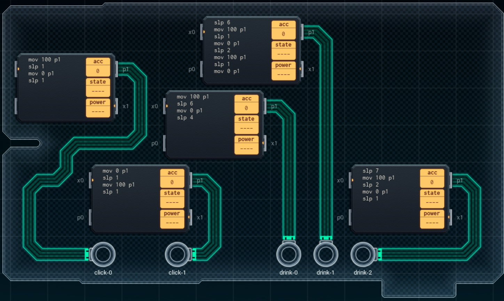

Title: SHENZHEN I/O Animated Esports Sign
Tags: 
  - SHENZHEN I/O
  - Vinkit
---
`❗ TÄMÄ TEKSTI SISÄLTÄÄ SPOILEREITA ❗`

## SHENZHEN I/O -pelin Animated Esports Sign -tehtävä
SHENZHEN I/O:n tehtävä numero neljä on Animated Esports Sign. Alla kuva ensimmäisestä toteutuksesta, jolla sain tehtävän suoritettua.

  

### Missä menin vikaan

En missään, tehtävä on helppo ja tehtävänanto on jälleen hyvin ymmärrettävissä. Eli generoidaan toistuvia syötteitä ohjeen mukaisesti

### Mitä olisi voinut tehdä paremmin

Myöhemmin pelissä paljastuvalla [GEN](https://shenzhen-io.fandom.com/wiki/Gen_(instruction))-komennolla saisi koodia vähennettyä selvästi. Myös Click-ulostulot voisi helposti ottaa ulos yhdestä piiristä, jolloin kuluja saisi karsittua.

🖥️