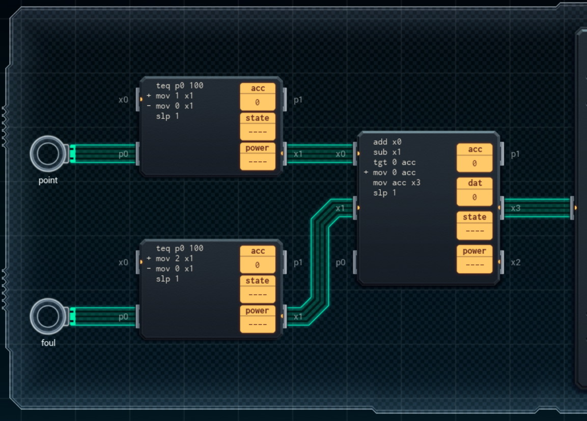

Title: SHENZHEN I/O Drinking Game Scorekeeper
Tags: 
  - SHENZHEN I/O
  - Vinkit
---
`❗ TÄMÄ TEKSTI SISÄLTÄÄ SPOILEREITA ❗`

## SHENZHEN I/O -pelin Drinking Game Scorekeeper -tehtävä
SHENZHEN I/O:n tehtävä numero viisi on Drinking Game Scorekeeper. Alla kuva ensimmäisestä toteutuksesta, jolla sain tehtävän suoritettua.

  

### Missä menin vikaan

En missään, tehtävä on helppo ja tehtävänanto on jälleen hyvin ymmärrettävissä. Eli pidetään kirjaa juomapelin pisteistä.

### Mitä olisi voinut tehdä paremmin

Molemmat syötteet voisi lukea sisään yhdellä ja samalla piirillä. Ja yhteenlaskuun ei tarvitsisi käyttää suurempaa piiriä. Kuluja saisi täten vähennettyä huomattavasti.

🖥️