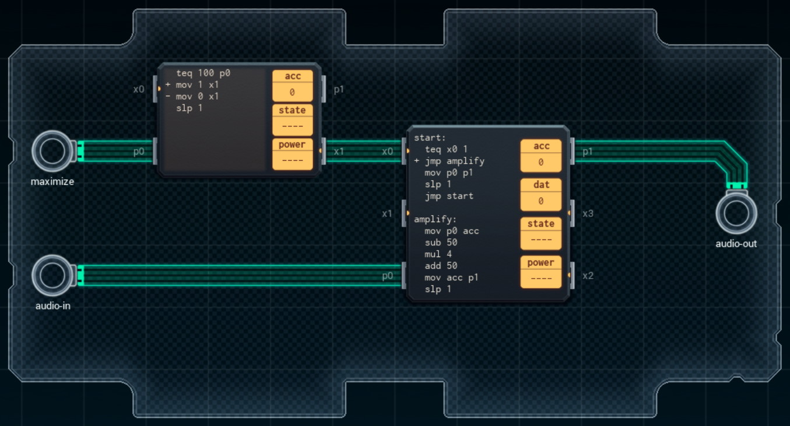

Title: SHENZHEN I/O Harmonic Maximization Engine
Tags: 
  - SHENZHEN I/O
  - Vinkit
---
`❗ TÄMÄ TEKSTI SISÄLTÄÄ SPOILEREITA ❗`

## SHENZHEN I/O -pelin Harmonic Maximization Engine -tehtävä
SHENZHEN I/O:n tehtävä numero kuusi on Harmonic Maximization Engine. Alla kuva ensimmäisestä toteutuksesta, jolla sain tehtävän suoritettua.

  

### Missä menin vikaan

En missään, tehtävä on helppo ja tehtävänanto on jälleen hyvin ymmärrettävissä. Eli sisääntulevalle audiosignaalille tehdään tarvittaessa hieman lisää laskentaa.

### Mitä olisi voinut tehdä paremmin

Ensimmäisessä piirissä voisi välittää eteenpäin suoraan syötettä, koska eteenpäin vietävän arvon ei tarvitse olla 0 tai 1 (koodin määrä vähenee). Toisessa piirissä *amplify*-osion voisi sisällyttää suoraan koodiin, jonka myötä koodin määrää saisi vähennettyä ja täten voisi käyttää pienempää piiriä kulujen karsimiseksi.

🖥️