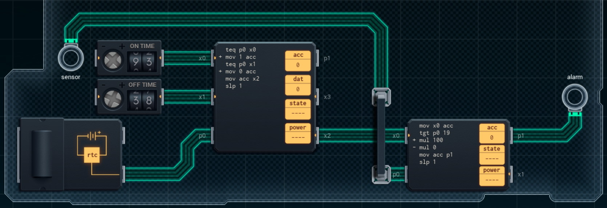

Title: SHENZHEN I/O Passive Infrared Sensor
Tags: 
  - SHENZHEN I/O
  - Vinkit
---
`❗ TÄMÄ TEKSTI SISÄLTÄÄ SPOILEREITA ❗`

## SHENZHEN I/O -pelin Passive Infrared Sensor -tehtävä
SHENZHEN I/O:n tehtävä numero seitsemän on Passive Infrared Sensor. Alla kuva ensimmäisestä toteutuksesta, jolla sain tehtävän suoritettua.

  

### Missä menin vikaan

En missään, tehtävä on helppo ja tehtävänanto on jälleen hyvin ymmärrettävissä. Eli tehdään hälytys tiettyinä aikoina, jos havaitaan liikettä.

### Mitä olisi voinut tehdä paremmin

Ensimmäinen piiri voisi välittää suoraan sopivan loppuarvon (1 vs. 100) toiselle piirille, jolloin toisella piirillä ei tarvitsisi tehdä kertolaskuja vaan välittää oikean arvon suoraan eteenpäin (koodin määrää saisi näin vähennettyä).

🖥️