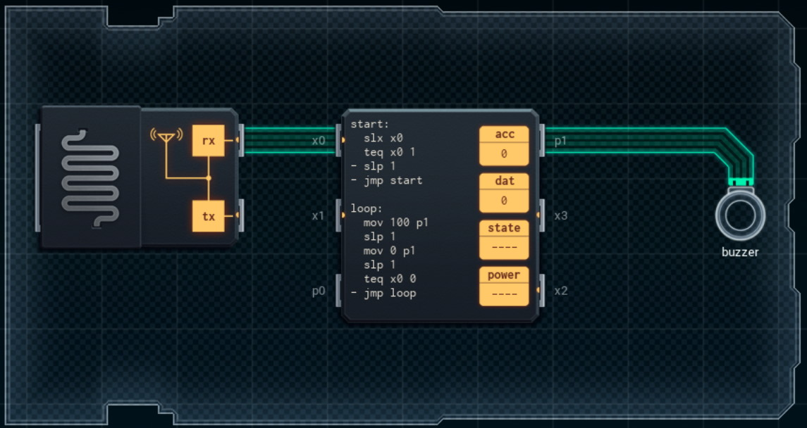

Title: SHENZHEN I/O Virtual Reality Buzzer
Tags: 
  - SHENZHEN I/O
  - Vinkit
---
`❗ TÄMÄ TEKSTI SISÄLTÄÄ SPOILEREITA ❗`

## SHENZHEN I/O -pelin Virtual Reality Buzzer -tehtävä
SHENZHEN I/O:n tehtävä numero kahdeksan on Virtual Reality Buzzer. Alla kuva ensimmäisestä toteutuksesta, jolla sain tehtävän suoritettua.

  

### Missä menin vikaan

En missään, tehtävä on helppo ja tehtävänanto on jälleen hyvin ymmärrettävissä. Eli laitetaan summeri päälle ja pois tarpeen mukaan.

### Mitä olisi voinut tehdä paremmin

Myöhemmin pelissä paljastuvalla [GEN](https://shenzhen-io.fandom.com/wiki/Gen_(instruction))-komennolla saisi koodia vähennettyä selvästi ja koodi mahtuisi kokonaisuudessaan pienemmälle piirille.

🖥️