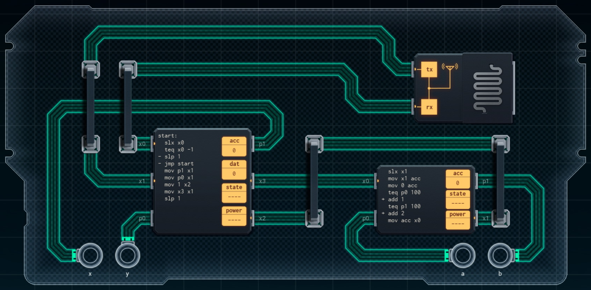

Title: SHENZHEN I/O Wireless Game Controller
Tags: 
  - SHENZHEN I/O
  - Vinkit
---
`❗ TÄMÄ TEKSTI SISÄLTÄÄ SPOILEREITA ❗`

## SHENZHEN I/O -pelin Wireless Game Controller -tehtävä
SHENZHEN I/O:n tehtävä numero yhdeksän on Wireless Game Controller. Alla kuva ensimmäisestä toteutuksesta, jolla sain tehtävän suoritettua.

  

### Missä menin vikaan

En missään, tehtävä on helppo ja tehtävänanto on jälleen hyvin ymmärrettävissä. Eli pyydettäessä luetaan sisääntulot, tehdään niille pieniä muutoksia ja välitetään eteenpäin.

### Mitä olisi voinut tehdä paremmin

Piirien välissä riittäisi yksi kommunikointiväylä. Suuremmalta piiriltä voisi myös vähentää komentoja, koska SLX-komentoa ei tarvitse (radio syöttää dataa jatkuvasti) ja alkuun hyppäämisen voisi korvata loppuun hyppäämisellä, jolloin yksi SLP-komento olisi tarpeeksi.

🖥️