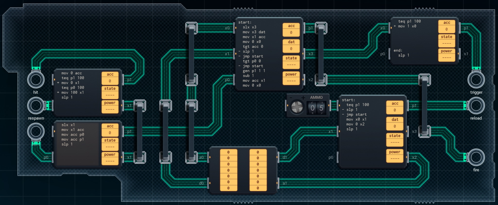

Title: SHENZHEN I/O Laser Tag Equipment
Tags: 
  - SHENZHEN I/O
  - Vinkit
---
`❗ TÄMÄ TEKSTI SISÄLTÄÄ SPOILEREITA ❗`

## SHENZHEN I/O -pelin Laser Tag Equipment -tehtävä
SHENZHEN I/O:n tehtävä numero kymmenen on Laser Tag Equipment. Alla kuva ensimmäisestä toteutuksesta, jolla sain tehtävän suoritettua.

  

### Missä menin vikaan

Tässä kohtaa peliä vaikeustaso nousi selvästi. Toteutus on liian monimutkainen, ja muistin käyttäminen ammuksien määrän tallentamiseen on täysin turhaa.

### Mitä olisi voinut tehdä paremmin

Muistia ei kannata käyttää olenkaan, eikä varsinkaan kahdelta eri piiriltä, koska osoittimen laittaminen nollaan syö käskyjä kahdella piirillä (ja linjojen vetäminen muuttuu työlääksi). Lisäksi mukana on turhia käskyjä, ja oikean yläkulman piiri tekee käytännössä vain P -> X -muunnosta.

🖥️