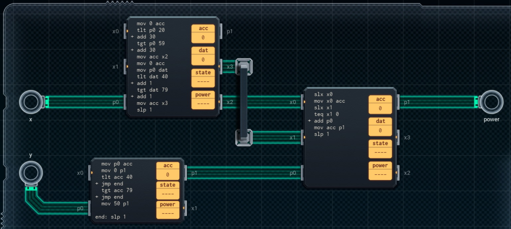

Title: SHENZHEN I/O Unknown Optimization Device
Tags: 
  - SHENZHEN I/O
  - Vinkit
---
`❗ TÄMÄ TEKSTI SISÄLTÄÄ SPOILEREITA ❗`

## SHENZHEN I/O -pelin Unknown Optimization Device -tehtävä
SHENZHEN I/O:n tehtävä numero kaksitoista on Unknown Optimization Device. Alla kuva ensimmäisestä toteutuksesta, jolla sain tehtävän suoritettua.

  

### Missä menin vikaan

En missään, tehtävä on helppo ja tehtävänanto on jälleen hyvin ymmärrettävissä. Lasketaan kaavan ja annettujen X ja Y-arvojen perusteella lopputulos.

### Mitä olisi voinut tehdä paremmin

Oikean reunan piiri voisi olla pienempi ja siinä ei tarvise käyttää **SLX**-komentoa, koska syötettä tulee jatkuvasti. Oikean reunan ja ylimmän piirin välisen kommunikoinnin voisi myös hoitaa yhtä väylää pitkin. Ylimmässä piirissä **dat**-rekisterin käyttö on turhaa, koska P-porteista voi lukea arvoja useamman kerran. Alimmassa piirissä **acc**-rekisterin käyttö on turhaa, koska P-porteista voi lukea arvoja useamman kerran.

🖥️