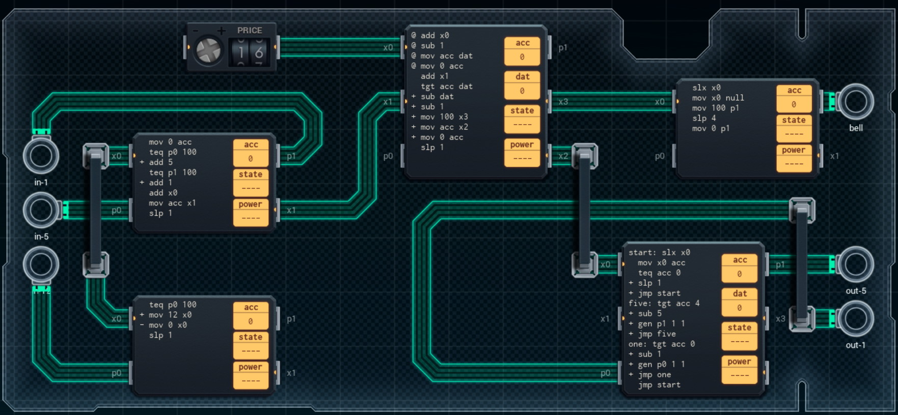

Title: SHENZHEN I/O Token-Based Payment Kiosk
Tags: 
  - SHENZHEN I/O
  - Vinkit
---
`❗ TÄMÄ TEKSTI SISÄLTÄÄ SPOILEREITA ❗`

## SHENZHEN I/O -pelin Token-Based Payment Kiosk -tehtävä
SHENZHEN I/O:n tehtävä numero kolmetoista on Token-Based Payment Kiosk. Alla kuva ensimmäisestä toteutuksesta, jolla sain tehtävän suoritettua.

  

### Missä menin vikaan

En missään, tehtävä on helppo ja tehtävänanto on jälleen hyvin ymmärrettävissä. Eli lasketaan sisääntulevien kolikoiden määrä, soitetaan kelloa jos annettu määrä on ylitetty ja palautetaan sitten vaihtorahat.

### Mitä olisi voinut tehdä paremmin

Vasemman reunan kaksi piiriä kannattaa korvata yhdellä piirillä + DX300:lla. Oikean yläreunan piirin voi poistaa kokonaan, ja antaa [GEN](https://shenzhen-io.fandom.com/wiki/Gen_(instruction))-komennon suoraan ylimmältä piiriltä. Ylimpään piiriin kannattaa laitta SLX-käsky alkuun, jolloin toimitaan vain silloin, kun rahaa syötetään sisään. Oikean alakulman piirissä 5- ja 1-kolikon määrän laskemista voi tiivistää, koska kaikki 5:t on palautettava ennen 1:siä.

🖥️