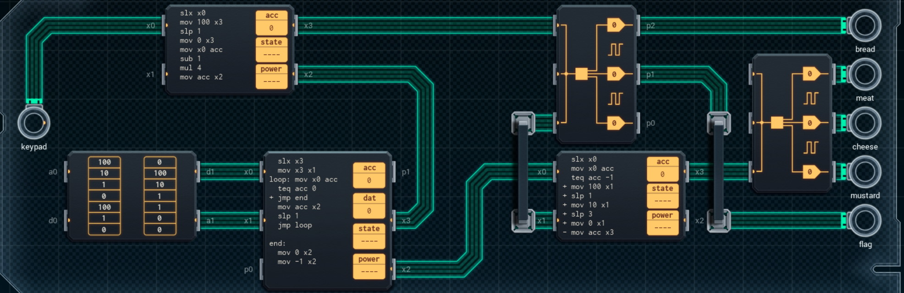

Title: SHENZHEN I/O Personal Sandwich Maker
Tags: 
  - SHENZHEN I/O
  - Vinkit
---
`❗ TÄMÄ TEKSTI SISÄLTÄÄ SPOILEREITA ❗`

## SHENZHEN I/O -pelin Personal Sandwich Maker -tehtävä
SHENZHEN I/O:n tehtävä numero neljätoista on Personal Sandwich Maker. Alla kuva ensimmäisestä toteutuksesta, jolla sain tehtävän suoritettua.

  

### Missä menin vikaan

En missään, tehtävä on helppo ja tehtävänanto on jälleen hyvin ymmärrettävissä. Eli tehdään leipiä annettujen ohjeiden mukaisesti.

### Mitä olisi voinut tehdä paremmin

Vasemman alareunan piirin voi korvata pienemmällä, koska end-osion ensimmäisen mov-komennon voi poistaa, jos aiemman mov-komennon siirtää hieman aiemmaksi. Ylempää DX300:sta ei myöskään tarvita, koska vaihtamalla siihen liittyvät piirit MC4000-mallisiksi, voi P-väyliä käyttää [GEN](https://shenzhen-io.fandom.com/wiki/Gen_(instruction))-komennon kanssa tekemään samat toimenpiteet.

🖥️