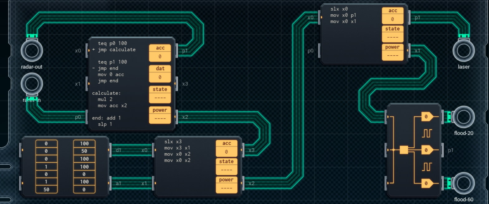

Title: SHENZHEN I/O Carbine Target Illuminator
Tags: 
  - SHENZHEN I/O
  - Vinkit
---
`❗ TÄMÄ TEKSTI SISÄLTÄÄ SPOILEREITA ❗`

## SHENZHEN I/O -pelin Carbine Target Illuminator -tehtävä
SHENZHEN I/O:n tehtävä numero viisitoista on Carbine Target Illuminator. Alla kuva ensimmäisestä toteutuksesta, jolla sain tehtävän suoritettua.

  

### Missä menin vikaan

En missään, tehtävä on helppo ja tehtävänanto on jälleen hyvin ymmärrettävissä. Eli mitataan viive ja sen perusteella ohjataan ampumaradan toimintoja.

### Mitä olisi voinut tehdä paremmin

Vasemman yläreunan piiri on korvattavissa MC4000-mallisella, jos keskikohdan JMP-komennot yhdistää yhdeksi. Vastaavasti alhaalla olevan ja oikeassa reunassa olevan piirin voi korvata yhdellä yhteisellä MC6000-piirillä.

🖥️