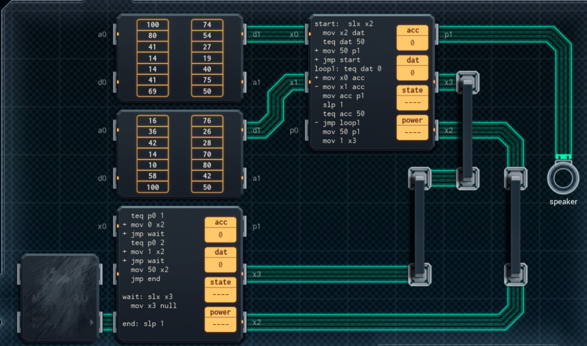

Title: SHENZHEN I/O Haunted Doll
Tags: 
  - SHENZHEN I/O
  - Vinkit
---
`❗ TÄMÄ TEKSTI SISÄLTÄÄ SPOILEREITA ❗`

## SHENZHEN I/O -pelin Haunted Doll -tehtävä
SHENZHEN I/O:n tehtävä numero kuusitoista on Haunted Doll. Alla kuva ensimmäisestä toteutuksesta, jolla sain tehtävän suoritettua.

  

### Missä menin vikaan

En missään, tehtävä on helppo ja tehtävänanto on jälleen hyvin ymmärrettävissä. Eli soitetaan pyydettäessä valittu audio kaiuttimen kautta ulos.

### Mitä olisi voinut tehdä paremmin

Vasemman alareunan piiri on vaihdettavissa pienempään, kunhan ehtolauseen kirjoittaa vain järkevämmin. Piirien välillä ei ole tarvetta käyttää kahta kommunikointiväylää, vaan yksi on oikeampi määrä.

🖥️