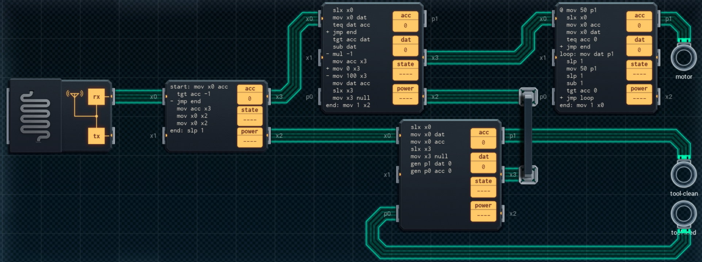

Title: SHENZHEN I/O Aquaponics Maintenance Robot
Tags: 
  - SHENZHEN I/O
  - Vinkit
---
`❗ TÄMÄ TEKSTI SISÄLTÄÄ SPOILEREITA ❗`

## SHENZHEN I/O -pelin Aquaponics Maintenance Robot -tehtävä
SHENZHEN I/O:n tehtävä numero seitsemäntoista on Aquaponics Maintenance Robot. Alla kuva ensimmäisestä toteutuksesta, jolla sain tehtävän suoritettua.

  

### Missä menin vikaan

En missään, tehtävä on helppo ja tehtävänanto on jälleen hyvin ymmärrettävissä. Eli ohjataan robottia annettujen käskyjen mukaan.

### Mitä olisi voinut tehdä paremmin

Vasemman reunan ja alareunan piirit voi yhdistää yhdeksi piiriksi. Ylhäällä keskellä olevan piirin X2-väylää ei tällöin tarvitse mihinkään, koska piiri voi kommunikoida takaisinpäin yhdistetylle piirille X0-väylää pitkin.

🖥️