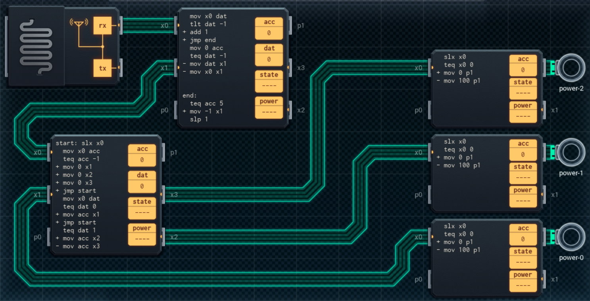

Title: SHENZHEN I/O Remote Kill Switch
Tags: 
  - SHENZHEN I/O
  - Vinkit
---
`❗ TÄMÄ TEKSTI SISÄLTÄÄ SPOILEREITA ❗`

## SHENZHEN I/O -pelin Remote Kill Switch -tehtävä
SHENZHEN I/O:n tehtävä numero kahdeksantoista on Remote Kill Switch. Alla kuva ensimmäisestä toteutuksesta, jolla sain tehtävän suoritettua.

  

### Missä menin vikaan

En missään, tehtävä on helppo ja tehtävänanto on jälleen hyvin ymmärrettävissä. Eli sammutetaan tai käynnistellään asioita annettujen komentojen mukaisesti.

### Mitä olisi voinut tehdä paremmin

Kaikki kolme oikean reunan piiriä ovat tarpeettomia, jos ne korvaa DX300:lla ja laskee sopivan arvon aiemmalla piirillä käyttäen DST-komentoa (ymmärsin alkuun DST-komennon väärin, kun oletin sen muuttavan vain olemassa olevaa arvoa, mutta sillä saa laitettua aina valitun numeron haluttuun arvoon). Tällä tavalla saa vähennettyä sekä kustannuksia, energian kulutusta että koodirivien määrää selvästi.

🖥️